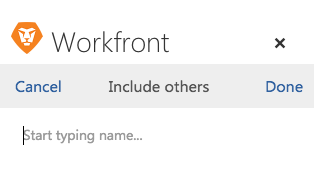

# Actualizar un objeto existente de un [!DNL Outlook] email

Puede actualizar un proyecto, tarea o problema existente con información de un [!DNL Outlook] correo electrónico.

## Requisitos de acceso

Debe tener el siguiente acceso para realizar los pasos de este artículo:

<table style="table-layout:auto"> 
 <col> 
 <col> 
 <tbody> 
  <tr> 
   <td role="rowheader">[!DNL Adobe Workfront] plan*</td> 
   <td> 
Cualquiera
 </td> 
  </tr> 
  <tr> 
   <td role="rowheader">[!DNL Adobe Workfront] licencia*</td> 
   <td> 
[!UICONTROL Work], [!UICONTROL Plan]
 </td> 
  </tr> 
 </tbody> 
</table>

&#42;Para saber qué plan, tipo de licencia o acceso tiene, póngase en contacto con su [!DNL Workfront] administrador.

## Requisitos previos

Su [!DNL Workfront] el administrador debe habilitar [!DNL Outlook for Office] con [!DNL Workfront] antes de poder utilizar esta integración.

## Actualizar un objeto existente de un [!DNL Outlook] email

1. En [!DNL Outlook], seleccione el correo electrónico que contiene la información que desea incluir en un [!DNL Adobe Workfront update].
1. Haga clic en el **[!DNL Workfront]** en la esquina superior derecha del mensaje de correo electrónico para mostrar el complemento de Workfront.\
   Es posible que tenga que hacer clic en la flecha hacia abajo situada en la parte superior derecha del correo electrónico para acceder a la [!DNL Workfront] icono.

1. Haga clic en el **[!UICONTROL Menú]** para mostrar la lista de [!DNL Workfront] opciones.\
   

1. Haga clic en **[!UICONTROL Actualizar] en Workfront**.\
   \
   Puede actualizar la siguiente información desde el correo electrónico antes de que se guarde como una tarea:

   * **[!UICONTROL Tipo]**: Seleccione el tipo de objeto que va a actualizar. Puede seleccionar **[!UICONTROL Proyecto]**, **[!UICONTROL Tarea]** o **[!UICONTROL Problema]**. El objeto seleccionado determina los resultados que se muestran en la variable **[!UICONTROL Nombre]** a continuación. Si no está seguro del tipo de objeto, seleccione **[!UICONTROL Todo]** para buscar proyectos, tareas y problemas simultáneamente.

   * **[!UICONTROL Nombre]**: Empiece a escribir el nombre del proyecto, la tarea o el problema que desee actualizar. Haga clic en el nombre cuando aparezca en la lista desplegable.
   * **[!UICONTROL Actualizar]**: De forma predeterminada, la actualización es la misma que el Cuerpo del correo electrónico. Puede modificar la actualización como desee.\

      Esta [!UICONTROL actualizar] se muestra como el estado de actualización en Workfront.

   * **[!UICONTROL Archivos adjuntos]**: Los archivos adjuntos de correo electrónico se guardan en la variable [!UICONTROL Documentos] del área de la tarea. Puede eliminar los archivos adjuntos antes de enviar la actualización.

1. (Opcional) Haga clic en **[!UICONTROL Incluir otros]**, empiece a escribir el nombre de los usuarios que desea incluir en la actualización y, a continuación, haga clic en el nombre cuando aparezca en la lista desplegable.\
   Repita este proceso para incluir usuarios adicionales y, a continuación, haga clic en **[!UICONTROL Listo]**.\
   De forma predeterminada, el usuario al que responda recibe una notificación independientemente de si la incluye o no.\
   

1. (Opcional) Haga clic en el **[!UICONTROL Bloqueo]** para restringir esta actualización a los usuarios de su empresa. Cuando la actualización está bloqueada, los usuarios fuera de la empresa no pueden ver la actualización.

   * **[!UICONTROL Desbloqueado]:** Cualquier usuario con acceso al proyecto, tarea o problema en el que reside la actualización puede ver la actualización.\

      De forma predeterminada, la actualización está desbloqueada.\
      

   * **[!UICONTROL Bloqueado]:** Solo los usuarios de la empresa pueden ver la actualización.\

      

1. Haga clic en **[!UICONTROL Actualizar]**.
1. (Opcional) Haga clic en **[!UICONTROL Ver en Workfront]** para ver el elemento actualizado con la variable [!DNL Workfront] integración dentro de [!UICONTROL Outlook].
