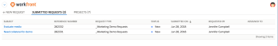

# Submit [!DNL Adobe Workfront] solicitudes de [!DNL Salesforce] objetos

Después de instalar [!DNL Adobe Workfront for Salesforce], puede enviar [!DNL Workfront] solicitudes de [!DNL Salesforce] Oportunidades y Cuentas. Esta funcionalidad existe tanto en la variable [!DNL Classic] y [!DNL Lightning Experience] marcos.

## Requisitos de acceso

Debe tener el siguiente acceso para utilizar la funcionalidad descrita en este artículo:

<table style="table-layout:auto"> 
 <col> 
 <col> 
 <tbody> 
  <tr> 
   <td role="rowheader">
[!DNL Adobe Workfront] plan*
</td> 
   <td> 
[!UICONTROL Pro] o superior
 </td> 
  </tr> 
  <tr> 
   <td role="rowheader">
[!DNL Adobe Workfront] licencia*
</td> 
   <td> 
[!UICONTROL Plan]
 </td> 
  </tr> 
 </tbody> 
</table>

&#42;Para saber qué plan, tipo de licencia o acceso tiene, póngase en contacto con su [!DNL Workfront] administrador.

## Requisitos previos

Para enviar un [!DNL Workfront] solicitud de un [!DNL Salesforce] Oportunidad o Cuenta asegúrese de que dispone de lo siguiente en su entorno:

* Su [!DNL Workfront] administrador instalado [!DNL Workfront for Salesforce].\
   Para obtener más información sobre la instalación [!DNL Workfront for Salesforce], consulte [Instalar [!DNL Adobe Workfront for Salesforce]](../../workfront-integrations-and-apps/using-workfront-with-salesforce/install-workfront-for-salesforce.md)

* Su [!DNL Workfront] el administrador ha añadido la variable [!DNL Workfront] para [!UICONTROL Oportunidad] y [!UICONTROL Cuenta] diseños de página.\
   Para obtener más información sobre cómo agregar la variable [!DNL Workfront] para un diseño de página, consulte [Configure las variables [!DNL Adobe Workfront] para [!DNL Salesforce] usuarios](../../workfront-integrations-and-apps/using-workfront-with-salesforce/configure-wf-section-for-salesforce-users.md).

* Tiene un [!DNL Workfront] puede iniciar sesión en ella desde la [!DNL Workfront] dentro de su oportunidad o cuenta.\
   Una vez que inicie sesión, podrá ver la [!UICONTROL Nuevas solicitudes] , donde puede empezar a introducir solicitudes.

## Submit [!DNL Workfront] solicitudes de [!DNL Salesforce]

1. Vaya a Oportunidad o Cuenta en Salesforce.
1. Vaya a la [!DNL Workfront] para obtener más información.
1. En el **[!UICONTROL Nuevas solicitudes]** seleccione un tipo de solicitud en la pestaña **[!UICONTROL Seleccionar un tipo de solicitud]** menú desplegable.

   Puede ver las mismas colas de solicitud a las que tiene acceso en Workfront.

1. Comience a rellenar los campos disponibles para su solicitud.

   Envío de una solicitud desde [!DNL Salesforce] es idéntico a enviar una solicitud en la variable [!DNL Workfront] aplicación web.

   >[!NOTE]
   >
   >Carga de un documento mediante la variable [!DNL Workfront] complemento [!DNL Salesforce] no está disponible temporalmente.

   Siga los pasos descritos en [Crear y enviar [!DNL Adobe Workfront] solicitudes](../../manage-work/requests/create-requests/create-submit-requests.md).

1. Haga clic en **[!UICONTROL Submit]**.

## Ver [!DNL Workfront] solicitudes

1. Vaya a Oportunidad o Cuenta en [!DNL Salesforce].
1. Vaya a la **[!DNL Workfront]** para obtener más información.

   >[!NOTE]
   >
   >Dependiendo de cómo [!DNL Workfront] administrador ha configurado esta sección, puede tener un nombre diferente.

1. Seleccione el **[!UICONTROL Solicitudes enviadas]** pestaña .

   Puede ver todas las solicitudes que usted u otros hayan enviado desde esta oportunidad o cuenta en esta pestaña. Las solicitudes enviadas a esta cola de solicitudes en la aplicación web no se muestran en esta lista en [!DNL Salesforce].

   >[!NOTE]
   >
   >Las solicitudes enviadas a esta cola de solicitudes en la aplicación web no se muestran en esta lista en Salesforce.

   

   Puede ver la siguiente información sobre las solicitudes enviadas:

   * Nombre de las solicitudes (en la variable [!UICONTROL Asunto] column)
   * Número de referencia
   * Tipo de solicitud
   * Estado
   * Enviado en fecha
   * Solicitado por nombre
   * Asignado a Nombre\

      Cuando esta información se actualiza en [!DNL Workfront], también se actualiza en esta lista.

1. (Opcional) Haga clic en el nombre de la solicitud para abrirla en [!DNL Workfront].

1. (Opcional) Haga clic en **[!UICONTROL Vaya a[!DNL Salesforce]]** para acceder a la oportunidad o cuenta en la que el problema se originó en las siguientes áreas de Workfront:

   * En el [!UICONTROL Detalles] sección del problema
   * En el panel Resumen al seleccionar el problema en una lista, después de hacer clic en [!UICONTROL Abrir resumen]  en la barra de herramientas de la lista.
   * En el encabezado del problema, cuando la variable [!UICONTROL Integraciones] está disponible. El administrador del sistema o del grupo debe agregar la variable [!UICONTROL Integraciones] para ver el vínculo Ir a Salesforce en el encabezado del problema. Para obtener más información, consulte [Personalización de encabezados de objeto mediante una plantilla de diseño](../../administration-and-setup/customize-workfront/use-layout-templates/customize-object-headers.md).

   >[!NOTE]
   >
   >La variable [!UICONTROL Ir a Salesforce] el vínculo es visible para todos [!DNL Workfront] usuarios que pueden ver el problema. Debe tener un [!DNL Salesforce] para poder ir a la [!DNL Salesforce] Oportunidad o cuenta en la que se registró el problema.
