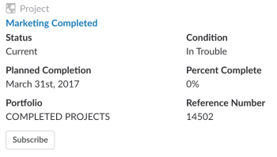

# Acceso [!DNL Adobe Workfront] objetos de un vínculo compartido en [!DNL Slack]

Cuando los vínculos a [!DNL Adobe Workfront] los objetos se comparten con usted en un [!DNL Slack] canal, puede ver información adicional sobre ellos en [!DNL Slack], una vez que haya instalado y configurado [!DNL Workfront for Slack].

Para obtener más información sobre la configuración [!DNL Workfront for Slack], consulte [Configurar [!DNL Adobe Workfront for Slack]](../../workfront-integrations-and-apps/using-workfront-with-slack/configure-workfront-for-slack.md).

Debe iniciar sesión en [!DNL Workfront] en una ficha de navegador independiente para abrir el vínculo o para realizar acciones adicionales en dichos objetos desde [!DNL Slack].

Cuando un usuario comparte un vínculo a un objeto en [!DNL Workfront] con usted, también puede mostrarse información adicional sobre el objeto junto con el vínculo . El usuario que envía el vínculo debe tener al menos [!UICONTROL Ver] permisos del objeto para que la información adicional se muestre en [!DNL Slack].

## Requisitos de acceso

Debe tener el siguiente acceso para utilizar la funcionalidad descrita en este artículo:

<table style="table-layout:auto"> 
 <col> 
 <col> 
 <tbody> 
  <tr> 
   <td role="rowheader">[!DNL Adobe Workfront] plan*</td> 
   <td> 
[!UICONTROL Pro] o superior
 </td> 
  </tr> 
  <tr> 
   <td role="rowheader">[!DNL Adobe Workfront] licencia*</td> 
   <td> 
[!UICONTROL Plan]
 </td> 
  </tr> 
 </tbody> 
</table>

&#42;Para saber qué plan, tipo de licencia o acceso tiene, póngase en contacto con su [!DNL Workfront] administrador.

## Requisitos previos

Antes de poder acceder a sus favoritos y elementos recientes desde [!DNL Slack], debe

* Configurar [!DNL Workfront for Slack]\
   Para obtener instrucciones sobre la configuración [!DNL Workfront for Slack], consulte [Configurar [!DNL Adobe Workfront for Slack]](../../workfront-integrations-and-apps/using-workfront-with-slack/configure-workfront-for-slack.md).

## Acceda a proyectos desde [!DNL Slack]

1. Inicie sesión en su [!DNL Slack] instancia e inicie sesión en [!DNL Workfront from Slack.]

   Para obtener más información sobre cómo iniciar sesión en [!DNL Workfront] from [!DNL Slack], consulte &quot;Inicio de sesión en [!DNL Workfront from Slack]&quot; en [Acceso [!DNL Adobe Workfront from Slack]](../../workfront-integrations-and-apps/using-workfront-with-slack/access-workfront-from-slack.md).

1. Vaya a un mensaje que incluya un vínculo a una [!DNL Workfront] proyecto.

   >[!NOTE]
   >
   >El usuario que comparte el vínculo debe tener al menos [!UICONTROL Ver] permisos del proyecto para que pueda ver información adicional sobre él.

   

1. (Opcional) Haga clic en el nombre del proyecto para abrirlo en [!DNL Workfront] en una nueva pestaña del explorador.
1. Considere la posibilidad de revisar la siguiente información adicional sobre el proyecto:

   * **[!UICONTROL Estado]:** Para obtener más información sobre el estado del proyecto, consulte [Acceso a la lista de estados de proyectos del sistema](../../administration-and-setup/customize-workfront/creating-custom-status-and-priority-labels/project-statuses.md).

   * **[!UICONTROL Fecha de finalización planeada]**: Para obtener más información sobre la fecha de finalización prevista, consulte [Establecer la fecha de finalización prevista del proyecto](../../manage-work/projects/planning-a-project/project-planned-completion-date.md).

   * **[!UICONTROL Portfolio]** Nombre: Para obtener más información sobre portafolios, consulte [Información general del Portfolio en Adobe Workfront](../../manage-work/portfolios/portfolios-overview/portfolio-overview.md).

   * **[!UICONTROL Condición]**: Para obtener más información sobre la condición del proyecto, consulte [Descripción general de la condición y el tipo de condición del proyecto](../../manage-work/projects/manage-projects/project-condition-and-condition-type.md).

   * **[!UICONTROL Porcentaje completado]**: Para obtener más información sobre el valor de Finalización porcentual de un proyecto, consulte [Resumen de finalización del porcentaje del proyecto](../../manage-work/tasks/task-information/project-percent-complete.md).

   * **[!UICONTROL Número de referencia]**: Para obtener más información sobre los números de referencia de objetos, consulte [Usar el número de referencia de los objetos](../../workfront-basics/navigate-workfront/search/reference-number-of-objects.md).

1. (Opcional) Haga clic en **[!UICONTROL Suscribirse]** para suscribirse al proyecto.

   Recibirá una confirmación de que se ha suscrito correctamente al proyecto.

## Acceder a tareas desde [!DNL Slack]

1. Inicie sesión en su [!DNL Slack] instancia e inicie sesión en [!DNL Workfront from Slack].

   Para obtener más información sobre cómo iniciar sesión en [!DNL Workfront] from [!DNL Slack], consulte &quot;Inicio de sesión en [!DNL Workfront] from [!DNL Slack]&quot; en [Acceso [!DNL Adobe Workfront from Slack]](../../workfront-integrations-and-apps/using-workfront-with-slack/access-workfront-from-slack.md).

1. Vaya a un mensaje que incluya un vínculo a una [!DNL Workfront] tarea.

   >[!NOTE]
   >
   >El usuario que comparte el vínculo debe tener al menos [!UICONTROL Ver] permisos para la tarea para que pueda ver información adicional sobre la tarea.

1. (Opcional) Haga clic en el nombre de la tarea para abrirla en [!DNL Workfront] en una nueva pestaña del explorador.
1. Considere la posibilidad de revisar la siguiente información adicional sobre la tarea:

   * **[!UICONTROL Estado]**

      Para obtener más información sobre los estados de tareas, consulte [Acceso a la lista de estados de tareas del sistema](../../administration-and-setup/customize-workfront/creating-custom-status-and-priority-labels/task-statuses.md).

   * **[!UICONTROL Porcentaje completado]**
   * **[!UICONTROL Asignado a nombre]**
   * **[!DNL Planned Completion Date]**
   * **[!UICONTROL Nombre del proyecto]** o **[!UICONTROL Nombre de tarea principal]**
   * **[!UICONTROL Número de referencia]**

      Para obtener más información sobre los números de referencia de objetos, consulte [Usar el número de referencia de los objetos](../../workfront-basics/navigate-workfront/search/reference-number-of-objects.md).

1. (Opcional) Haga clic en **[!UICONTROL Suscribirse]** para suscribirse a la tarea.

   Recibirá una confirmación de que se ha suscrito correctamente a la tarea.

1. (Opcional) Haga clic en **[!UICONTROL Asignar al usuario]** para asignar la tarea a un usuario.
1. (Condicional) Empiece a escribir el nombre de un usuario si ha hecho clic en **[!UICONTROL Asignar al usuario]**.

   No puede asignar una tarea a una función de trabajo o a un equipo de [!DNL Slack].

## Problemas de acceso desde [!DNL Slack]

1. Inicie sesión en su [!DNL Slack] instancia e inicie sesión en [!DNL Workfront] from [!DNL Slack].

   Para obtener más información sobre el inicio de sesión en Workfront desde [!DNL Slack], consulte &quot;Inicio de sesión en [!DNL Workfront] from [!DNL Slack]&quot; en [Acceso [!DNL Adobe Workfront] from [!DNL Slack]](../../workfront-integrations-and-apps/using-workfront-with-slack/access-workfront-from-slack.md).

1. Vaya a un mensaje que incluya un vínculo a una [!DNL Workfront] problema.

   >[!NOTE]
   >
   >El usuario que comparte el vínculo debe tener al menos [!UICONTROL Ver] permisos para el problema para que pueda ver información adicional sobre él.

1. (Opcional) Haga clic en el nombre del problema para abrirlo en [!DNL Workfront] en una nueva pestaña del explorador.
1. Considere la posibilidad de revisar la siguiente información adicional sobre la tarea:

   * **[!UICONTROL Estado]**: Para obtener más información sobre los estados de problemas, consulte [Acceda a la lista de estados de problemas del sistema](../../administration-and-setup/customize-workfront/creating-custom-status-and-priority-labels/issue-statuses.md).

   * **[!UICONTROL Asignado a nombre]**
   * **[!UICONTROL Fecha planificada de finalización]**
   * **[!UICONTROL Nombre del proyecto]**
   * **[!UICONTROL Número de referencia]**: Para obtener más información sobre los números de referencia de objetos, consulte [Usar el número de referencia de los objetos](../../workfront-basics/navigate-workfront/search/reference-number-of-objects.md).

1. (Opcional) Haga clic en **[!UICONTROL Suscribirse]** para suscribirse al problema.

   Recibirá una confirmación de que se ha suscrito correctamente al problema.

1. (Opcional) Haga clic en **[!UICONTROL Asignar al usuario]** para asignar el problema a un usuario.
1. (Condicional) Empiece a escribir el nombre de un usuario si ha hecho clic en **[!UICONTROL Asignar al usuario]**.

   No puede asignar un problema a una función de trabajo o a un equipo de [!DNL Slack].

## Acceda a portafolios desde [!DNL Slack]

1. Inicie sesión en su [!DNL Slack] instancia e inicie sesión en [!DNL Workfront] from [!DNL Slack].

   Para obtener más información sobre cómo iniciar sesión en [!DNL Workfront] from [!DNL Slack], consulte &quot;Inicio de sesión en [!DNL Workfront] from [!DNL Slack]&quot; en [Acceso [!DNL Adobe Workfront] from [!DNL Slack]](../../workfront-integrations-and-apps/using-workfront-with-slack/access-workfront-from-slack.md).

1. Vaya a un mensaje que incluya un vínculo a una [!DNL Workfront] portafolio.

   >[!NOTE]
   >
   >El usuario que comparte el vínculo debe tener al menos [!UICONTROL Ver] permisos del portafolio para que pueda ver información adicional sobre él.

1. (Opcional) Haga clic en el nombre del portafolio para abrirlo en [!DNL Workfront] en una nueva pestaña del explorador.
1. Considere revisar la siguiente información adicional sobre el portafolio:

   * **[!UICONTROL Nombre del administrador de Portfolio]**
   * **[!UICONTROL A tiempo]**
   * **[!UICONTROL Retorno de la inversión]**
   * **[!UICONTROL Valor neto]**
   * **[!UICONTROL Estado]**
   * **[!UICONTROL Dentro del presupuesto]**
   * **[!UICONTROL Alineado]**

      Para obtener más información sobre las métricas de portafolio, incluido [!UICONTROL ROI], [!UICONTROL Valor neto], [!UICONTROL Alineación]y [!UICONTROL Tiempo de activación] y [!UICONTROL Sobre presupuesto] valores, consulte [Información sobre [!UICONTROL Optimizador de Portfolio].](../../manage-work/portfolios/portfolio-optimizer/portfolio-optimizer-overview.md)

## Acceda a los programas desde [!DNL Slack]

1. Inicie sesión en su [!DNL Slack] instancia e inicie sesión en [!DNL Workfront] from [!DNL Slack].

   Para obtener más información sobre cómo iniciar sesión en [!DNL Workfront] from [!DNL Slack], consulte &quot;Inicio de sesión en [!DNL Workfront] from [!DNL Slack]&quot; en [Acceso [!DNL Adobe Workfront] from [!DNL Slack]](../../workfront-integrations-and-apps/using-workfront-with-slack/access-workfront-from-slack.md).

1. Vaya a un mensaje que incluya un vínculo a una [!DNL Workfront] programa.

   >[!NOTE]
   >
   > El usuario que comparte el vínculo debe tener al menos [!UICONTROL Ver] permisos del programa para que pueda ver información adicional sobre él.

1. (Opcional) Haga clic en el nombre del programa para abrirlo en [!DNL Workfront] en una nueva pestaña del explorador.
1. Considere la posibilidad de revisar la siguiente información adicional sobre el programa:

   * **[!UICONTROL Descripción]**
   * **[!UICONTROL Nombre del portafolio]**
   * **[!UICONTROL Nombre del administrador de programas]**

      Para obtener más información sobre los programas, consulte [Cree y administre programas.](../../manage-work/portfolios/create-and-manage-programs/create-and-manage-programs.md)

## Acceda a informes desde [!DNL Slack]

1. Inicie sesión en su [!DNL Slack] instancia e inicie sesión en [!DNL Workfront] from [!DNL Slack].

   Para obtener más información sobre cómo iniciar sesión en [!DNL Workfront] from [!DNL Slack], consulte &quot;Inicio de sesión en [!DNL Workfront] from [!DNL Slack]&quot; en [Acceso [!DNL Adobe Workfront] from [!DNL Slack]](../../workfront-integrations-and-apps/using-workfront-with-slack/access-workfront-from-slack.md).

1. Vaya a un mensaje que incluya un vínculo a una [!DNL Workfront] informe.

   >[!NOTE]
   >
   >El usuario que comparte el vínculo debe tener al menos [!UICONTROL Ver] permisos para el informe para que pueda ver información adicional sobre él.

1. (Opcional) Haga clic en el nombre del informe para abrirlo en [!DNL Workfront] en una nueva pestaña del explorador.
