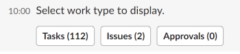
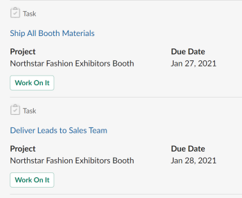

# Administre su trabajo y aprobaciones desde [!DNL Slack]

Una vez instalado [!DNL Adobe Workfront for Slack], puede hacer lo siguiente:

* Acceso a listas de [!UICONTROL Página principal] elementos de [!DNL Slack]
* Revisar y aceptar para trabajar en tareas y problemas de [!DNL Slack]
* Revisar y tomar decisiones sobre las aprobaciones de [!DNL Slack]

Para obtener más información sobre la configuración [!DNL Workfront] con [!DNL Slack], consulte [Configurar [!DNL Adobe Workfront for Slack]](../../workfront-integrations-and-apps/using-workfront-with-slack/configure-workfront-for-slack.md).

## Requisitos de acceso

Debe tener lo siguiente:

<table style="table-layout:auto"> 
 <col> 
 <col> 
 <tbody> 
  <tr> 
   <td role="rowheader"><a href="https://www.workfront.com/plans" target="_blank">[!DNL Adobe Workfront] plan</a>*</td> 
   <td> 
[!UICONTROL Pro] o superior
 </td> 
  </tr> 
 </tbody> 
</table>

&#42;Para saber qué plan, tipo de licencia o acceso tiene, póngase en contacto con el administrador de Workfront.

## Requisitos previos

Antes de administrar el trabajo y las aprobaciones desde [!DNL Slack], debe

* Configurar [!DNL Workfront for Slack]\
   Para obtener instrucciones sobre la configuración [!DNL Workfront for Slack], consulte [Configurar [!DNL Adobe Workfront for Slack]](../../workfront-integrations-and-apps/using-workfront-with-slack/configure-workfront-for-slack.md).

## Administre su trabajo desde [!DNL Slack]

1. Inicie sesión en su [!DNL Slack] instancia e inicie sesión en [!DNL Workfront] from [!DNL Slack].\
   Para obtener más información sobre cómo iniciar sesión en [!DNL Workfront] from [!DNL Slack], consulte &quot;Inicio de sesión en [!DNL Workfront] from [!DNL Slack]&quot; en [Acceso [!DNL Adobe Workfront] from [!DNL Slack]](../../workfront-integrations-and-apps/using-workfront-with-slack/access-workfront-from-slack.md).

1. Desde cualquier canal, empiece a escribir el siguiente comando en el campo del mensaje:

   `/workfront home`

   >[!NOTE]
   >
   >* Los comandos distinguen entre mayúsculas y minúsculas.
   >* Puede iniciar el comando con `/wf` en lugar de `/workfront`.

   Se muestran los botones desde los que puede acceder a las listas de tareas, problemas y aprobaciones. Al hacer clic en uno de los botones, se muestran los 20 primeros elementos de cada lista de [!DNL Slack].\
   

1. (Opcional) Haga clic en **[!UICONTROL Tareas]** para mostrar todas las tareas.

   Para obtener más información sobre la administración de tareas en [!DNL Slack], consulte [Administrar las tareas desde [!DNL Slack]](#manage-your-tasks-from-slack-manage-your-tasks-from-slack).

1. (Opcional) Haga clic en **[!UICONTROL Problemas]** para mostrar todos los problemas.

   Para obtener más información sobre la administración de problemas en [!DNL Slack], consulte [Administración de problemas desde [!DNL Slack]](#manage-your-issues-from-slack-manage-your-issues-from-slack).

1. (Opcional) Haga clic en **[!UICONTROL Aprobaciones]** para mostrar todas las aprobaciones que esperan su decisión.\
   Para obtener más información sobre la administración de aprobaciones en [!DNL Slack], consulte [Administre las aprobaciones desde [!DNL Slack]](#manage-your-approvals-from-slack-manage-your-approvals-from-slack).

## Administre sus tareas desde [!DNL Slack] {#manage-your-tasks-from-slack}

1. Inicie sesión en su [!DNL Slack] instancia e inicie sesión en [!DNL Workfront] from [!DNL Slack].\
   Para obtener información sobre cómo iniciar sesión en [!DNL Workfront] from [!DNL Slack], consulte &quot;Inicio de sesión en [!DNL Workfront] from [!DNL Slack]&quot; en [Acceso [!DNL Adobe Workfront] from [!DNL Slack]](../../workfront-integrations-and-apps/using-workfront-with-slack/access-workfront-from-slack.md).

1. Desde cualquier canal, empiece a escribir cualquiera de los siguientes comandos en el campo del mensaje:

   `/workfront home`y haga clic en **[!UICONTROL Tareas]**

   O

   `/workfront tasks`

   >[!NOTE]
   >
   >* Los comandos distinguen entre mayúsculas y minúsculas.
   >* Puede iniciar el comando con `/wf` en lugar de `/workfront`.

   Se muestran las 20 primeras tareas de la lista.\
   

1. Haga clic en **[!UICONTROL +`<remaining number>` more]** para mostrar tareas adicionales.
1. Considere la posibilidad de revisar la siguiente información sobre sus elementos de trabajo:

   * **[!UICONTROL Nombre]**
   * **[!UICONTROL Nombre del proyecto]** o **[!DNL Parent Object Name]**

   * **[!DNL Planned Completion Date]** del elemento de trabajo.
   * **[!DNL Assigned By Name]**: es el nombre del usuario que le asignó la tarea.
   * **[!UICONTROL Estado]**

1. (Opcional) Haga clic en el nombre de un elemento para abrirlo en Workfront en una ficha de navegador independiente.
1. (Opcional) En la **[!UICONTROL Estado]** , seleccione un nuevo estado.
1. (Opcional) Haga clic en **[!UICONTROL Tiempo de registro]** y, a continuación, seleccione un **[!UICONTROL Tipo de hora]** y una cantidad de hora para registrar la hora del artículo.

   >[!NOTE]
   >
   >* Solo puede registrar horas en incrementos de una hora completa o media, hasta 12 horas y 30 minutos.
   >* Las horas de registro tienen una Fecha de entrada de hoy. No se puede registrar la hora de una fecha pasada o futura a partir de [!DNL Slack].

   Recibirá una confirmación de que la hora se ha registrado.

1. (Opcional) Haga clic en **[!UICONTROL Trabaje en él]** aceptar para trabajar en una tarea. La variable [!UICONTROL Trabaje en él] desaparece.

## Gestione sus problemas desde [!DNL Slack] {#manage-your-issues-from-slack}

1. Inicie sesión en su [!DNL Slack] instancia e inicie sesión en [!DNL Workfront] from [!DNL Slack].\
   Para obtener más información sobre cómo iniciar sesión en [!DNL Workfront] from [!DNL Slack], consulte la [Inicio de sesión en [!DNL Workfront] from [!DNL Slack]](../../workfront-integrations-and-apps/using-workfront-with-slack/access-workfront-from-slack.md#logging-in-to-workfront) section in [Access [!DNL Adobe Workfront] from [!DNL Slack]](../../workfront-integrations-and-apps/using-workfront-with-slack/access-workfront-from-slack.md).

1. Desde cualquier canal, empiece a escribir cualquiera de los siguientes comandos en el campo del mensaje:

   `/workfront home`y haga clic en **[!UICONTROL Problemas]**

   O

   `/workfront issues`

   >[!NOTE]
   >
   >* Los comandos distinguen entre mayúsculas y minúsculas.
   >* Puede iniciar el comando con `/wf` en lugar de `/workfront`.

   Se muestran los 20 primeros problemas de la lista.\
   

1. Haga clic en **[!UICONTROL + restante `<number>` more]** para mostrar elementos adicionales.
1. Considere la posibilidad de revisar la siguiente información sobre sus elementos de trabajo:

   * **[!UICONTROL Nombre]**
   * **[!UICONTROL Proyecto]** Nombre o nombre del objeto principal
   * **[!UICONTROL Vence el]** Fecha: Esta es la fecha de finalización prevista del elemento de trabajo.
   * **[!DNL Requested by]** Nombre: Este es el Contacto principal (para problemas) o el usuario que realizó la asignación (para tareas).

1. (Opcional) Haga clic en el nombre del problema para abrirlo en Workfront en una pestaña del explorador independiente.
1. (Opcional) Haga clic en **[!DNL Work on it]** para comenzar a trabajar en problemas que aún no ha aceptado.

   La variable [!UICONTROL Trabaje en él] desaparece.

## Administre las aprobaciones desde [!DNL Slack] {#manage-your-approvals-from-slack}

1. Inicie sesión en su [!DNL Slack] instancia e inicie sesión en [!DNL Workfront] from [!DNL Slack].\
   Para obtener más información sobre cómo iniciar sesión en [!DNL Workfront] from [!DNL Slack], consulte &quot;Inicio de sesión en [!DNL Workfront] from [!DNL Slack]&quot; en [Acceso [!DNL Adobe Workfront] from [!DNL Slack]](../../workfront-integrations-and-apps/using-workfront-with-slack/access-workfront-from-slack.md).

1. Desde cualquier canal, empiece a escribir cualquiera de los siguientes comandos en el campo del mensaje:

   `/workfront home`y haga clic en **[!UICONTROL Aprobaciones]**

   O

   `/workfront approvals`

   >[!NOTE]
   >
   >* Los comandos distinguen entre mayúsculas y minúsculas.
   >* Puede iniciar el comando con `/wf` en lugar de `/workfront`.

   Los primeros 20 artículos de su **[!UICONTROL Aprobaciones]** visualización de la lista. También se muestra información adicional sobre los elementos, como el nombre del usuario que lo solicitó o el nombre del proyecto al que pertenece el elemento.

1. Haga clic en **[!UICONTROL + restante `<number>` more]** para mostrar elementos adicionales.

   

   

   

1. Considere la posibilidad de administrar aprobaciones para los siguientes objetos:

   * **Proyectos**

      Haga clic en **[!UICONTROL Aprobar]** o **[!UICONTROL Rechazar]** para aceptar o rechazar el cambio de estado de un proyecto.

   * **Tareas**

      Haga clic en **[!UICONTROL Aprobar]** o **[!UICONTROL Rechazar]** para aceptar o rechazar el cambio de estado de una tarea.

   * **Problemas**

      Haga clic en **[!UICONTROL Aprobar]** o **[!DNL Reject]** para aceptar o rechazar el cambio de estado de un problema.

   * **Documentos**

      Haga clic en **[!UICONTROL Aprobar]** para aprobar un documento, **[!UICONTROL Rechazar]** para rechazarlo, o **[!UICONTROL Cambios]** para indicar que lo aprueba, pero que el documento necesita cambios adicionales.\
      (Opcional) Pase el ratón sobre la miniatura del documento para hacer clic en la lupa y obtener una vista previa del documento.

   * **Pruebas**&#x200B; Haga clic en el nombre de la prueba para abrirla en [!DNL Workfront] en una pestaña independiente y administre la aprobación.
   * **Solicitudes de acceso**

      Haga clic en **[!UICONTROL Conceder acceso]** para conceder permisos mejorados al objeto solicitado, o **[!UICONTROL Ignorar]** para ignorar la solicitud de más acceso.

1. (Opcional) Haga clic en el nombre del objeto enviado para aprobación para abrirlo en [!DNL Workfront] en una nueva pestaña del explorador.
