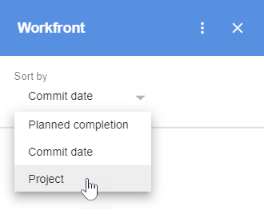

# Acceso [!DNL Adobe Workfront] [!UICONTROL Página principal] contenido de [!DNL G Suite]

Puede acceder a su [!DNL Adobe Workfront] [!UICONTROL Página principal] contenido, incluidas todas las tareas, problemas, aprobaciones y solicitudes de acceso asignadas a usted, sin salir de G Suite.

## Requisitos de acceso

Debe tener el siguiente acceso para realizar los pasos de este artículo:

<table style="table-layout:auto"> 
 <col> 
 <col> 
 <tbody> 
  <tr> 
   <td role="rowheader">[!DNL Adobe Workfront] plan*</td> 
   <td> 
Cualquiera
 </td> 
  </tr> 
  <tr> 
   <td role="rowheader">[!DNL Adobe Workfront] licencia*</td> 
   <td> 
[!UICONTROL Work], [!UICONTROL Plan]
 </td> 
  </tr> 
 </tbody> 
</table>

&#42;Para saber qué plan, tipo de licencia o acceso tiene, póngase en contacto con su [!DNL Workfront] administrador.

## Requisitos previos

Antes de poder acceder a [!UICONTROL Página principal] contenido de [!DNL G Suite], debe

* Instalar [!DNL Workfront for G suite]\
   Para obtener instrucciones, consulte [Instalar [!DNL Adobe Workfront for G Suite]](../../workfront-integrations-and-apps/workfront-for-g-suite/install-workfront-for-gsuite.md).

## Acceso [!DNL Workfront] [!UICONTROL Página principal] from [!DNL G Suite]

1. Asegúrese de haber iniciado sesión en [!DNL Workfront].
1. Si la variable [!UICONTROL Workfront para G Suite] no se muestra el panel, haga clic en el botón [!DNL Workfront] icono  en el [!DNL G Suite] barra lateral de complementos en el extremo derecho de la página.
1. Si ve una flecha izquierda en la parte superior de [!DNL Workfront] para [!DNL G Suite], haga clic en la flecha para ir a la [!UICONTROL Página principal] .

   

1. En el **[!UICONTROL Ordenar por]** , haga clic en la flecha de expansión y, a continuación, haga clic en una opción para especificar cómo desea agrupar los elementos de trabajo para que pueda encontrar el que desee.

   

   Cuando ordena por **[!UICONTROL Fecha de confirmación]** o **[!UICONTROL Finalización prevista]** , los elementos de trabajo más antiguos se encuentran en la parte superior.

   Cuando ordena por **[!UICONTROL Proyecto]**, los elementos de trabajo aparecen en el orden de sus proyectos principales, enumerados alfabéticamente de A a Z. Los elementos de trabajo sin un proyecto principal se muestran en **[!UICONTROL Sin proyecto]**.

1. Haga clic en la flecha de expansión  para la agrupación que desee ver.

   El número de elementos contenidos dentro de cada grupo se muestra entre paréntesis. Al hacer clic en el botón [!UICONTROL expandir] , se muestran todos los elementos de trabajo del grupo.

   Los elementos de trabajo aparecen de la siguiente manera:

   *  **Tareas** muestre el nombre del proyecto principal, el nombre de la tarea y la fecha de finalización planificada.

   *  **Problemas** muestre el nombre del proyecto principal, el nombre del problema y la fecha de finalización planificada.

   *   **Aprobaciones** muestre el nombre del solicitante, el nombre del documento y la fecha de envío.
   * **Solicitudes de acceso** muestre el nombre del solicitante, el nombre del objeto y la fecha de envío. El icono del tipo de objeto aparece a la izquierda.

1. Haga clic en cualquier lugar de un elemento de trabajo para ver sus detalles, actualizaciones y documentos.
