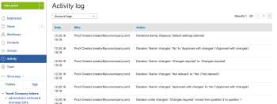
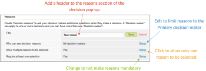
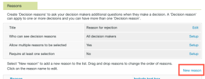
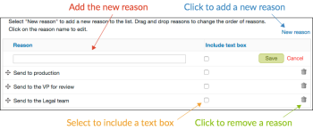
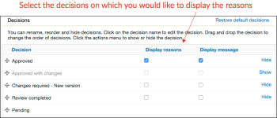
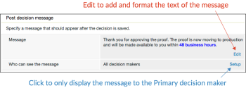
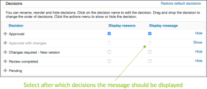

# Configuración de las opciones de decisión de aprobación en [!DNL Workfront Proof]

>[!IMPORTANT]
>
>Este artículo hace referencia a la funcionalidad del producto independiente [!DNL Workfront Proof]. Para obtener información sobre la revisión dentro de [!DNL Adobe Workfront], consulte [Revisión](../../../review-and-approve-work/proofing/proofing.md).

Como administrador de [!DNL Workfront Proof] que usa un plan de edición Select o Premium, puede configurar las opciones de decisión de aprobación de las siguientes maneras para todas las pruebas creadas por los usuarios de [!DNL Workfront Proof] de la organización:

* Cambiar el nombre de la decisión
* Cambiar el orden de las decisiones que se muestran en el visor de revisión
* Decidir qué decisiones se mostrarán

En este artículo se explica lo siguiente:

## Establecimiento de las decisiones de configuración

1. Haga clic en **[!UICONTROL Configuración de la cuenta]**.
1. Abra la pestaña **[!UICONTROL Decisiones]**.
1. Realice cualquiera de los siguientes cambios:

   * Para ocultar una decisión, haga clic en **[!UICONTROL Ocultar]**, a la derecha de la decisión que no necesite.
   * Para cambiar el nombre de una decisión, haga clic en el nombre de la decisión, edítela y, a continuación, haga clic fuera del cuadro (o presione Entrar). [!DNL Workfront Proof] actualizará el nombre de la decisión en todas las pruebas existentes del sistema.

     >[!IMPORTANT]
     >
     >Conserve la lógica de una decisión cuando le cambie el nombre. Por ejemplo, la decisión predeterminada “Rechazado” podría cambiarse por “Se requiere una nueva versión”, pero no debería cambiarse por “Enviar a impresoras”).

     En caso de querer volver a los valores predeterminados de [!DNL Workfront Proof], haga clic en Restaurar decisiones predeterminadas.

>[!NOTE]
>
>* La lógica que hay detrás de las decisiones se usa para calcular el estado general de un flujo de trabajo de prueba en caso de haber varias decisiones de varios niveles.
>* Las decisiones “Aprobado” y “Aprobado con cambios” activan la siguiente fase de un flujo de trabajo automático.
>* Al cambiar el nombre de una decisión y querer verificar la lógica, es posible hacer clic en **[!UICONTROL Actividad]**, en el panel de navegación izquierdo, y comprobar el registro de actividad donde se muestran las decisiones originales entre corchetes.
>
>  >

## Creación de motivos de decisión

Los motivos de decisión son una buena manera de recopilar información adicional de decisiones sobre una prueba.

1. Haga clic en **[!UICONTROL Configuración]** > **[!UICONTROL Configuración de la cuenta]**.

1. Abra la ficha **[!UICONTROL Decisiones]**.
De forma predeterminada, los motivos están disponibles para todos los responsables de la toma de decisiones en sus pruebas, pero solo puede restringirlos a los responsables de la toma de decisiones principales.
Según sus necesidades, puede permitir que se seleccionen varios motivos o puede convertirla en una sola lista de selección. También puede hacer que los motivos sean obligatorios, lo que significa que los revisores tendrán que elegir un motivo antes de que se les permita guardar su decisión en una prueba.
   

1. En la sección **[!UICONTROL Motivos]**, haga clic en **[!UICONTROL Nuevo motivo]**.
   

1. Escriba un título para la sección de motivos en el cuadro que aparece en **[!UICONTROL Motivo]**.
1. Si desea incluir un cuadro de texto, seleccione **[!UICONTROL Incluir cuadro de texto]**.
1. Haga clic en **[!UICONTROL Guardar]**.
   
El paso más importante es seleccionar las decisiones por las que los motivos deben mostrarse. Si se olvida de hacerlo, los motivos no aparecerán en las pruebas.

1. Marque las casillas en la columna **[!UICONTROL Motivos de visualización]** de la lista de decisiones en la parte superior de la página. Puede seleccionar una o más decisiones por los motivos que desee.
   

## Creación de un mensaje posterior a la decisión

Es posible crear un mensaje posterior a la decisión para que se muestre después de que un revisor guarde su decisión sobre la prueba.

1. Haga clic en **[!UICONTROL Configuración]** > **[!UICONTROL Configuración de la cuenta]**.

1. Abra la pestaña **[!UICONTROL Decisiones]**.
1. En la sección **[!UICONTROL Mensaje de decisión posterior]**, haga clic en **[!UICONTROL Editar]** al final de la fila **[!UICONTROL Mensaje]**.
También puede decidir si desea que el mensaje se muestre a todos los responsables de la toma de decisiones o si desea limitarlo al responsable de la toma de decisiones principal.
   

1. En la columna **[!UICONTROL Mostrar mensaje]**, especifique las decisiones en las que se debe mostrar este mensaje.
Si no selecciona al menos una decisión, el mensaje no se mostrará en las pruebas. Asegúrese de marcar al menos una casilla en esta columna.
   
