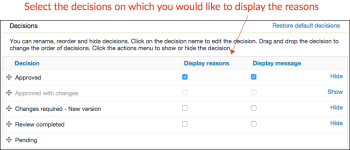

# Configure las opciones de decisión de aprobación en [!DNL Workfront Proof]

>[!IMPORTANT]
>
>Este artículo se refiere a la funcionalidad en el producto independiente [!DNL Workfront Proof]. Para obtener información sobre pruebas en el interior [!DNL Adobe Workfront], consulte [Prueba](../../../review-and-approve-work/proofing/proofing.md).

Como [!DNL Workfront Proof] con un plan de edición Select o Premium, puede configurar las opciones de decisión de aprobación de las siguientes maneras para todas las pruebas creadas por [!DNL Workfront Proof] usuarios de su organización:

* Cambiar el nombre de la decisión
* Cambiar el orden de las decisiones que se muestran en el visor de pruebas
* Decidir qué decisiones se deben mostrar

Este artículo explica lo siguiente:

## Configuración de la decisión

1. Haga clic en **[!UICONTROL Configuración de la cuenta]**.
1. Abra el **[!UICONTROL Decisiones]** pestaña .
1. Realice cualquiera de los siguientes cambios:

   * Para ocultar una decisión, haga clic en **[!UICONTROL Ocultar]** a la derecha de la decisión que no necesita.
   * Para cambiar el nombre de una decisión, haga clic en el nombre de la decisión, edítela y, a continuación, haga clic fuera del cuadro (o pulse Intro). [!DNL Workfront Proof] actualiza el nombre de la decisión en todas las pruebas existentes del sistema.

      >[!IMPORTANT]
      >
      >Mantenga la lógica de una decisión cuando le cambie el nombre. Por ejemplo, la decisión predeterminada &quot;Rechazado&quot; podría cambiarse a &quot;Se requiere una nueva versión&quot;, pero no debería cambiarse a &quot;Enviar a impresoras&quot;).

      Si desea volver al [!DNL Workfront Proof] de forma predeterminada, puede hacer clic en Restaurar decisiones predeterminadas.

>[!NOTE]
>
>* La lógica tras las decisiones se utiliza para calcular el estado general de un flujo de trabajo de prueba si hay varias decisiones de varios niveles.
>* Las decisiones &quot;Aprobado&quot; y &quot;Aprobado con cambios&quot; déclencheur la siguiente etapa en un flujo de trabajo automático.
>* Si cambia el nombre de una decisión y desea verificar la lógica, puede hacer clic en **[!UICONTROL Actividad]** en el panel de navegación de la izquierda y compruebe el registro de actividades donde aparecen entre corchetes las decisiones originales.
>
>  >

## Creación de motivos de decisión

Las razones de la decisión son una buena manera de capturar información adicional de decisión sobre una prueba.

1. Haga clic en **[!UICONTROL Configuración]** > **[!UICONTROL Configuración de la cuenta]**.

1. Abra el **[!UICONTROL Decisiones]** pestaña .
De forma predeterminada, todos los responsables de la toma de decisiones tienen a su disposición las razones, pero puede restringirlo únicamente a los responsables primarios de la toma de decisiones.
Según sus necesidades, puede permitir que se seleccionen varias razones o que se convierta en una lista de opciones única. También puede hacer que los motivos sean obligatorios, lo que significa que los revisores tendrán que elegir un motivo antes de que se les permita guardar su decisión en una prueba.
   

1. En el **[!UICONTROL Razones]** , haga clic en **[!UICONTROL Motivo nuevo]**.
   

1. Escriba un título para la sección de motivos en el cuadro que aparece debajo de **[!UICONTROL Razón]**.
1. Si desea incluir un cuadro de texto, seleccione **[!UICONTROL Cuadro de texto Incluir]**.
1. Haga clic en **[!UICONTROL Guardar]**.
   
El paso más importante es seleccionar las decisiones en las que se deben mostrar los motivos. Si olvidas hacerlo, las razones no aparecerán en tus pruebas.

1. Marque las casillas de la sección **[!UICONTROL Motivos de visualización]** en la lista de decisiones de la parte superior de la página. Puede seleccionar una o más decisiones por sus motivos.
   

## Creación de un mensaje de posdecisión

Puede crear un mensaje de decisión de anuncio para que se muestre después de que un revisor guarde su decisión en la prueba.

1. Haga clic en **[!UICONTROL Configuración]** > **[!UICONTROL Configuración de la cuenta]**.

1. Abra el **[!UICONTROL Decisiones]** pestaña .
1. En el **[!UICONTROL Mensaje tras la decisión]** , haga clic en **[!UICONTROL Editar]** al final del **[!UICONTROL Mensaje]** fila.
También puede decidir si desea que el mensaje se muestre a todos los responsables de la toma de decisiones o si desea limitarlo al responsable principal de la toma de decisiones.
   

1. En el **[!UICONTROL Mostrar mensaje]** especifique las decisiones en las que se debe mostrar este mensaje.
Si no selecciona al menos una decisión, el mensaje no aparecerá en las pruebas. Asegúrese de marcar al menos una casilla en esta columna.
   
