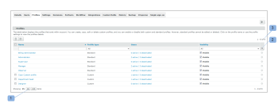
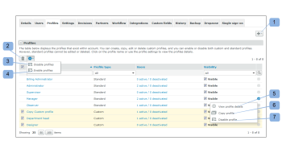
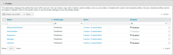
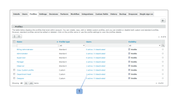
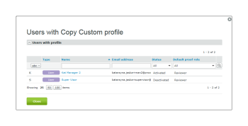

# Configurar perfiles personalizados en [!DNL Workfront Proof]

>[!IMPORTANT]
>
>Este artículo hace referencia a la funcionalidad del producto independiente [!DNL Workfront] Proof. Para obtener información sobre la revisión dentro de [!DNL Adobe Workfront], consulte [Revisión](../../../review-and-approve-work/proofing/proofing.md).

Como administrador de facturación de [!DNL Workfront Proof] o administrador de [!DNL Workfront Proof], puede configurar perfiles personalizados para otros usuarios.

Los perfiles personalizados le permiten asignar permisos granulares a los usuarios de su cuenta y definir el nivel de acceso y los derechos que tienen sobre los elementos de su cuenta. Para obtener más información acerca de los perfiles personalizados, vea [Crear y administrar perfiles personalizados con [!DNL Workfront Proof]](../../../workfront-proof/wp-mnguserscontacts/users/create-and-manage-custom-profiles.md).

Puede ajustar el diseño de la página para ver únicamente la información relevante para usted:

* Puede ajustar el número de elementos mostrados (1)
* Puede filtrar la lista de perfiles para localizar los que desea usar (2)
* Puede comprobar fácilmente el número de perfiles que tiene en la cuenta (3)\
   

## Pestaña Perfiles

La pestaña [!UICONTROL Perfiles] le permite agregar y administrar perfiles personalizados de manera práctica. Desde aquí puede realizar las siguientes acciones:

* Añadir un nuevo perfil (1)
* Realice acciones masivas en los perfiles:
* Eliminar varios perfiles (2)
* Deshabilitar varios perfiles (3)
* Activar varios perfiles (4)
* Detalles del perfil de acceso (5)
* Copia de un perfil (6)
* Desactivación de un perfil (7)

Para obtener información adicional sobre cómo personalizar la ficha Perfiles, vea [Crear y administrar perfiles personalizados con [!DNL Workfront Proof]](../../../workfront-proof/wp-mnguserscontacts/users/create-and-manage-custom-profiles.md).

## Detalles del perfil

La página Detalles del perfil le permite modificar los permisos habilitados para el perfil personalizado, copiar el perfil, eliminar el perfil y ver la lista de usuarios a los que está asignado el perfil.

Para obtener más información sobre las acciones que puede realizar en esta página, consulte &quot;[Crear y administrar perfiles personalizados con [!DNL Workfront Proof]](../../../workfront-proof/wp-mnguserscontacts/users/create-and-manage-custom-profiles.md).

* [Acceso a la página Detalles del Perfil](#accessing-the-profile-details-page)
* [Visualización de la lista de usuarios con un perfil asignado](#viewing-the-list-of-users-with-a-profile-assigned)

### Acceso a la página Detalles del Perfil {#accessing-the-profile-details-page}

Para acceder a los detalles del perfil:

1. Haga clic en el nombre del perfil.
1. 

### Visualización de la lista de usuarios con un perfil asignado {#viewing-the-list-of-users-with-a-profile-assigned}

Para ver la lista de usuarios a los que se ha asignado un perfil determinado:

1. Haga clic en el vínculo que muestra el número de usuarios activos y desactivados con este perfil (1).
1. Como alternativa, esta lista se muestra en la página Detalles del perfil.
1. 

1. La lista muestra los usuarios activos y desactivados de la cuenta a los que se ha asignado el perfil en cuestión. Si la lista es demasiado larga, puede ajustar convenientemente el diseño de la página para ver únicamente la información que está buscando.
1. 
