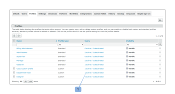

# Configurar perfiles personalizados en [!DNL Workfront Proof]

>[!IMPORTANT]
>
>Este artículo se refiere a la funcionalidad en el producto independiente [!DNL Workfront] Prueba. Para obtener información sobre pruebas en el interior [!DNL Adobe Workfront], consulte [Prueba](../../../review-and-approve-work/proofing/proofing.md).

Como [!DNL Workfront Proof] Administrador de facturación o [!DNL Workfront Proof] Administrador, puede configurar perfiles personalizados para otros usuarios.

Los perfiles personalizados le permiten asignar permisos granulares a los usuarios de su cuenta y definir el nivel de acceso y los derechos que tienen sobre los elementos de su cuenta. Para obtener más información sobre los perfiles personalizados, consulte [Crear y administrar perfiles personalizados mediante [!DNL Workfront Proof]](../../../workfront-proof/wp-mnguserscontacts/users/create-and-manage-custom-profiles.md).

Puede ajustar el diseño de la página para ver solo la información relevante para usted:

* Puede ajustar el número de elementos mostrados (1)
* Puede filtrar la lista de perfiles para localizar los que desea utilizar (2)
* Puede comprobar fácilmente la cantidad de perfiles que tiene en la cuenta (3)\
   

## Pestaña Perfiles

La variable [!UICONTROL Perfiles] permite añadir y administrar perfiles personalizados de forma conveniente. Desde aquí puede realizar las siguientes acciones:

* Añadir un nuevo perfil (1)
* Realizar acciones masivas en perfiles:
* Eliminar varios perfiles (2)
* Desactivar varios perfiles (3)
* Habilitar varios perfiles (4)
* Acceso a los detalles del perfil (5)
* Copiar un perfil (6)
* Desactivación de un perfil (7)

Para obtener información adicional sobre cómo personalizar la pestaña Perfiles , consulte [Crear y administrar perfiles personalizados mediante [!DNL Workfront Proof]](../../../workfront-proof/wp-mnguserscontacts/users/create-and-manage-custom-profiles.md).

## Detalles del perfil

La página Detalles del perfil le permite modificar los permisos habilitados para su perfil personalizado, copiar el perfil, eliminar el perfil y ver la lista de usuarios a los que se asigna el perfil.

Para obtener más información sobre las acciones que puede realizar en esta página, consulte &quot;[Crear y administrar perfiles personalizados mediante [!DNL Workfront Proof]](../../../workfront-proof/wp-mnguserscontacts/users/create-and-manage-custom-profiles.md).

* [Acceso a la página Detalles del perfil](#accessing-the-profile-details-page)
* [Visualización de la lista de usuarios con un perfil asignado](#viewing-the-list-of-users-with-a-profile-assigned)

### Acceso a la página Detalles del perfil {#accessing-the-profile-details-page}

Para acceder a los detalles del perfil:

1. Haga clic en el nombre del perfil.
1. 

### Visualización de la lista de usuarios con un perfil asignado {#viewing-the-list-of-users-with-a-profile-assigned}

Para ver la lista de usuarios a los que se les ha asignado un perfil en particular:

1. Haga clic en el vínculo que muestra el número de usuarios activos y desactivados con este perfil (1).
1. Como alternativa, esta lista se muestra en la página de detalles del perfil.
1. 

1. La lista muestra los usuarios activos y desactivados de la cuenta a los que se les ha asignado el perfil en cuestión. Si la lista es demasiado larga, puede ajustar convenientemente el diseño de la página para ver solamente la información que está buscando.
1. 
