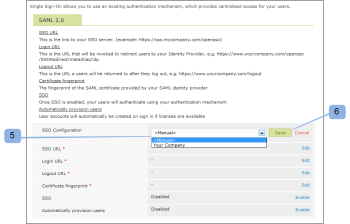

# Configuración del inicio de sesión único para [!DNL Workfront Proof] usuarios

>[!IMPORTANT]
>
>Este artículo se refiere a la funcionalidad en el producto independiente [!DNL Workfront Proof]. Para obtener información sobre pruebas en el interior [!DNL Adobe Workfront], consulte [Prueba](../../../review-and-approve-work/proofing/proofing.md).

Si tiene el plan Select or Premium , puede proporcionar la capacidad Single Sign-On (SSO) que le permite utilizar el nombre de usuario y la contraseña de su organización existente para acceder a su [!DNL Workfront Proof] cuenta.

Esto significa que se autenticará contra su propio sistema de inicio de sesión, no contra el [!DNL Workfront Proof] página de inicio de sesión.

>[!NOTE]
>
>Debe tener un subdominio o dominio personalizado configurado en su [!DNL Workfront Proof] para habilitar SAML. Los subdominios personalizados pueden configurarse libremente. Consulte [Marcas](https://support.workfront.com/hc/en-us/sections/115000921208-Branding) para obtener más información.Puede obtener más información sobre los dominios totalmente personalizados en nuestra [Marca la variable [!DNL Workfront Proof] sitio: avanzado](../../../workfront-proof/wp-acct-admin/branding/brand-wp-site-advanced.md).

## Habilitación de SSO dentro de [!DNL Workfront Proof]

La funcionalidad Inicio de sesión único se puede habilitar en la [!UICONTROL Inicio de sesión único] de su [!UICONTROL Configuración de la cuenta]y se aplicará a todos los usuarios de su [!DNL Workfront Proof] cuenta. Consulte [Configuración de la cuenta](https://support.workfront.com/hc/en-us/sections/115000912147-Account-settings) para obtener más información.

## ID de entidad

Como proveedor de servicios, hemos publicado nuestro identificador de entidad aquí:

[https://yoursubdomain.proofhq.com/saml/module.php/saml/sp/metadata.php/phq](https://yoursubdomain.proofhq.com/saml/module.php/saml/sp/metadata.php/phq) (donde &quot;susubdominio&quot; es el subdominio de la cuenta)

[!DNL Workfront Proof] requiere la dirección de correo electrónico del usuario como identificador único, que puede pasarse como uno de los atributos siguientes:

* urn:mace:dir:attribute-def:emailAddress
* http://schemas.xmlsoap.org/ws/2005/05/identity/claims/emailaddress
* http://schemas.xmlsoap.org/claims/EmailAddress
* urn:oid:0.9.2342.19200300.100.1.3
* http://axschema.org/contact/email
* openid.sreg.email
* correo
* email
* emailAddress

Para configurar SSO:

1. Abra el **[!UICONTROL Inicio de sesión único]** (1).
1. Introduzca la variable **URL de SSO** (2)
Este es el vínculo a su servidor SSO (por ejemplo, **https://sso.mycompany.com/opensso**).

1. Introduzca la variable **URL de inicio de sesión** (3)
Esta es la dirección URL que se invocará para redirigir a los usuarios a su proveedor de identidad.

1. Esta no es una URL real que usted introduce en el navegador, sino un punto final que procesará la información que le enviamos para presentar la pantalla de inicio de sesión.

Introduzca la variable **URL de cierre de sesión** (4)
Esta es la dirección URL a la que volverá después de cerrar la sesión, por ejemplo

**https://www.yourcompany.com/services/logout.asp**

1. Introduzca la variable **Huella digital del certificado** (5)
1. La huella SHA1 del certificado SAML proporcionado por su proveedor de identidad SAML.
1. Asegúrese de incluir la información de clave configurándola en su proveedor de identidad.
1. Conmutador **SSO** a **[!UICONTROL Habilitado]** (6)
Una vez que SSO esté habilitado, usted y los demás usuarios de su cuenta iniciarán sesión con su propio mecanismo de autenticación. Esto significa que cuando los usuarios acceden a su [!DNL Workfront Proof] pantalla de inicio de sesión de la cuenta (por ejemplo, **yourcompany.proofhq.com/login**), se le solicitará con la ventana de transferencia a su propia página de inicio de sesión de autenticación.

1. (Opcional) Active **Aprovisionar usuarios automáticamente** (7)
Una vez habilitada esta opción, las cuentas de usuario se crean automáticamente para las personas que no tienen la suya propia [!DNL Workfront Proof] perfiles, pero accederá a su [!DNL Workfront Proof] con sus credenciales de inicio de sesión único. Esto solo se llevará a cabo cuando el límite de usuarios aún no se haya alcanzado en su cuenta.

1. Los nuevos usuarios aprovisionados tendrán los permisos de perfil de Administrador asignados de forma predeterminada. Si necesita más información, consulte [Perfiles de permisos de prueba en [!DNL Workfront Proof]](../../../workfront-proof/wp-acct-admin/account-settings/proof-perm-profiles-in-wp.md).

## Habilitación de SSO para cuentas satelitales

Cuando tenga cuentas satélite conectadas a su cuenta de concentrador, puede administrarlas desde el nivel de cuenta de concentrador.

El inicio de sesión único es una función Select and Premium , por lo que el inicio de sesión único solo se puede activar en satélites que se encuentren en planes Select y Premium.

1. Haga clic en **[!UICONTROL Configuración]** > **[!UICONTROL Configuración de la cuenta]** (1)

1. Haga clic en la cuenta de satélite en el menú desplegable (2).
1. Abra el **[!UICONTROL Inicio de sesión único]** (3).
1. Comience a editar la configuración de SSO (4).
1. 
Aquí tiene dos métodos (5) de configuración:

1. **Heredado:** SSO con la configuración tomada de su cuenta de concentrador.
Si un usuario accede a [!DNL Workfront Proof] a través de **página de inicio de sesión predeterminada** ([https://www.proofhq.com/login](https://www.proofhq.com/login)) habrá **dos niveles de autorización**: Primero se pide a un usuario que inicie sesión utilizando [!DNL Workfront Proof] datos de acceso (correo electrónico y contraseña); a continuación, el usuario se transfiere a través de una ventana SSO a la página de inicio de sesión de SSO.
Por lo tanto, con el servicio SSO habilitado, recomendamos que inicie sesión a través de su [!DNL Workfront Proof] subdominio/dominio.

   >[!NOTE]
   >
   >En este momento, cuando el Registro único está habilitado en su [!DNL Workfront Proof] no podrá iniciar sesión en la aplicación de iPhone con esas credenciales.

   1. **Manual** (predeterminado): SSO con una configuración diferente (por ejemplo, señalando a otro proveedor de identidad).

      >[!NOTE]
      >
      >Si la cuenta satélite hereda la configuración de SSO de la cuenta de concentrador, la pantalla de inicio de sesión será la de la cuenta de concentrador. Cuando el usuario de la cuenta satélite introduzca sus detalles de inicio de sesión SSO en esta página, se redirigirá a la cuenta satélite.

      

   1. Haga clic en **[!UICONTROL Guardar]** (6)

## Configuración de SSO heredada de una cuenta de Hub

Cuando decida heredar la configuración de su cuenta de concentrador, verá que todos los campos ahora se rellenan con los datos de su cuenta de concentrador (7) y que el inicio de sesión único se activa/deshabilita automáticamente(8) como en su cuenta principal. Ya no hay vínculos de edición en los campos, ya que toda la configuración SSO de la cuenta satélite se establece y administra desde su cuenta de concentrador.

En su cuenta de concentrador (9), la variable [!UICONTROL Uso de SSO] El campo muestra que esta configuración está en uso por cuentas satélite (10).\

## SSO configurado manualmente

Si se ha elegido la configuración SSO manual para una cuenta satélite (1), debe introducir manualmente los datos del inicio de sesión único.

1. Haga clic en **[!UICONTROL Configuración]** > **[!UICONTROL Configuración de la cuenta]** (1)

1. Abra el **[!UICONTROL Inicio de sesión único]** pestaña .
1. Haga clic en **[!UICONTROL Editar],** rellene el campo y haga clic en **[!UICONTROL Guardar]** (2)

1. En el **[!UICONTROL SSO]** fila, haga clic en **[!UICONTROL Habilitado]** (3)

## Inicio de sesión en SSO

1. Haga clic en **[!UICONTROL Configuración]** > **[!UICONTROL Configuración de la cuenta]** (1)

1. Abra el **[!UICONTROL Inicio de sesión único]** pestaña .
1. Asegúrese de que su [!DNL Workfront Proof] dominio/subdominio (1) configurado y que los usuarios accedan a su [!DNL Workfront Proof] a través de este dominio o subdominio personalizado.
   
Con el Inicio de sesión único habilitado, la dirección URL de inicio de sesión de subdominio (por ejemplo, yourcompany.proofhq.com/login) muestra una pantalla de transferencia (2) que le lleva directamente a la página de inicio de sesión de SSO.
   

1. Si un usuario accede a [!DNL Workfront Proof] a través de **página de inicio de sesión predeterminada** ([https://www.proofhq.com/login](https://www.proofhq.com/login)) habrá **dos niveles de autorización**. Primero se pide a un usuario que inicie sesión utilizando [!DNL Workfront Proof] acceso a datos (correo electrónico y contraseña). A continuación, el usuario se transfiere a través de una ventana de SSO (2) a la página de inicio de sesión de SSO.\
   Por lo tanto, con el servicio SSO habilitado, recomendamos que inicie sesión a través de su [!DNL Workfront Proof] subdominio/dominio.

1. En este momento, cuando el inicio de sesión único está habilitado en la cuenta de prueba de Workfront, no podrá iniciar sesión en la aplicación de iPhone con esas credenciales.

## Acerca de la adición de un nuevo usuario

Cuando la funcionalidad Registro único está habilitada en su [!DNL Workfront Proof] Los usuarios nuevos no recibirán ningún correo electrónico de confirmación, ya que sus cuentas se activarán automáticamente y estarán listas para su uso.

Desde su [!DNL Workfront Proof] inicie sesión en la página, después de hacer clic en el botón [!UICONTROL Inicio de sesión] , los usuarios accederán a la página de inicio de sesión de SSO y se les pedirá que introduzcan sus credenciales de inicio de sesión de inicio de sesión único.

>[!IMPORTANT]
>
>Los usuarios se identifican mediante una dirección de correo electrónico durante el proceso de autenticación, lo que significa que la cuenta de correo electrónico utilizada para el inicio de sesión de SSO debe ser la dirección de correo electrónico del usuario registrado en la cuenta.

## Servicios de federación de Active Directory (AD FS)

Los Servicios de federación de Active Directory (AD FS) son [!DNL Microsoft] componente de software que se puede instalar en sistemas operativos Windows Server para proporcionar a los usuarios acceso de inicio de sesión único a sistemas y aplicaciones ubicados más allá de los límites de la organización. Para obtener más información, consulte &quot;Servicios de federación de Active Directory&quot; en el sitio web de Microsoft Developer Network.

La variable [!DNL Workfront Proof] el sistema es compatible con SAML 2.0 y solo es compatible con AD FS versión 2.0 o buenas.

Consulte [Inicio de sesión único [!DNL Workfront Proof]: Configuración de AD FS](../../../workfront-proof/wp-acct-admin/account-settings/sso-in-wp-adfs-configuration.md) para obtener instrucciones detalladas.
