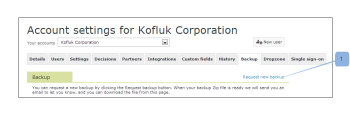

# Solicitar una nueva copia de seguridad de datos en [!DNL Workfront Proof]

>[!IMPORTANT]
>
>Este artículo hace referencia a la funcionalidad del producto independiente [!DNL Workfront Proof]. Para obtener información sobre la revisión dentro de [!DNL Adobe Workfront], consulte [Revisión](../../../review-and-approve-work/proofing/proofing.md).

Después de solicitar una copia de seguridad de los datos de revisión, puede solicitar que se cree otra nueva. Para obtener más información acerca de las copias de seguridad de datos, consulte [Realizar copias de seguridad de los datos de  [!DNL Workfront Proof] ](../../../workfront-proof/wp-work-proofsfiles/organize-your-work/back-up-data.md).

1. En la esquina superior derecha de la ventana, haga clic en **[!UICONTROL Settings]**.
1. Haga clic en **[!UICONTROL Account Settings]** en el menú desplegable y, a continuación, abra la pestaña **[!UICONTROL Backup]**.

1. Haga clic en **[!UICONTROL Request New Backup]**.
   
Los datos se le envían como un archivo zip.
