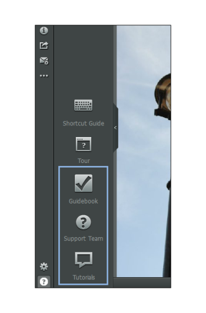
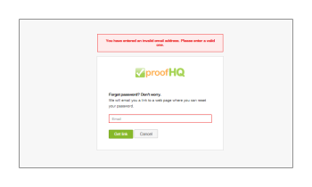

# Marcar el sitio [!DNL Workfront Proof] - avanzado

>[!IMPORTANT]
>
>Este artículo hace referencia a la funcionalidad del producto independiente [!DNL Workfront Proof]. Para obtener información sobre la revisión dentro de [!DNL Adobe Workfront], vea [Revisión](../../../review-and-approve-work/proofing/proofing.md).

La promoción de marca avanzada está disponible en los planes Select y Premium y está incluida en el costo del plan.

Para obtener información sobre la promoción de la marca básica, que incluye la página de inicio de sesión, las notificaciones por correo electrónico y las pruebas, consulta [Marcar el [!DNL Workfront Proof] sitio](../../../workfront-proof/wp-acct-admin/branding/brand-wp-site.md).

Las opciones avanzadas de promoción de la marca incluyen la personalización de las siguientes áreas:

* Color de encabezado y texto
* Encabezado de aplicación web
* Barra de menús y color del texto
* Cuadro de bienvenida y cuadro de inicio rápido del panel
* Texto del pie
* Favicon
* Título de página
* Vínculos de ayuda

Las siguientes secciones describen la promoción avanzada de la marca con más detalle:

## Información general de promoción de marca avanzada

Encontrarás la sección [!UICONTROL Configuración de marca] en la pestaña de tu página [Configuración de la cuenta](https://support.workfront.com/hc/en-us/sections/115000912147-Account-Settings). Para aplicar los cambios a su cuenta, asegúrese de que la opción de promoción de la marca está establecida en [!UICONTROL Habilitado] (1).

Consulte la sección siguiente para obtener información más detallada sobre cómo configurar las opciones de promoción de la marca avanzada (2-14).

## Configuración avanzada de marca

Puede marcar las siguientes áreas de [!DNL Workfront Proof]:

* [Aplicación web](#web-application)
* [Encabezado](#header)
* [Vínculos de encabezado](#header-links)
* [Barra lateral](#sidebar)
* [Cuadro de bienvenida](#welcome-box)
* [Encabezados de sección](#section-headers)

### Aplicación web {#web-application}

Puede elegir entre tres opciones de promoción de la marca para el encabezado de la aplicación web (2):

* Imagen de marca en el encabezado
* Su nombre de cuenta en el encabezado
* Si deshabilita la marca, el logotipo [!DNL Workfront Proof] permanecerá en el encabezado de la aplicación web

Imagen de marca: cambia de tamaño hasta un tamaño máximo de 550 x 90 px. Puede utilizar JPG, GIF o PNG de, y se admiten los fondos transparentes.

Nombre de la cuenta: se toma de los detalles de la cuenta y se muestra con una fuente en blanco. El nombre de tu cuenta puede tener hasta 60 caracteres (incluyendo espacios y signos de puntuación).

### Encabezado {#header}

En este campo (3) puede establecer el fondo del encabezado y puede elegir un color sólido o una imagen de fondo.

Color: aquí, como en todos los demás campos de personalización de marca de la configuración de combinación de colores, puede introducir un valor de color hexadecimal de su elección o utilizar un práctico selector de color (al hacer clic en el campo de texto se abre la ventana emergente). El color de fondo de encabezado predeterminado es #232d2e.

Imagen de fondo: se puede combinar con la imagen de marca.

* Puede utilizar JPG, GIF o PNGs para los archivos con transparencia se muestra un color de fondo blanco.
* La altura del encabezado es de 96 píxeles y no se cambiará el tamaño de la imagen cargada para la opción [!UICONTROL No repetir].
* La imagen de fondo se coloca en la parte superior izquierda.

### Vínculos de encabezado {#header-links}

En este campo (4) puede modificar el color del nombre de usuario y el color de los vínculos en el menú Encabezado visible en la esquina superior derecha de la cuenta.

### Barra lateral {#sidebar}

Elija colores para la barra de menús (5) y la fuente del menú (6) para personalizar la barra lateral

>[!NOTE]
>
>El color de desplazamiento se ajusta automáticamente añadiendo un valor hexadecimal constante al color de la barra de menús seleccionada.

El color del botón Nueva prueba no se puede personalizar.

### Cuadro de bienvenida {#welcome-box}

En este campo (7) puede establecer el color del cuadro de bienvenida que se muestra en la página Tablero.

### Encabezados de sección {#section-headers}

Estos campos le permiten personalizar el fondo (8) y el color de fuente (9) de los encabezados de sección en las páginas de [[!UICONTROL Configuración de la cuenta]](https://support.workfront.com/hc/en-us/sections/115000912147-Account-Settings).

**Pie de página**

En este campo (10) de la configuración de promoción de la marca puede crear un pie de página que se mostrará en la parte inferior de todas las páginas de la cuenta. Puede utilizar el editor WYSIWYG integrado o simplemente puede pegar su propio diseño.

>[!NOTE]
>
>No puede editar el HTML en el editor de texto del pie de página, pero puede pegar un diseño copiado (incluidos todos los vínculos e imágenes).

**Favicon y título de página**

Puede personalizar la forma en que se presentan las páginas de [!DNL Workfront Proof] en los exploradores configurando su propia imagen de favicon (archivo .ICO) (11) y el título de página (12), que se mostrarán en los encabezados de pestañas/ventanas de todos los exploradores de las páginas de la cuenta.

>[!NOTE]
>
>Su icono de favoritos también se mostrará en los encabezados de las ventanas del visor [!DNL Workfront Proof] para todas las pruebas creadas en su cuenta.

**Vínculos de ayuda**

Puede personalizar sus propios vínculos de ayuda para dirigir a los usuarios y revisores a su propio contenido. Para activar esto, establezca la opción [!UICONTROL Vínculos de ayuda] (13) en Habilitado y agregue los vínculos en los campos siguientes (14). Puede configurar hasta cuatro vínculos, que estarán disponibles:

* en el menú [!UICONTROL Encabezado] bajo el vínculo [!UICONTROL Ayuda]
  

* en el panel [!UICONTROL Ayuda] de la barra lateral [!DNL Workfront Proof] [!UICONTROL Visor]
  

Por un cargo adicional, los clientes con planes de empresa también tienen la opción de personalizar completamente lo siguiente:

* Personalizar completamente las páginas de aterrizaje (por ejemplo, páginas de inicio y cierre de sesión, página de contraseña olvidada)
* Personalización total del dominio

Póngase en contacto con nosotros en sales.team@workfront.com para obtener más información sobre las opciones de marca adicionales.

<!--
<h2 data-mc-conditions="QuicksilverOrClassic.Draft mode">Custom Domains</h2>
-->

<!--

Our Select and Premium plans include the option to purchase a fully-branded domain. This means that you can customize your URL as well as all links included in notification emails.&nbsp;

-->

<!--

For more information, please see&nbsp;<a href="../../../workfront-proof/wp-acct-admin/branding/configure-branded-domain-in-wp.md" class="MCXref xref">Configure a branded domain in Workfront Proof</a>.

-->

<!--
<h2 data-mc-conditions="QuicksilverOrClassic.Draft mode">Custom Page Branding</h2>
-->

<!--

Custom branding of the Workfront Proof pages is a paid service and by default&nbsp;includes full customization of the following:

-->

<!--
  <li data-mc-conditions="QuicksilverOrClassic.Draft mode"><a href="https://app.proofhq.com/login">Log in/landing page</a> </li>
  -->

<!--
  <li data-mc-conditions="QuicksilverOrClassic.Draft mode"><a href="https://app.proofhq.com/logout">Logout page</a> </li>
  -->

<!--
  <li data-mc-conditions="QuicksilverOrClassic.Draft mode"><a href="https://app.proofhq.com/login/password">Forgot password page</a> </li>
  -->

<!--
<h3 data-mc-conditions="QuicksilverOrClassic.Draft mode">Design Elements</h3>
-->

<!--

Please create your design&nbsp;in&nbsp;a .PSD file with all the elements placed in the separate layers - this will allow us to prepare the scalable pages for you.

-->

<!--

There are no particular restrictions on the .PSD files, and the look and layout of the pages is completely up to you. However please make sure that the key elements are included in your design:

-->

<!--

<strong>Login Page</strong>    

-->

<!--

<strong>Logout page</strong>    

-->

<!--

<strong>Forgot password</strong>    

-->

<!--

<strong>Inactivity alert</strong>    

-->

<!--

<strong>Invalid email address</strong>    

-->

<!--

<strong>Inactivity and incorrect email address</strong>    

-->

<!--
<note type="note">
&nbsp;The separate designs for the alerts are not required. If you'd like us to leave the default style of the messages, as shown on the screencasts above, please let us know. The team will match the colors with your design.
</note>
-->

<!--

If you'd like to have placeholder text in the text fields, please include this in your designs.

-->

<!--
<note type="note">
The wording of the alerts cannot be changed as these are the system messages.
</note>
-->

<!--

<strong>2. Fonts</strong> 

-->

<!--

Please make sure that the text is not rasterized but kept as the text layers, unless you want the particular elements to be displayed as images on your landing pages.

-->

<!--

If you use custom fonts in your design, please make sure to include the following font files: EOT + .TTF + OTF + SVG + WOFF for support in all browsers.

-->

<!--
<note type="note">
&nbsp; You need to hold an appropriate license, which allows implementing your selected fonts on the web pages.
</note>
-->

<!--

If you use the standard and widely available fonts, the font files are not required. Please see the following lists for reference:

-->

<!--
  <li data-mc-conditions="QuicksilverOrClassic.Draft mode"><a href="http://www.w3schools.com/cssref/css_websafe_fonts.asp">Websafe fonts listed in the standard Font families</a> </li>
  -->

<!--
  <li data-mc-conditions="QuicksilverOrClassic.Draft mode"><a href="https://www.google.com/fonts">Open Source Google fonts</a> </li>
  -->

<!--

<strong>3. Screen resolution</strong> 

-->

<!--

We support 1024x768 screen resolution (1366x768 for wide screens) and upwards. However, for the landing pages designs we do recommend using higher resolution for the better results on the various screens. The best practice would be to determine what screen resolution is the most common on your users' machines and prepare a slightly bigger design.

-->

<!--

<strong>4. Browsers compatibility</strong> 

-->

<!--

The newer browsers generally don't require any custom code to display the pages properly. However, if your users have the older browser versions installed on their machines some code adjustments may be needed.

-->

<!--

By default we do prepare the pages compatible with the following browsers:

-->

<!--
  <li data-mc-conditions="QuicksilverOrClassic.Draft mode">Internet Explorer 9+</li>
  -->

<!--
  <li data-mc-conditions="QuicksilverOrClassic.Draft mode">Safari 6.x+</li>
  -->

<!--
  <li data-mc-conditions="QuicksilverOrClassic.Draft mode">Chrome 22+ *</li>
  -->

<!--
  <li data-mc-conditions="QuicksilverOrClassic.Draft mode">Firefox 15+ *</li>
  -->

<!--

* Preferred browsers 

-->

<!--
<note type="note"> Workfront Proof will not design your custom pages, the PSD files must be supplied by you, but if you have any questions, please contact our Support team.
</note>
-->
