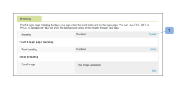
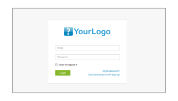
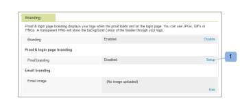
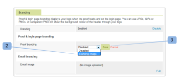
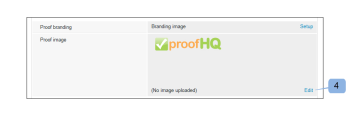
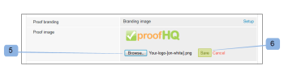
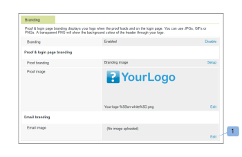
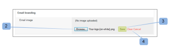
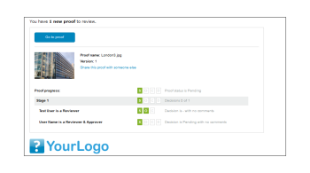

# Personalización de marca del sitio [!DNL Workfront Proof]

>[!IMPORTANT]
>
>Este artículo hace referencia a la funcionalidad de la prueba del producto independiente [!DNL Workfront]. Para obtener información sobre la revisión en [!DNL Adobe Workfront], consulte [Revisión](../../../review-and-approve-work/proofing/proofing.md).

Como administrador de [!DNL Workfront Proof], puede personalizar la marca de su cuenta de [!DNL Workfront Proof] para que usted y sus usuarios tengan una experiencia más personalizada.

La personalización de marca básica de la cuenta está disponible en todos los planes sin coste adicional.

Para obtener información sobre la personalización avanzada de marca, la cual incluye la personalización de marca en el encabezado, la barra de menús, el panel de control y mucho más, consulte [Personalizar marca del sitio:  [!DNL Workfront Proof] avanzado](../../../workfront-proof/wp-acct-admin/branding/brand-wp-site-advanced.md). La personalización de marca avanzada solo está disponible en los planes Select y Premium

Consulte las secciones siguientes para obtener información sobre cómo personalizar una marca en varios aspectos del sitio de Proof [!DNL Workfront]:

## Habilitar personalización de marca en la página de inicio de sesión de [!DNL Workfront Proof]

Para habilitar la personalización de marca en su cuenta:

1. Inicie sesión en [!DNL Workfront Proof] como administrador de [!DNL Workfront Proof].
1. Haga clic en **[!UICONTROL Configuración de la cuenta]** en la esquina superior derecha de la interfaz [!DNL Workfront Proof].

   Para obtener más información acerca de las distintas configuraciones de cuenta que puede establecer, consulte [Configuración de la cuenta.](https://support.workfront.com/hc/en-us/sections/115000912147-Account-Settings)

1. Haga clic en la pestaña **[!UICONTROL Configuración]**.
1. En la sección **[!UICONTROL Personalización de marca]**, haga clic en **[!UICONTROL Habilitar]**. (1)

   

   La imagen de personalización de marca ahora aparece en la página de inicio de sesión.

   >[!NOTE]
   >
   >La imagen de personalización de marca no aparece en su página de inicio de sesión si accede a través de la URL de inicio de sesión principal de [!DNL Workfront] Proof. Por ejemplo, `https://www.proofhq.com/login`. Solo se muestra si accede a la página de inicio de sesión a través de su subdominio personalizado o su dominio completamente personalizado. Para acceder a su página de inicio de sesión personalizada, simplemente escriba la URL de su cuenta en el navegador. Por ejemplo, `http://<yoursubdomain>.proofhq.com.` <!--For more information about fully branded domains, see "Fully Branded Domains" in the article [Configure a branded domain in [!DNL Workfront Proof]](../../../workfront-proof/wp-acct-admin/branding/configure-branded-domain-in-wp.md).-->

   

## Habilitación de personalización de marca en Proofs

Para añadir su propia imagen de marca a la página [!UICONTROL carga de pruebas] de todas las pruebas creadas en su cuenta:

1. Inicie sesión en [!DNL Workfront Proof] como administrador de [!DNL Workfront Proof].
1. Haga clic en **[!UICONTROL Configuración de la cuenta]** en la esquina superior derecha de la interfaz [!DNL Workfront Proof].

   Para obtener más información acerca de las distintas configuraciones de cuenta que puede establecer, consulte [Configuración de la cuenta.](https://support.workfront.com/hc/en-us/sections/115000912147-Account-Settings)

1. Haga clic en la pestaña **[!UICONTROL Configuración]**.
1. En la sección **[!UICONTROL Personalización de marca]**, haga clic en **[!UICONTROL Configuración]** junto a **[!UICONTROL Personalización de marca de Proof]**. (1)

   

1. En el menú desplegable, seleccione **[!UICONTROL Imagen de marca]**.
Si selecciona **[!UICONTROL Deshabilitar]**, el logotipo [!DNL Workfront Proof] aparecerá en la página de carga de revisión

1. Haga clic en **[!UICONTROL Guardar]**. (3)

   

1. Haga clic en **[!UICONTROL Editar]** para seleccionar la imagen de personalización de marca (4).

   Puede utilizar archivos JPG, GIF o PNG. Compatible con transparencias. El tamaño de la imagen recomendado es de 150 x 300 px. Se cambiará el tamaño de la imagen en las páginas de inicio y cierre de sesión a estas dimensiones.

   

1. Seleccione la imagen que desea cargar. (5)
1. Haga clic en **[!UICONTROL Guardar]**.

   La imagen de personalización de marca ahora se muestra en la página de carga de pruebas de todas las pruebas creadas en su cuenta.

   

## Notificaciones de personalización de marca por correo electrónico

Puede configurar la imagen de personalización de marca para que se incluya en las notificaciones por correo electrónico enviadas a los revisores. Se ha cambiado el tamaño de esta imagen al tamaño máximo de 90 x 550 px.

Para configurar la personalización de marca del correo electrónico:

1. Inicie sesión en [!DNL Workfront Proof] como administrador de [!DNL Workfront Proof].
1. Haga clic en **[!UICONTROL Configuración de la cuenta]** en la esquina superior derecha de la interfaz [!DNL Workfront Proof].

   Para obtener más información acerca de las distintas configuraciones de cuenta que puede establecer, consulte [Configuración de la cuenta.](https://support.workfront.com/hc/en-us/sections/115000912147-Account-Settings)

1. Haga clic en la pestaña **[!UICONTROL Configuración]**.
1. En la sección **[!UICONTROL Personalización de marca]**, haga clic en **[!UICONTROL Editar]** junto a la imagen de la aplicación del correo electrónico (1).
   

1. Seleccione la imagen que desea utilizar para la personalización de marca de los correos electrónicos. (2)

   Si ya tiene una personalización de marca de correo electrónico configurada y desea deshabilitarla, haga clic en **[!UICONTROL Borrar]**. (4)

   

1. Haga clic en **[!UICONTROL Guardar]**.

   La imagen ahora aparece en todos los correos electrónicos de notificación de prueba. (3)

   

<!--
<h2 data-mc-conditions="QuicksilverOrClassic.Draft mode">Custom Sub-Domains</h2>
-->

<!--

You can add your brand name to your Workfront Proof account URL. For example, your URL might look like this:

-->

<!--

<strong>http://yoursubdomain.proofhq.com</strong> 

-->

<!--

This customization is also included in all your proof links, as well as in the 'From' email address for your proof notifications.

-->

<!--

For more information on how to set up a branded sub-domain, see <a href="../../../workfront-proof/wp-acct-admin/branding/configure-branded-domain-in-wp.md" class="MCXref xref">Configure a branded domain in Workfront Proof</a>

-->

## Supresión de botones y vínculos mediante la API

Si crea una prueba mediante la API [!DNL Workfront Proof], puede suprimir botones y vínculos y crear sus propios vínculos personalizados.

Consulte [[!DNL Workfront Proof] API](https://api.proofhq.com/) para obtener más información.
