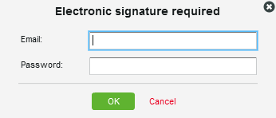
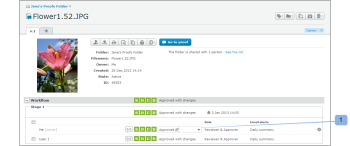
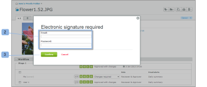
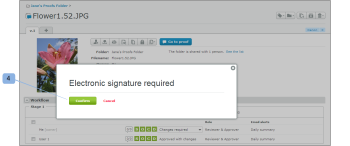
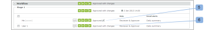

# Explicación de las firmas electrónicas en [!DNL Workfront Proof]

>[!IMPORTANT]
>
>Este artículo hace referencia a la funcionalidad del producto independiente [!DNL Workfront Proof]. Para obtener información sobre la revisión dentro de [!DNL Adobe Workfront], consulte [Revisión](../../../review-and-approve-work/proofing/proofing.md).

Las firmas electrónicas le permiten mejorar la seguridad de sus pruebas y cumplir con los estándares del sector, como ISO.

Esta configuración puede hacerse obligatoria o no obligatoria en el nivel de cuenta. Si es obligatoria de forma predeterminada, está habilitada en todas las pruebas creadas en su cuenta y no se puede deshabilitar en el nivel de prueba. Si esta configuración no es obligatoria de forma predeterminada, podrá habilitarla o deshabilitarla en el nivel de prueba.

Para obtener más información, consulte.

Cuando la configuración de firma electrónica está habilitada en una prueba, un cuadro de firma electrónica solicita a cualquier revisor que tome una decisión sobre la prueba para proporcionar su correo electrónico y contraseña.

## Firmas electrónicas en la página [!UICONTROL Detalles de la revisión]

Si un revisor toma su decisión seleccionando su decisión en la página [!UICONTROL Detalles de la revisión] (1), aparecerá un cuadro emergente de [!UICONTROL Firma electrónica] en el que se le pedirá que introduzca sus detalles (2) y que confirme su decisión (3).

La ventana emergente mostrará el conjunto de mensajes predeterminado (si lo hay) y el revisor deberá introducir su correo electrónico y contraseña.

La ventana emergente [!UICONTROL Firma electrónica] aparecerá en el visor de corrección y también en la página [!UICONTROL Detalles de la revisión] si el revisor decide tomar su decisión a partir de ese nivel.

Si la opción [!UICONTROL Inicio de sesión único] está habilitada en la revisión, los detalles del correo electrónico y la contraseña no se mostrarán en la ventana emergente [!UICONTROL Firma electrónica] al tomar una decisión.

En su lugar, después de hacer clic en el botón [!UICONTROL Confirmar] (4) de esta ventana emergente, el revisor será redirigido a la página [!UICONTROL Inicio de sesión único].

Después de escribir sus credenciales de SSO, el revisor se redirigirá automáticamente a la página [!UICONTROL Detalles de la revisión] (o a [!UICONTROL Visor de corrección] si la decisión se toma desde allí).

>[!NOTE]
>
> Si la decisión está firmada electrónicamente, el **[!UICONTROL icono de firma]** (5) aparece junto a la decisión en la sección [!UICONTROL Flujo de trabajo] de la página [!UICONTROL Detalles de la revisión]. Si la decisión no la modifica el revisor, sino otra persona con derechos de edición sobre la revisión, no se le pedirá que firme electrónicamente la decisión y no habrá ningún icono de firma junto a la decisión (6).

Para obtener más información sobre el inicio de sesión único, consulte [Inicio de sesión único en Workfront Proof](../../../workfront-proof/wp-acct-admin/managing-security/single-sign-on-overview.md).

Para obtener información sobre la página de detalles de la revisión, consulte [Administrar detalles de la revisión en en  [!DNL Workfront] Revisión](../../../workfront-proof/wp-work-proofsfiles/manage-your-work/manage-proof-details.md).
