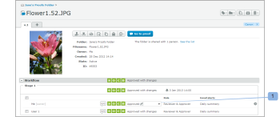

# Explicación de las firmas electrónicas en [!DNL Workfront Proof]

>[!IMPORTANT]
>
>Este artículo se refiere a la funcionalidad en el producto independiente [!DNL Workfront Proof]. Para obtener información sobre pruebas en el interior [!DNL Adobe Workfront], consulte [Prueba](../../../review-and-approve-work/proofing/proofing.md).

Las firmas electrónicas le permiten mejorar la seguridad de sus pruebas y cumplir con las normas del sector, como ISO.

Esta configuración puede hacerse obligatoria o no obligatoria en el nivel de cuenta. Si es obligatorio de forma predeterminada, está habilitado en todas las pruebas creadas en la cuenta y no se puede deshabilitar en el nivel de prueba. Si esta configuración no es obligatoria de forma predeterminada, puede habilitarla o deshabilitarla a nivel de prueba.

Para obtener más información, consulte .

Cuando la configuración de firma electrónica está habilitada en una prueba, un cuadro de firma electrónica solicita a cualquier revisor que tome una decisión sobre la prueba que proporcione su correo electrónico y contraseña.

## Firmas electrónicas en el [!UICONTROL Detalles de la prueba] Página

Si un revisor toma una decisión al seleccionar su decisión sobre la variable [!UICONTROL Detalles de la prueba] página (1) y [!UICONTROL Firma electrónica] aparecerá un cuadro emergente pidiéndoles que introduzcan sus datos (2) y confirmen su decisión (3).

La ventana emergente mostrará el conjunto de mensajes predeterminado (si lo hay) y el revisor deberá introducir su correo electrónico y contraseña.

La variable [!UICONTROL Firma electrónica] la ventana emergente se mostrará en el visor de pruebas y también en el [!UICONTROL Detalles de la prueba] si el revisor decide tomar una decisión a partir de ese nivel.

Si la variable [!UICONTROL Inicio de sesión único] está activada en la prueba, los detalles de correo electrónico y contraseña no se muestran en la variable [!UICONTROL Firma electrónica] aparece al tomar una decisión.

En su lugar, después de hacer clic en el botón [!UICONTROL Confirmar] (4) en esta ventana emergente, el revisor se redirigirá al [!UICONTROL Inicio de sesión único] página.

Después de introducir sus credenciales de SSO, el revisor se redirigirá automáticamente al [!UICONTROL Detalles de la prueba] (o vuelva a la página [!UICONTROL Visor de pruebas] si la decisión se toma a partir de ahí).

>[!NOTE]
>
> Si la decisión se firma electrónicamente, la variable **[!UICONTROL icono de firma]** (5) aparece junto a la decisión en el [!UICONTROL Flujo de trabajo] en la sección [!UICONTROL Detalles de la prueba] página. Si la decisión no la cambia el revisor, sino otra persona que tenga derechos de edición en la prueba, no se le pedirá a esa persona que firme electrónicamente la decisión y no habrá ningún icono de firma junto a la decisión (6).

Para obtener información sobre el inicio de sesión único, consulte [Inicio de sesión único en la prueba de Workfront](../../../workfront-proof/wp-acct-admin/managing-security/single-sign-on-overview.md).

Para obtener información sobre la página de detalles de la prueba, consulte [Administrar detalles de prueba en [!DNL Workfront] Prueba](../../../workfront-proof/wp-work-proofsfiles/manage-your-work/manage-proof-details.md).
