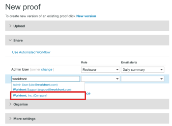
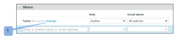
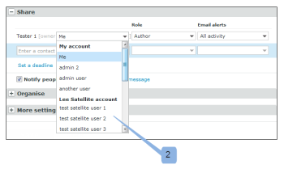

# Compartir elementos con un socio en [!DNL Workfront Proof]

>[!IMPORTANT]
>
>Este artículo se refiere a la funcionalidad del producto independiente [!DNL Workfront Proof]. Para obtener información sobre la revisión en [!DNL Adobe Workfront], consulte [Revisión](../../../review-and-approve-work/proofing/proofing.md).

Si tiene una relación de socio de [!DNL Workfront Proof] con otra organización (como un cliente u otro departamento de su compañía), puede compartir pruebas, archivos, carpetas y detalles de contacto con el socio. Para obtener más información acerca de las relaciones con los socios, consulte [Administrar una relación de socio entre cuentas de Workfront Proof](../../../workfront-proof/wp-acct-admin/partner-accounts/manage-partner-relationship-between-wp-accts.md).

## Acerca del uso compartido de elementos con un socio

Tenga en cuenta lo siguiente a la hora de compartir elementos con un socio:

* Puede elegir un usuario en una cuenta de socio para que sea el propietario de una prueba solo si es la nueva prueba que está creando. No puede hacerlo para una prueba existente o una nueva versión de la misma.
* Cuando comparte un elemento con un socio, pasa los derechos de edición para la prueba a los supervisores y administradores en la cuenta de socio. Los supervisores y administradores de la cuenta en la que se creó la prueba ya no tienen derechos de edición sobre ella (incluido el creador). Para obtener más información acerca de los permisos en [!DNL Workfront], consulte [Perfiles de permisos de revisión en  [!DNL Workfront] Revisión](../../../workfront-proof/wp-acct-admin/account-settings/proof-perm-profiles-in-wp.md).
* La prueba se almacena en la cuenta a la que pertenece la prueba (no en la cuenta en la que se creó).
* La marca de la prueba se toma de la cuenta a la que pertenece la prueba (no de la cuenta en la que se creó).

## Uso compartido de elementos con un socio

Después de tener una relación aceptada con un socio, puede compartir fácilmente elementos, como carpetas, archivos y pruebas con ellos.

1. Empiece a compartir una prueba o un archivo.\
   Para obtener más información acerca del uso compartido, consulte [Compartir una prueba en [!DNL Workfront Proof]](../../../workfront-proof/wp-work-proofsfiles/share-proofs-and-files/share-proof.md) [Compartir archivos en [!DNL Workfront Proof]](../../../workfront-proof/wp-work-proofsfiles/share-proofs-and-files/share-files.md) y [Compartir carpetas en [!DNL Workfront Proof]](../../../workfront-proof/wp-work-proofsfiles/organize-your-work/share-folders.md).

1. En la sección **[!UICONTROL Compartir]** de la página [!UICONTROL Nueva prueba] o [!UICONTROL Nuevo archivo], el nombre de su socio aparecerá cuando empiece a escribir el nombre en el campo de autocompletar, como si estuviera compartiendo con otro usuario del sistema.\
   

## Hacer que un usuario de una cuenta de socio sea el propietario de la prueba

Si ha configurado relaciones de socio con otras cuentas de [!DNL Workfront Proof], puede seleccionar un usuario de una cuenta de socio para que sea el propietario de la prueba.

>[!NOTE]
>
>Puede seleccionar un usuario de una cuenta de socio solo si se cumplen las siguientes condiciones:
>
>* No hay campos personalizados
>* No se ha seleccionado ninguna carpeta
>* No se han aplicado etiquetas
>

Para hacer que un usuario de una cuenta de socio sea el propietario de una prueba:

1. En la página [!UICONTROL Nueva prueba], haga clic en el vínculo **[!DNL Change]**. (1)\
   

1. Elija un usuario de una cuenta de Partner para que sea el propietario de la prueba. (2)\
   
