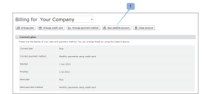
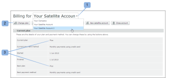
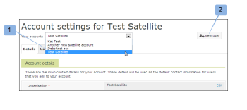

# Configuración de una cuenta satélite en [!DNL Workfront Proof]

>[!IMPORTANT]
>
>Este artículo se refiere a la funcionalidad del producto independiente [!DNL Workfront Proof]. Para obtener información sobre la revisión en [!DNL Adobe Workfront], consulte [Revisión](../../../review-and-approve-work/proofing/proofing.md).

Las cuentas satélite son cuentas de pago configuradas y administradas desde su propia cuenta de [!DNL Workfront Proof]. Para obtener más información, vea [Cuentas satélite en [!DNL Workfront] Proof](../../../workfront-proof/wp-acct-admin/satellite-accounts/sat-accts-in-wp.md).

Cualquier administrador de facturación puede crear una cuenta satélite. Para obtener información sobre los administradores de facturación, consulte [[!UICONTROL Perfiles de permisos de revisión] en [!DNL Workfront Proof]](../../../workfront-proof/wp-acct-admin/account-settings/proof-perm-profiles-in-wp.md).

>[!NOTE]
>
> Las cuentas satélite deben estar definidas en uno de nuestros planes [!UICONTROL Estándar] o superiores.

## Creación de una cuenta satélite {#creating-a-satellite-account}

Para crear una cuenta satélite, haga lo siguiente:

1. Vaya a la página [!UICONTROL Facturación].\
   Para obtener más información acerca de la página de facturación, consulte [La página Facturación de  [!DNL Workfront Proof] ](../../../workfront-proof/wp-billingsettings/manage-your-billing/wp-billing-page.md).

1. Haga clic en el botón **[!UICONTROL Nueva cuenta satélite]**. (1)

   Aparece una ventana emergente.

   

1. Introduzca los detalles de su cliente, incluidos los códigos promocionales relevantes.
1. Haga clic en **[!UICONTROL Guardar]**. La cuenta satélite aparece de forma automática en el menú desplegable [!UICONTROL Cuentas], en la parte superior de la página [!UICONTROL Facturación].
1. Seleccione la nueva cuenta satélite del menú desplegable.
1. Continúe con [Selección de un plan para su cuenta satélite](#selecting-a-plan-for-your-satellite-account) para actualizar su cuenta satélite.

## Selección de un plan para su cuenta satélite {#selecting-a-plan-for-your-satellite-account}

Después de configurar la cuenta satélite como se describe en [Creación de una cuenta satélite](#creating-a-satellite-account), debe actualizarla al plan deseado.

1. Vaya a la página [!UICONTROL Facturación].\
   Para obtener más información acerca de la página de facturación, consulte [La página Facturación de  [!DNL Workfront Proof] ](../../../workfront-proof/wp-billingsettings/manage-your-billing/wp-billing-page.md).

1. En el menú desplegable **[!UICONTROL Sus cuentas]**, que se encuentra en la parte superior de la página (1), elija la cuenta satélite correspondiente.

   Aparecerá la página de facturación de la cuenta satélite y los detalles de contacto de facturación de su cuenta se replicarán de forma automática.

   

1. Haga clic en el botón **[!UICONTROL Cambiar plan]** en la esquina superior derecha de la página. (2)\
   O\
   Abra la ventana emergente haciendo clic en el nombre del plan actual o el siguiente. (3)

1. Actualización o bajada de categoría de su plan.

## Adición de usuarios a su cuenta satélite

Después de haber actualizado la cuenta satélite al plan elegido, debe añadir usuarios a la cuenta.

1. Inicie sesión en [!DNL Workfront Proof] como administrador de [!DNL Workfront Proof].
1. Haga clic en **[!UICONTROL Configuración de la cuenta]**.
1. En el menú desplegable de la parte superior de la página, seleccione la cuenta satélite correspondiente. (1)\
   Aparecerá la página de configuración de la cuenta de satélite.
1. Haga clic en el botón **[!UICONTROL Nuevo usuario]** en la parte superior derecha de la página. (2)\
   Se muestra la página [!DNL New User].

1. Escriba los detalles del usuario y haga clic en **[!UICONTROL Guardar]**.\
   El usuario recibe una notificación por correo electrónico que le da acceso a la cuenta.

Los usuarios añadidos a la cuenta satélite aparecen como miembros en la lista de contactos de la cuenta central.

Del mismo modo, los usuarios de la cuenta hub aparecen como miembros en los contactos de la cuenta Satellite.

Para ver una lista completa de todos los usuarios en la cuenta satélite, haga clic en la pestaña **[!UICONTROL Usuarios]**.

## Vinculación de cuentas independientes existentes a su cuenta central

Si creó anteriormente otras cuentas independientes para sus clientes, estas se pueden convertir en cuentas satélite.

Nos encargaremos de esto al vincularlas a su cuenta de [!DNL Workfront Proof] (convirtiéndola en una cuenta central).

Todo lo que debe hacer es proporcionarnos los siguientes detalles:

* El nombre de su cuenta de [!DNL Workfront Proof] y la dirección de correo electrónico que utilizó para configurarla
* Los nombres de las cuentas independientes que desea vincular a su cuenta y las direcciones de correo electrónico utilizadas para configurar las cuentas independientes.
