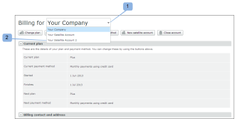
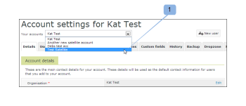

# Administrar una cuenta satélite en [!DNL Workfront Proof]

>[!IMPORTANT]
>
>Este artículo hace referencia a la funcionalidad del producto independiente [!DNL Workfront Proof]. Para obtener información sobre la revisión dentro de [!DNL Adobe Workfront], consulte [Revisión](../../../review-and-approve-work/proofing/proofing.md).

Como administrador de [!DNL Workfront Proof], puede administrar una cuenta satélite configurada en la cuenta de su organización.

## Actualizando información de facturación

Para ver y administrar los detalles de facturación de su cuenta satélite:

1. Vaya a la página [!UICONTROL Facturación].
1. Abra el menú desplegable en la parte superior de la página (1) y elija la cuenta satélite correspondiente. (2)

   Para obtener más información, consulte &quot; [La [!DNL Workfront Proof] [!UICONTROL página de facturación]](../../../workfront-proof/wp-billingsettings/manage-your-billing/wp-billing-page.md).

   

## Actualización de Información de Cuenta

Para ver y administrar la configuración de la cuenta de satélite:

1. Vaya a [!UICONTROL Configuración de la cuenta] en la parte superior de la página.
1. Haga clic en el menú desplegable **[!UICONTROL Sus cuentas]** y, a continuación, elija la cuenta satélite correspondiente. (1)
1. Haga clic en la pestaña correspondiente para administrar la configuración de la cuenta de satélite.

