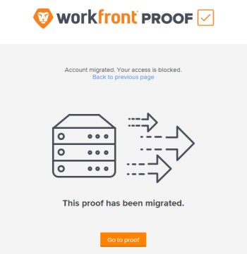

# Preguntas frecuentes: Migración de [!UICONTROL Workfront Proof] de EE. UU. a EMEA

>[!IMPORTANT]
>
>Este artículo hace referencia a la funcionalidad del producto independiente [!DNL Workfront Proof]. Para obtener información sobre la revisión dentro de [!DNL Adobe Workfront], consulte [Revisión](../../../review-and-approve-work/proofing/proofing.md).

## ¿Cómo sé si este cambio afecta a mi organización?

[!DNL Workfront] contactará directamente con todas las organizaciones afectadas por la migración de [!DNL Workfront Proof] de EE. UU. a EMEA.

## ¿Tengo que hacer algo para prepararme para la migración?

Sí. Antes de la migración, asegúrese de añadir lo siguiente a la lista de permitidos de su organización:

**[!DNL webcapture.proofhq.eu]**

## ¿Cuánto tardará la migración de mi cuenta?

Durante un período de tiempo reducido, de hasta dos horas, su cuenta no estará accesible mientras la migramos a su nueva ubicación en el centro de datos de EMEA.

Una vez completada la migración de cuentas, empezaremos a trasladar todos sus archivos desde nuestro centro de datos de EE. UU. al centro de datos de EMEA. Mientras se mueven los archivos, se podrá acceder a ellos desde el centro de datos de EE. UU. Este proceso tendrá lugar en segundo plano y no le afectará a usted ni a sus usuarios.

Una vez finalizada la migración, usted y sus usuarios solo podrán acceder a los archivos y pruebas desde el centro de datos de EMEA.

## ¿Qué pasará con la URL que uso para acceder a [!DNL Workfront Proof]?

Esta URL no se modificará. Podrá acceder al sistema de [!DNL Workfront] exactamente igual que lo ha hecho hasta ahora.

## ¿Puedo seguir utilizando mis antiguos vínculos y marcadores de pruebas?

Los marcadores específicos de las pruebas dejarán de funcionar tras la migración. Todo aquel que utilice uno recibirá un mensaje que le permitirá acceder a la prueba a través de un botón [!UICONTROL Ir a la prueba]:

## ¿Seguirán siendo mi nombre de usuario y mi contraseña los mismos que antes?

Sí, su nombre de usuario y contraseña seguirán siendo exactamente los mismos que hasta ahora.

## ¿Puedo seguir interactuando con las cuentas de prueba con las que estoy asociado en EE. UU.?

No, cualquier acceso que tuviera a cuentas anteriores de prueba de EE. UU. ya no estará disponible. Su cuenta en EMEA está completamente desvinculada del entorno de EE. UU. El objetivo es garantizar la seguridad de sus datos y el cumplimiento de la legislación de la UE sobre protección de datos.

Si tiene otra cuenta en EE. UU. con la que está asociado y debe mantener esta asociación, los propietarios de esa cuenta deben migrar con la suya. Hable de esto con ellos antes de la migración para asegurarse de que se migran las cuentas correctas.

## ¿Qué ocurre si utilizo SSO en mi cuenta?

Si utiliza SSO en su cuenta de pruebas, deberá volver a configurar la cuenta para que utilice el nuevo dominio [!DNL proofhq.eu].
