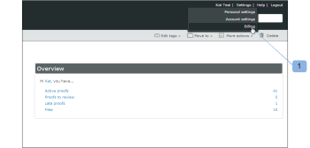
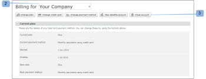
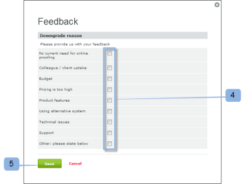
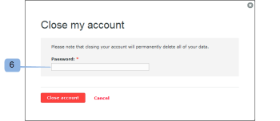

# Cerrar su cuenta de [!DNL Workfront Proof]

>[!IMPORTANT]
>
>Este artículo hace referencia a la funcionalidad del producto independiente [!DNL Workfront Proof]. Para obtener información sobre la revisión dentro de [!DNL Adobe Workfront], consulte [Revisión](../../../review-and-approve-work/proofing/proofing.md).

Después de completar los pasos de esta sección, su cuenta se cerrará inmediatamente. Todos los datos de su cuenta se eliminarán y no se podrán restaurar.

Estamos continuamente tratando de mejorar nuestro producto. Si desea cerrar su cuenta, le agradeceríamos que nos dedicara unos minutos y nos hiciera saber cómo podemos mejorar.

Puede comunicarse con nosotros en [!DNL support@proofhq.com] enviándonos sus comentarios; todos los comentarios son bienvenidos.

1. Abra la página [!UICONTROL Facturación] en su cuenta abriendo el menú [!UICONTROL Configuración] y eligiendo **[!UICONTROL Facturación]** (1).

   Para obtener más información sobre la página Facturación, consulte [La [!DNL Workfront] página de facturación de revisión](../../../workfront-proof/wp-billingsettings/manage-your-billing/wp-billing-page.md).

   

1. Haga clic en el botón **[!UICONTROL Cerrar cuenta]** (3).

   

1. Seleccione el motivo para cerrar la cuenta. (4)
1. Confirme su decisión haciendo clic en **[!UICONTROL Guardar]**. (5)

   

1. Escriba la contraseña para cerrar la cuenta. (6)

   
