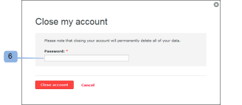

# Cierre las [!DNL Workfront Proof] account

>[!IMPORTANT]
>
>Este artículo se refiere a la funcionalidad en el producto independiente [!DNL Workfront Proof]. Para obtener información sobre pruebas en el interior [!DNL Adobe Workfront], consulte [Prueba](../../../review-and-approve-work/proofing/proofing.md).

Después de completar los pasos de esta sección, su cuenta se cerrará inmediatamente. Todos los datos de su cuenta se eliminarán y no se podrán restaurar.

Estamos tratando continuamente de mejorar nuestro producto. Si usted desea cerrar su cuenta, le agradeceríamos que se tome unos minutos y nos informe cómo podemos mejorar.

Puede ponerse en contacto con nosotros en [!DNL support@proofhq.com] con sus observaciones; todos los comentarios son bienvenidos.

1. Abra el [!UICONTROL Facturación] en su cuenta abriendo la variable [!UICONTROL Configuración] menú y selección **[!UICONTROL Facturación]** (1)

   Para obtener más información sobre la página Facturación, consulte [La variable [!DNL Workfront] Página Probar Facturación](../../../workfront-proof/wp-billingsettings/manage-your-billing/wp-billing-page.md).

   

1. Haga clic en el **[!UICONTROL Cerrar cuenta]** botón (3).

   

1. Seleccione el motivo para cerrar la cuenta. (4)
1. Confirme su decisión haciendo clic en **[!UICONTROL Guardar]**. (5)

   

1. Escriba la contraseña para cerrar la cuenta. (6)

   
