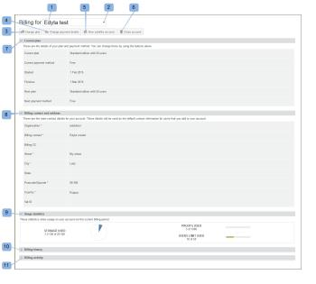
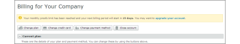

# La variable [!DNL Workfront Proof] Página Facturación

>[!IMPORTANT]
>
>Este artículo se refiere a la funcionalidad en el producto independiente [!DNL Workfront Proof]. Para obtener información sobre pruebas en el interior [!DNL Adobe Workfront], consulte [Prueba](../../../review-and-approve-work/proofing/proofing.md).

## La página Facturación

Para acceder a la [!UICONTROL Facturación] abra la página **[!UICONTROL Configuración]** en la parte superior derecha de la pantalla y seleccione **[!UICONTROL Facturación]** en el menú desplegable.

La variable [!UICONTROL Facturación] contiene lo siguiente:

* Nombre de la cuenta (1)
* Lista de cuentas (por ejemplo, si tiene cuentas satélite)(2)
* Plan de cambios (3)
* Cambio de los detalles de pago (4)
* Nueva cuenta satélite (5)
* Cerrar cuenta (6)
* Información actual del plan (7)
* Contacto y dirección de facturación (8)
* Estadísticas de uso (9)
* Historial de facturación (10)
* Actividad de facturación (11)

   

## [!UICONTROL Plan actual]

Esta sección (7) muestra los detalles de su plan actual, entre los que se incluyen los siguientes:

* Nombre del plan
* Método de pago actual
* Fechas de inicio y finalización del plan actual
* Tipo de plan siguiente
* Método de pago del plan siguiente

   Para obtener más información, consulte [Elegir el método de pago en [!DNL Workfront Proof]](../../../workfront-proof/wp-billingsettings/manage-your-billing/choose-payment-method-in-wp.md).

## [!UICONTROL Contacto y dirección de facturación]

Esta sección (8) muestra el contacto de facturación principal y los detalles de dirección de su cuenta.

El contacto Facturación solo se puede seleccionar entre los usuarios configurados como Administradores de facturación en la cuenta. En las cuentas de satélite, solo se pueden configurar en este campo los administradores de facturación de la cuenta principal.

>[!NOTE]
>
> Puede tener varios administradores de facturación en la cuenta, pero solo uno de ellos, seleccionado en el [!UICONTROL Contacto de facturación] , recibirá todas las notificaciones de facturación y alertas de uso de cuentas.

Esto incluye los siguientes correos electrónicos de notificación:

* Uso de la prueba
* Facturas
* Descargar
* Alerta de suspensión de cuentas/pagos atrasados
* Fallo en la tarjeta de crédito

   

La variable [!UICONTROL Facturación CC] también le permite añadir una dirección de correo electrónico para copiarla en todos los correos electrónicos relacionados con la facturación. Haga clic en el campo para activar la edición de inclusión e introduzca una dirección de correo electrónico de su elección (puede ser también una dirección de correo electrónico de un usuario existente).

## [!UICONTROL Dirección de facturación]

Esta sección utiliza la edición en línea, por lo que simplemente haga clic en los campos para introducir o editar el texto.

>[!NOTE]
>
> Incluimos esta dirección en sus facturas de suscripción, por lo que asegúrese de que estos datos estén siempre actualizados.

## [!UICONTROL Estadísticas de uso]

Esta sección muestra las estadísticas de uso de su cuenta durante el periodo de facturación actual, entre las que se incluyen las siguientes:

* Almacenamiento utilizado
* Pruebas utilizadas
* Límite de usuarios utilizado

### [!UICONTROL Advertencias de uso]

La variable [[!UICONTROL Perfiles de permisos de prueba] en [!DNL Workfront] Prueba](../../../workfront-proof/wp-acct-admin/account-settings/proof-perm-profiles-in-wp.md) establecido como Contacto de facturación (1) en su cuenta recibirá una notificación por correo electrónico cuando su cuenta alcance:

* 75% y luego 98% de su capacidad de almacenamiento
* 75 % y luego 100 % de su límite de prueba

Una vez que se alcancen las pruebas o los límites de almacenamiento, también verá las alertas en la parte superior del [!UICONTROL Facturación] página:

* Para el límite de pruebas alcanzado

   

* Para el límite de almacenamiento alcanzado

>[!NOTE]
>
>El recuento de pruebas se utiliza cuando se crean pruebas en la cuenta y no se puede restaurar eliminando las pruebas.

El espacio de almacenamiento se puede liberar eliminando las pruebas y los archivos y vaciando el [!UICONTROL Papelera] después.

Recuerde que si necesita más pruebas, almacenamiento o usuarios, puede actualizar su cuenta en cualquier momento; y tiene efecto inmediato.

## [!UICONTROL Historial de facturación]

Esta sección muestra la actividad de cualquier período de facturación reciente. También puede descargar sus facturas desde esta sección.

Para obtener más información, consulte &quot; [Descarga de [!DNL Workfront Proof] Factura](../../../workfront-proof/wp-billingsettings/manage-your-billing/download-wp-invoice.md).&quot;

## [!UICONTROL Actividad de facturación]

Esta sección muestra los cambios recientes en la configuración de facturación, por ejemplo: suscripciones, actualizaciones, descensos y renovaciones de su [!DNL Workfront Proof] Planificar.

Si cambia su plan a uno con un límite de usuarios más bajo (1), los usuarios que superen el nuevo límite se desactivarán automáticamente cuando se inicie el nuevo plan. Esta actividad también se capturará en los registros de cuenta (2).

