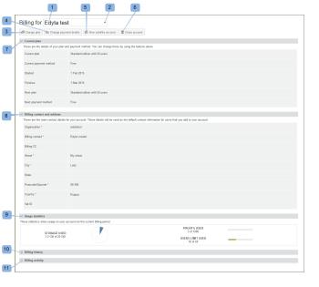
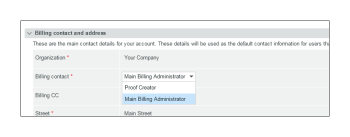
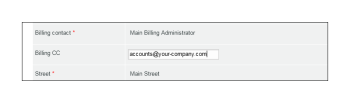
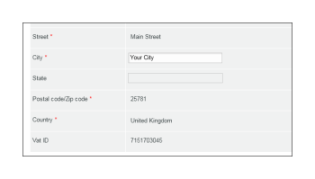
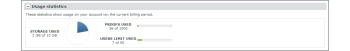
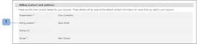
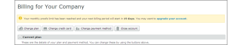
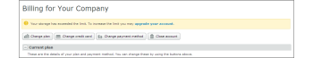
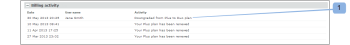
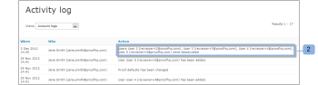

# La página de facturación de [!DNL Workfront Proof]

>[!IMPORTANT]
>
>Este artículo se refiere a la funcionalidad del producto independiente [!DNL Workfront Proof]. Para obtener información sobre la revisión en [!DNL Adobe Workfront], consulte [Revisión](../../../review-and-approve-work/proofing/proofing.md).

## La página de facturación

Para acceder a la página [!UICONTROL Facturación], abra el menú **[!UICONTROL Configuración]** en la parte superior derecha de la pantalla y elija **[!UICONTROL Facturación]** en el menú desplegable.

La página [!UICONTROL Facturación] contiene lo siguiente:

* Nombre de la cuenta (1)
* Lista de cuentas (por ejemplo, si tiene cuentas satélite)(2)
* Cambiar plan (3)
* Cambiar datos de pago (4)
* Nueva cuenta satélite (5)
* Cerrar cuenta (6)
* Información del plan actual (7)
* Contacto y dirección de facturación (8)
* Estadísticas de uso (9)
* Historial de facturación (10)
* Actividad de facturación (11)

  

## [!UICONTROL Plan actual]

Esta sección (7) muestra los detalles de su plan actual, incluidos los siguientes:

* El nombre del plan
* Método de pago actual
* Fechas de inicio y finalización del plan actual
* Siguiente tipo de plan
* Método de pago del siguiente plan

  Para obtener más información, consulte [Elección de la forma de pago en  [!DNL Workfront Proof]](../../../workfront-proof/wp-billingsettings/manage-your-billing/choose-payment-method-in-wp.md).

## [!UICONTROL Contacto y dirección de facturación]

Esta sección (8) muestra los detalles principales de contacto de facturación principal y de dirección de su cuenta.

El contacto de facturación solo se puede seleccionar entre los usuarios configurados como Administradores de facturación en su cuenta. En las cuentas satélite, solo se pueden definir en este campo los administradores de facturación de la cuenta principal.

>[!NOTE]
>
> Puede tener varios administradores de facturación en su cuenta, pero solo uno de ellos, seleccionado en el campo [!UICONTROL Contacto de facturación], recibirá todas las notificaciones de facturación y alertas de uso de la cuenta.

Esto incluye los siguientes correos electrónicos de notificación:

* Uso de revisión
* Facturas
* Bajar de categoría
* Alerta de pago atrasado/suspensión de cuenta
* Error de tarjeta de crédito

  

El campo [!UICONTROL Facturación CC] también le permite añadir una dirección de correo electrónico para que se copie en todos los correos electrónicos relacionados con la facturación. Haga clic en el campo para activar la edición en línea e introduzca una dirección de correo electrónico de su elección (puede ser también la dirección de correo electrónico de un usuario existente).

## [!UICONTROL Dirección de facturación]

Esta sección utiliza la edición en línea, por lo que solo tiene que hacer clic en los campos para introducir o editar el texto.

>[!NOTE]
>
> Incluimos esta dirección en sus facturas de suscripción para asegurarse de que estos datos estén siempre actualizados.

## [!UICONTROL Estadísticas de uso]

Esta sección muestra las estadísticas de uso de su cuenta dentro del período de facturación actual, incluidas las siguientes:

* Almacenamiento utilizado
* Pruebas utilizadas
* Límite de usuarios utilizado

### [!UICONTROL Advertencias de uso]

Los [[!UICONTROL perfiles de permisos de prueba] en [!DNL Workfront] Prueba](../../../workfront-proof/wp-acct-admin/account-settings/proof-perm-profiles-in-wp.md) establecidos como contacto de facturación (1) en su cuenta recibirán una notificación por correo electrónico cuando esta llegue a:

* Un 75 % y, posteriormente, un 98 % de la capacidad de almacenamiento
* Un 75% y, posteriormente, un 100 % del límite de pruebas

Una vez que se alcancen los límites de pruebas o de almacenamiento, aparecerán las alertas en la parte superior de la página [!UICONTROL Facturación]:

* Para el límite de pruebas alcanzado

  

* Para el límite de almacenamiento alcanzado

>[!NOTE]
>
>El recuento de pruebas se termina cuando se crean pruebas en su cuenta y no se puede restaurar eliminándolas.

Se puede liberar espacio de almacenamiento eliminando las pruebas y los archivos y vaciando la [!UICONTROL Papelera] posteriormente.

Recuerde que, si necesita más pruebas, almacenamiento o usuarios, puede actualizar su cuenta en cualquier momento y con efecto inmediato.

## [!UICONTROL Historial de facturación]

Esta sección muestra la actividad de los períodos de facturación recientes. También puede descargar sus facturas desde esta sección.

Para obtener más información, consulte “[Descargar [!DNL Workfront Proof] factura](../../../workfront-proof/wp-billingsettings/manage-your-billing/download-wp-invoice.md)”.

## [!UICONTROL Actividad de facturación]

Esta sección muestra los cambios recientes en su configuración de facturación, como suscripciones, actualizaciones, reducciones y renovaciones de plan [!DNL Workfront Proof].

Si se cambia el plan a uno con un límite de usuarios inferior (1), se desactivará automáticamente a quienes excedan el nuevo límite cuando comience el nuevo plan. Esta actividad también se guarda en los Registros de la cuenta (2).

