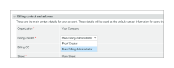

# La página de facturación [!DNL Workfront Proof]

>[!IMPORTANT]
>
>Este artículo hace referencia a la funcionalidad del producto independiente [!DNL Workfront Proof]. Para obtener información sobre la revisión dentro de [!DNL Adobe Workfront], vea [Revisión](../../../review-and-approve-work/proofing/proofing.md).

## La página Facturación

Para acceder a la página [!UICONTROL Facturación], abre el menú **[!UICONTROL Configuración]** en la parte superior derecha de la pantalla y elige **[!UICONTROL Facturación]** en el menú desplegable.

La página [!UICONTROL Facturación] contiene lo siguiente:

* Nombre de la cuenta (1)
* Lista de cuentas (por ejemplo, si tiene cuentas satélite)(2)
* Plan de cambios (3)
* Cambiar datos de pago (4)
* Nueva cuenta satélite (5)
* Cerrar cuenta (6)
* Información del plan actual (7)
* Contacto y dirección de facturación (8)
* Estadísticas de uso (9)
* Historial de facturación (10)
* Actividad de facturación (11)

  

## [!UICONTROL Plan actual]

Esta sección (7) muestra los detalles de su plan actual, incluidos los siguientes:

* El nombre del plan
* Método de pago actual
* Fechas de inicio y finalización del plan actual
* Siguiente tipo de plan
* Método de pago del plan siguiente

  Para obtener más información, consulte [Elección de la forma de pago en [!DNL Workfront Proof]](../../../workfront-proof/wp-billingsettings/manage-your-billing/choose-payment-method-in-wp.md).

## [!UICONTROL Contacto y dirección de facturación]

Esta sección (8) muestra el contacto de facturación principal y los detalles de dirección de su cuenta.

El contacto Facturación solo se puede seleccionar entre los usuarios configurados como Administradores de facturación en la cuenta. En las cuentas satélite, solo se pueden definir en este campo los administradores de facturación de la cuenta principal.

>[!NOTE]
>
> Puedes tener varios administradores de facturación en tu cuenta, pero solo uno de ellos, seleccionado en el campo [!UICONTROL Contacto de facturación], recibirá todas las notificaciones de facturación y alertas de uso de la cuenta.

Esto incluye los siguientes correos electrónicos de notificación:

* Uso de revisión
* Facturas
* Rebajar categoría
* Alerta de pago atrasado/suspensión de cuenta
* Error de tarjeta de crédito

  

El campo [!UICONTROL Facturación CC] también le permite agregar una dirección de correo electrónico para que se copie en todos los correos electrónicos relacionados con la facturación. Haga clic en el campo para activar la edición en línea e introduzca una dirección de correo electrónico de su elección (puede ser también la dirección de correo electrónico de un usuario existente).

## [!UICONTROL Dirección de facturación]

Esta sección utiliza la edición en línea, por lo que solo tiene que hacer clic en los campos para introducir o editar el texto.

>[!NOTE]
>
> Incluimos esta dirección en sus facturas de suscripción para asegurarse de que estos datos estén siempre actualizados.

## [!UICONTROL Estadísticas de uso]

Esta sección muestra las estadísticas de uso de su cuenta dentro del período de facturación actual, incluidas las siguientes:

* Almacenamiento utilizado
* Pruebas utilizadas
* Límite de usuarios utilizado

### [!UICONTROL Advertencias de uso]

Los [[!UICONTROL Perfiles de permisos de revisión] de [!DNL Workfront] Prueba](../../../workfront-proof/wp-acct-admin/account-settings/proof-perm-profiles-in-wp.md) establecidos como el Contacto de facturación (1) de su cuenta recibirán una notificación por correo electrónico cuando su cuenta llegue a:

* 75% y luego 98% de su capacidad de almacenamiento
* 75% y luego 100% del límite de prueba

Una vez que se alcancen las pruebas o los límites de almacenamiento, también verá las alertas en la parte superior de la página [!UICONTROL Facturación]:

* Para las pruebas, límite alcanzado

  

* Para el límite de almacenamiento alcanzado

>[!NOTE]
>
>El recuento de pruebas se utiliza cuando se crean pruebas en su cuenta y no se puede restaurar eliminando las pruebas.

Se puede liberar espacio de almacenamiento eliminando las pruebas y los archivos y vaciando la [!UICONTROL Papelera] posteriormente.

Recuerde que si necesita más pruebas, almacenamiento o usuarios, puede actualizar su cuenta en cualquier momento y tiene efecto inmediato.

## [!UICONTROL Historial de facturación]

Esta sección muestra la actividad de cualquier período de facturación reciente. También puede descargar sus facturas desde esta sección.

Para obtener más información, consulta &quot;[Descargando tu [!DNL Workfront Proof] factura](../../../workfront-proof/wp-billingsettings/manage-your-billing/download-wp-invoice.md)&quot;.

## [!UICONTROL Actividad de facturación]

Esta sección muestra los cambios recientes en la configuración de facturación, como suscripciones, actualizaciones, reducciones y renovaciones de su plan [!DNL Workfront Proof].

Si cambias tu plan a uno con un límite de usuarios inferior (1), los usuarios que excedan el nuevo límite serán desactivados automáticamente cuando comience el nuevo plan. Esta actividad también se registra en los registros de la cuenta (2).

