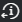

# Cambiar la configuración de alertas por correo electrónico para una revisión en [!DNL Workfront Proof]

>[!IMPORTANT]
>
>Este artículo hace referencia a la funcionalidad del producto independiente [!DNL Workfront Proof]. Para obtener información sobre la revisión dentro de [!DNL Adobe Workfront], consulte [Revisión](../../../review-and-approve-work/proofing/proofing.md).

También puede cambiar las alertas por correo electrónico de [!DNL Workfront Proof] que recibe para una revisión de la que es revisor.

## Cambiar las alertas por correo electrónico para los revisores de una revisión

1. Desde cualquier vista de lista, haga clic en el menú **[!UICONTROL More]** que se encuentra a la derecha de la prueba. 

1. Haga clic en **[!UICONTROL Ver detalles de la revisión]**
1. En la página **[!UICONTROL Detalles de la revisión]**, abra el menú desplegable [!UICONTROL alerta por correo electrónico] para un revisor y, a continuación, seleccione la nueva configuración.
1. (Opcional) Repita el paso 3 para cualquier otro revisor.

## Cambiar la configuración de alertas por correo electrónico para una revisión que está revisando

1. Abra la revisión en el Visor de corrección.
1. Haga clic en el icono [!UICONTROL Página de detalles] en la esquina inferior izquierda del visor de corrección. 

1. En la sección [!UICONTROL Flujo de trabajo] de la página [!UICONTROL Detalles de la revisión] que aparece, en **[!UICONTROL Alertas por correo electrónico]**, haga clic en la opción que desee en el menú desplegable.
