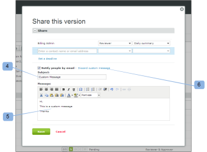

# Nuevo correo electrónico de prueba

>[!IMPORTANT]
>
>Este artículo hace referencia a la funcionalidad del producto independiente [!DNL Workfront Proof]. Para obtener información sobre la revisión dentro de [!DNL Adobe Workfront], vea [Revisión](../../../review-and-approve-work/proofing/proofing.md).

<!--

Make this article work better for PiW.

-->

Al crear una nueva prueba o versión de una prueba, agregar nuevas personas a una prueba o agregar un flujo de trabajo a una prueba, puede decidir si desea enviar un correo electrónico a los revisores, como se explica en estos artículos:

* [Creación de una prueba avanzada con un flujo de trabajo automatizado](../../../review-and-approve-work/proofing/creating-proofs-within-workfront/create-automated-proof-workflow.md)
* [Generar revisiones en  [!DNL Workfront Proof]](../../../workfront-proof/wp-work-proofsfiles/create-proofs-and-files/generate-proofs.md)

El correo electrónico que reciben los destinatarios se llama [!UICONTROL Nueva revisión]. Solo el creador de la prueba y los usuarios autorizados a agregar revisores a una prueba pueden controlar este correo electrónico. Los destinatarios no pueden deshabilitarlo.

El nuevo correo electrónico de prueba contiene:

* Su mensaje personal (si decide incluir uno)
* Si siempre envías el mismo mensaje personalizado a tus revisores, podría ser una buena idea guardarlo en tu [!UICONTROL configuración personal] en la pestaña [!UICONTROL Valores predeterminados de revisión]. Para obtener más información, consulte .
* Vínculo personal a la prueba
* **[!UICONTROL Ver detalles]** vínculo que lo lleva al objeto [!DNL Workfront] asociado (como un proyecto, tarea o problema)
* Miniatura de la imagen de prueba
* Los siguientes detalles de la prueba:

   * Nombre de revisión
   * Número de versión
   * Lista de revisores y su progreso en la prueba
   * Un vínculo para compartir la prueba con otra persona

     Esto le permite compartir la URL de prueba o el vínculo de descarga del archivo original. Esto no le permite añadir explícitamente revisores a la prueba, solo compartirá la URL de prueba pública y el destinatario recibirá acceso de solo lectura a la prueba.

     Consulte [Compartir una revisión en [!DNL Workfront Proof]](../../../workfront-proof/wp-work-proofsfiles/share-proofs-and-files/share-proof.md) para obtener más información.

     Si no deseas que este enlace aparezca en el correo electrónico de tu destinatario, puedes deshabilitar la configuración de [!UICONTROL Uso compartido público] en la revisión

     (Descargar archivo original y URL pública). Consulte [Administrar detalles de revisión en [!DNL Workfront Proof]](../../../workfront-proof/wp-work-proofsfiles/manage-your-work/manage-proof-details.md) para obtener más información.

## El registro de actividad

El envío de un correo electrónico [!UICONTROL Nueva prueba] a un revisor se ha registrado en la sección [!UICONTROL Actividad] de la página [!UICONTROL Detalles de la prueba]. Consulte [Administrar[!UICONTROL  detalles de revisión] en [!DNL Workfront Proof]](../../../workfront-proof/wp-work-proofsfiles/manage-your-work/manage-proof-details.md) para obtener más información. Puede comprobar si el correo electrónico [!UICONTROL Nueva revisión] se habilitó en el momento de crear una revisión.

>[!NOTE]
>
>* Si el creador o propietario de la prueba tiene [!UICONTROL Pruebas realizadas] correos electrónicos deshabilitados de forma predeterminada (en su configuración personal), no recibirá [!UICONTROL Pruebas realizadas] ni [!UICONTROL Nuevas pruebas] correos electrónicos aunque la casilla [!UICONTROL Notificar a las personas por correo electrónico] esté marcada en la página Nueva prueba. Para obtener más información, consulte .
>* Si las notificaciones por correo electrónico están deshabilitadas como predeterminadas en la [!UICONTROL configuración de la cuenta], el creador/propietario de la prueba no recibirá ningún correo electrónico de [!UICONTROL Prueba realizada] o [!UICONTROL Nueva prueba] aunque esté habilitado en su configuración personal y la casilla de verificación [!UICONTROL Notificar] a las personas por correo electrónico esté marcada en la página Nueva prueba. Para obtener más información, [Envíenos un correo electrónico a [!UICONTROL Prueba realizada]](../../../workfront-proof/wp-emailsntfctns/proof-notifications-and-reminders/proof-made-email.md) y consulte .
>

## Habilite el correo electrónico [!UICONTROL Nueva revisión] e incluya un mensaje personalizado

Puede especificar si desea enviar una alerta por correo electrónico a los revisores sobre una prueba cuando la cree o cuando añada a alguien a ella.

* [Al crear una prueba](#when-you-create-a-proof)
* [Cuando agrega un revisor a una prueba](#when-you-add-a-reviewer-to-a-proof)

### Al crear una prueba {#when-you-create-a-proof}

Cuando esté creando una nueva prueba en la página [!UICONTROL Nueva prueba], en la sección **[!UICONTROL Compartir]**, puede seleccionar si desea enviar alertas por correo electrónico:

* Aquí puedes decidir si quieres [!UICONTROL Notificar a las personas por correo electrónico] (1). Si anula la selección de esta opción, ninguno de los revisores recibirá un correo electrónico para informarles de que la prueba está lista para su revisión.
* También puede incluir un mensaje personalizado en la notificación por correo electrónico (2).
* Si decide añadir su propio mensaje personalizado, podrá colocar una línea de asunto personalizada (3) y un mensaje en el cuerpo del correo electrónico (4).
* Para descartar el mensaje personalizado, simplemente haga clic en el vínculo (5).

  >[!NOTE]
  >
  >Si siempre envía el mismo mensaje personalizado a los revisores, sería aconsejable guardarlo en la configuración personal de la ficha [!UICONTROL Valores predeterminados de revisión]. Para obtener más información, consulte .

### Cuando agrega un revisor a una prueba {#when-you-add-a-reviewer-to-a-proof}

Puede seleccionar si un revisor nuevo agregado a una prueba existente recibirá una notificación de la prueba (similar a la anterior).

* Primero, agregue nuevos revisores haciendo clic en el botón **[!UICONTROL Compartir esta versión]** en la página **[!UICONTROL Detalles de la prueba]** (1).

* Aparece un cuadro en el que puede agregar nuevos revisores. A continuación, puede decidir si desea que se les notifique por correo electrónico (2) y elegir añadir un mensaje personalizado al correo electrónico (3).

* Si decide añadir un mensaje personalizado, el cuadro se expande y podrá colocar una línea de asunto personalizada (4) y texto personalizado en el cuerpo del correo electrónico (5). También puede descartar el mensaje personalizado haciendo clic en el vínculo (6).

