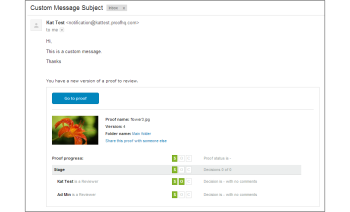

# Correo electrónico [!UICONTROL Nueva versión]

>[!IMPORTANT]
>
>Este artículo hace referencia a la funcionalidad del producto independiente [!DNL [!DNL Workfront Proof]]. Para obtener información sobre la revisión dentro de [!DNL [!DNL Adobe Workfront]], consulte [Revisión](../../../review-and-approve-work/proofing/proofing.md).

<!--

Does this apply to PiW?

-->

Se envían correos electrónicos informando de la nueva versión cuando se crea una [!UICONTROL Nueva versión] de una revisión. Puede personalizarlos y deshabilitarlos del mismo modo que los correos electrónicos de [!UICONTROL Nueva revisión].

>[!NOTE]
>
>Si las notificaciones por correo electrónico están deshabilitadas de forma predeterminada en [!UICONTROL Configuración de la cuenta], los revisores no recibirán ningún correo electrónico de [!UICONTROL Nueva versión] a menos que la casilla [!UICONTROL Notificar a las personas por correo electrónico] esté seleccionada en la página Nueva versión.

