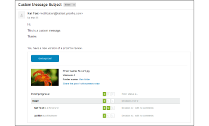

# La variable [!UICONTROL Nueva versión] email

>[!IMPORTANT]
>
>Este artículo se refiere a la funcionalidad en el producto independiente [!DNL [!DNL Workfront Proof]]. Para obtener información sobre pruebas dentro de [!DNL [!DNL Adobe Workfront]], consulte [Prueba](../../../review-and-approve-work/proofing/proofing.md).

<!--

Does this apply to PiW?

-->

Se envían correos electrónicos de nueva versión al crear una [!UICONTROL Nueva versión] de una prueba. Puede personalizarlos y deshabilitarlos del mismo modo que el [!UICONTROL Nueva prueba] correos electrónicos.

>[!NOTE]
>
>Si las notificaciones por correo electrónico están deshabilitadas de forma predeterminada en la variable [!UICONTROL Configuración de la cuenta], los revisores no recibirán ningún [!UICONTROL Nueva versión] los correos electrónicos a menos que [!UICONTROL Notificar a las personas por correo electrónico] está marcada en la página Nueva versión .

