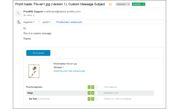
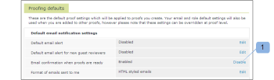

# Correo electrónico de [!UICONTROL Prueba realizada]

>[!IMPORTANT]
>
>Este artículo hace referencia a la funcionalidad del producto independiente [!DNL Workfront Proof]. Para obtener información sobre la revisión dentro de [!DNL Adobe Workfront], consulte [Revisión](../../../review-and-approve-work/proofing/proofing.md).

El correo electrónico de [!UICONTROL Prueba realizada] se envía al creador de la prueba solo cuando este ha creado una prueba. Si una persona ha creado una prueba y ha designado a otra persona como Propietario, el nuevo Propietario será el único que reciba también el correo electrónico de [!UICONTROL prueba realizada]. El Creador o el Propietario no recibirá ninguno; solo recibirá el correo electrónico de [!UICONTROL prueba realizada]. Para obtener más información sobre el correo electrónico de [!UICONTROL nueva prueba], consulte Correo electrónico de [[!UICONTROL nueva prueba]](../../../workfront-proof/wp-emailsntfctns/proof-notifications-and-reminders/new-proof-email.md).

Los usuarios pueden deshabilitar los correos electrónicos de [!UICONTROL prueba realizada] en la configuración de su perfil, como se explica a continuación.

>[!NOTE]
>
> Si el creador o propietario de la prueba tiene los correos electrónicos de [!UICONTROL prueba realizada] deshabilitados de forma predeterminada en su configuración personal, no recibirá ningún correo electrónico de [!UICONTROL prueba realizada] ni [!UICONTROL nueva prueba], aunque la casilla [!UICONTROL Notificar a las personas por correo electrónico] esté seleccionada en la página [!UICONTROL Nueva prueba].

Un correo electrónico de [!UICONTROL prueba realizada] incluye un mensaje personal (si se ha incluido) y los siguientes detalles de la prueba:

* Nombre de revisión
* Vínculo personal a la prueba
* Número de versión
* Miniatura de la prueba
* Progreso de revisión
* Un vínculo para compartir la prueba con otra persona
* Esto le permite compartir la URL de la prueba o el vínculo de descarga del archivo original.

>[!NOTE]
>
> El uso compartido de vínculos de las pruebas no permite añadir explícitamente revisores a la prueba, solo se comparte la URL de la prueba pública y el destinatario recibirá acceso de solo lectura a la prueba.

Consulte [Compartir una revisión en [!DNL Workfront Proof]](../../../workfront-proof/wp-work-proofsfiles/share-proofs-and-files/share-proof.md) para obtener más información.

Si no desea que este enlace aparezca en el correo electrónico del destinatario, debe deshabilitar la configuración de [!UICONTROL Uso compartido público] en la prueba ([!UICONTROL Descargar archivo original] y [!UICONTROL URL pública]).

## Deshabilitar el correo electrónico de [!UICONTROL prueba realizada]

1. Haga clic en **[!UICONTROL Configuración]** > **[!UICONTROL Configuración personal]**, abra la pestaña **[!UICONTROL Valores predeterminados de revisión]** y haga clic en **[!UICONTROL Deshabilitar]** junto a **[!UICONTROL Confirmación por correo electrónico cuando las pruebas estén listas]**.

1. 

1. Consulte [Configuración de notificaciones por correo electrónico en Workfront Proof](../../../workfront-proof/wp-emailsntfctns/email-alerts/config-email-notification-settings-wp.md) para obtener instrucciones más detalladas.
1. Si las notificaciones por correo electrónico están deshabilitadas de forma predeterminada en [!UICONTROL Configuración de la cuenta], el creador o el propietario de la prueba no recibirá ningún correo electrónico de [!UICONTROL prueba realizada] o [!UICONTROL nueva prueba], aunque tenga esta opción habilitada en su configuración personal y la casilla de verificación [!UICONTROL Notificar a las personas por correo electrónico] esté seleccionada en la página [!UICONTROL Nueva prueba].
