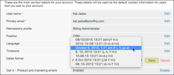

# Configuración de zonas horarias en [!DNL Workfront Proof]

>[!IMPORTANT]
>
>Este artículo hace referencia a la funcionalidad del producto independiente [!DNL Workfront Proof]. Para obtener información sobre la revisión dentro de [!DNL Adobe Workfront], consulte [Revisión](../../../review-and-approve-work/proofing/proofing.md).

[!DNL Workfront Proof] muestra la hora en la que se creó una prueba y la hora en la que se produjo cualquier actividad en la prueba, como plazos, decisiones y comentarios. De forma predeterminada, la hora se muestra en GMT.

Como usuario con su propia cuenta de [!DNL Workfront Proof], puede seleccionar su zona horaria en la configuración personal. Todas las horas de [!DNL Workfront] se mostrarán en esta zona horaria, incluso para una prueba creada por un usuario en una zona horaria diferente. Para obtener más información, consulte [Configuración personal.](https://support.workfront.com/hc/en-us/sections/115000921168-Personal-settings)

Todos los revisores invitados (usuarios sin su propia cuenta de [!DNL Workfront Proof]) verán todas las horas en la zona horaria del propietario de la prueba. Para obtener más información, consulte [Explicación de los usuarios, miembros e invitados en [!DNL Workfront Proof]](../../../workfront-proof/wp-mnguserscontacts/contacts/use-members-guests.md).

## Configuración de la zona horaria personal

1. Haga clic en **[!UICONTROL Configuración]** > **[!UICONTROL Configuración personal]** y, a continuación, abra la pestaña **[!UICONTROL Configuración]**.

1. (Opcional) Para cambiar el formato de las fechas y horas mostradas en su cuenta, edite el **[!UICONTROL formato de las fechas]**.\
   Si desea ver las horas mostradas en formato AM/PM, asegúrese de elegir la siguiente opción en el menú:

1. 

## Configuración de la zona horaria predeterminada de la organización

Si es administrador de cuentas, puede establecer una zona horaria predeterminada para su organización. Esta zona horaria se establece de forma predeterminada para todos los usuarios nuevos añadidos a la organización (sin embargo, el usuario individual puede cambiarla).

1. Haga clic en **[!UICONTROL Configuración]** > **[!UICONTROL Configuración personal]** y, a continuación, abra la pestaña **[!UICONTROL Configuración]**.

1. En **[!UICONTROL Detalles de la cuenta]**, haga clic en [!UICONTROL Editar] a la derecha de **[!UICONTROL Zona horaria predeterminada]** y realice el cambio.
