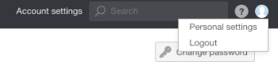
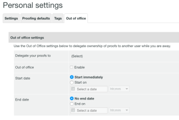
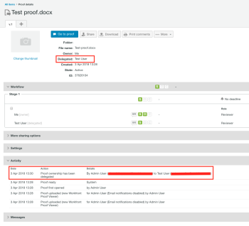

# Designando propietarios de revisión temporales en [!DNL Workfront Proof]

>[!IMPORTANT]
>
>Este artículo hace referencia a la funcionalidad del producto independiente [!DNL Workfront Proof]. Para obtener información sobre la revisión dentro de [!DNL Adobe Workfront], consulte [Revisión](../../../review-and-approve-work/proofing/proofing.md).

Si va a estar fuera de la oficina durante un período de tiempo prolongado, puede delegar la propiedad de las pruebas a otro usuario de la cuenta.

>[!NOTE]
>
>Esta función solo está disponible en [!DNL Workfront Proof].

Para designar la propiedad temporal de las pruebas:

1. En [!DNL Workfront Proof], vaya a **[!UICONTROL Configuración personal]**.\
   

1. Haga clic en la ficha **[!UICONTROL Fuera de la oficina]**. Las configuraciones disponibles son las siguientes:

   * **[!UICONTROL Delegue sus pruebas a]** otro usuario en su cuenta.
   * Habilite y deshabilite la función **[!UICONTROL Fuera de la oficina]** marcando o desmarcando la casilla de verificación.
   * Seleccione la **[!UICONTROL Fecha de inicio]**.

     Si se elige la opción **[!UICONTROL Iniciar inmediatamente]**, la propiedad de las pruebas se delegará al usuario seleccionado inmediatamente después de activar la característica.

     Si se establecen una fecha y hora de inicio específicas, la función se activará en el día y la hora seleccionados.

   * Seleccione la **[!UICONTROL Fecha de finalización]**.

     Si no se elige una fecha de finalización, la propiedad de las pruebas se delega hasta que la función se deshabilite manualmente.

     Si se establece una fecha y hora de finalización específicas, la función se desactivará en el día y la hora seleccionados.

     

1. Cuando se delegan las pruebas, se muestra el propietario delegado en la sección **[!UICONTROL Detalles]** de la página de detalles de la prueba. La nota de delegación de propiedad aparece en la sección **[!UICONTROL Actividad]** de la página de detalles de la prueba.

   

   También se muestra una notificación [!UICONTROL Fuera de la oficina] en la cuenta del propietario de la revisión original durante el tiempo en que la característica está habilitada. Esto sirve como recordatorio para el propietario original y también le permite finalizar la delegación inmediatamente o ir a [!UICONTROL Configuración personal] para ajustarla.

   

   Cuando el propietario original recupera la propiedad de las pruebas, el propietario delegado desaparece de la sección [!UICONTROL Detalles] de la página de detalles de prueba y la notificación [!UICONTROL Fuera de la oficina] ya no se muestra en la cuenta del propietario de la prueba original. Aparece una nota que muestra que la propiedad de la prueba se ha revertido en la sección [!UICONTROL Actividad] de la página de detalles de la prueba.

   >[!NOTE]
   >
   >El propietario delegado permanece en el flujo de trabajo de prueba a menos que se elimine manualmente.

   ![[!UICONTROL activity-section-taken-back].png](assets/activity-section-taken-back-350x99.png)
