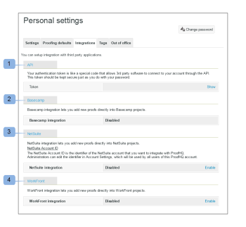

# Integraciones: configuración del usuario

>[!IMPORTANT]
>
>Este artículo hace referencia a la funcionalidad del producto independiente [!DNL Workfront Proof]. Para obtener información sobre la revisión dentro de [!DNL Adobe Workfront], consulte [Revisión](../../../review-and-approve-work/proofing/proofing.md).

Esta sección muestra las opciones que tiene para configurar vínculos de integración predefinidos con aplicaciones de terceros.

Aquí también puede encontrar el token de autenticación que permite que el software de terceros se conecte a su cuenta mediante la API.

Los puntos de integración actuales están disponibles para lo siguiente:

* API pública (1): consulte nuestra [página de ayuda de API](https://api.proofhq.com/) dedicada
* [!DNL Basecamp] (2): consulte nuestras páginas de ayuda [[!DNL Basecamp]](https://support.workfront.com/hc/es-es/sections/115000911927-Basecamp) y [[!DNL Basecamp Classic]](https://support.workfront.com/hc/es-es/categories/115000588707-Basecamp-Classic) dedicadas

* [!DNL NetSuite] (3)
* [!DNL WorkFront] (4)

