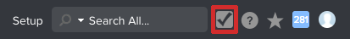

# Previsualizar entorno de prueba de zona protegida - [!DNL Workfront Proof]

>[!IMPORTANT]
>
>Este artículo hace referencia a la funcionalidad del producto independiente [!DNL Workfront Proof]. Para obtener información sobre la revisión dentro de [!DNL Adobe Workfront], vea [Revisión](../../../review-and-approve-work/proofing/proofing.md).

La zona protegida de vista previa es un entorno de prueba que sirve como réplica de su entorno activo y se actualiza cada fin de semana por [!DNL Workfront Proof].

## Explicación de la zona protegida de previsualización

La zona protegida de vista previa sirve como entorno en el que los usuarios de su organización pueden probar y trabajar con seguridad con datos del entorno de producción sin afectar al entorno de producción. Es ideal para ejecutar sesiones de formación, probar nuevas funciones y determinar la funcionalidad de la configuración.

Además, las nuevas funciones del producto se cargan en el entorno de vista previa de espacio aislado antes de enviarse al entorno de producción. Los usuarios pueden probar las nuevas funciones allí sin afectar al flujo de trabajo habitual en el entorno de producción.

La zona protegida de vista previa contiene los datos de producción reales. Los datos fluyen de Producción a Vista previa y no a la inversa. Se actualiza cada fin de semana, por lo que los datos pueden retrasarse hasta una semana respecto al entorno de producción. Los elementos creados desde la última actualización se encuentran en el entorno de vista previa de espacio aislado hasta la siguiente actualización.

## Acceso a la zona protegida de previsualización

De forma predeterminada, como administrador del sistema, tiene acceso al entorno de vista previa de espacio aislado. Si no puede acceder al entorno de vista previa de espacio aislado como se describe en esta sección, póngase en contacto con su administrador de [!DNL Workfront] o con nuestro equipo de asistencia.

* [Acceder a la vista previa de espacio aislado como cliente independiente [!DNL Workfront Proof] s](#accessing-the-preview-sandbox-as-a-stand-alone-workfront-proof-customer)
* [Acceder a la vista previa de espacio aislado como cliente de  [!DNL Workfront]+[!DNL Workfront Proof] &#x200B;](#accessing-the-preview-sandbox-as-a-workfrontworkfront-proof-customer)

### Acceder a la vista previa de espacio aislado como cliente independiente de [!DNL Workfront Proof]

1. Vaya a esta dirección URL: `https://preview.proofhq.com`.
1. Inicie sesión con sus credenciales de vista previa.\
   Las credenciales de vista previa deben ser las mismas que las de producción, a menos que las haya cambiado en Producción después de la actualización de la vista previa. Los inicios de sesión solo se sincronizan cuando se produce una actualización, que tiene lugar cada fin de semana. No se sincronizan automáticamente.

### Acceder a la vista previa de espacio aislado como cliente de revisión [!DNL Workfront+Workfront]

Como administrador del sistema, puede acceder a la zona protegida de vista previa [!DNL Workfront Proof] a través de la interfaz [!DNL Workfront].

Para acceder a la zona protegida de vista previa [!DNL Workfront Proof]:

1. Inicie sesión en su entorno de [!DNL Workfront].
1. Haga clic en **[!UICONTROL Configuración]** en la barra de navegación global.
1. Haga clic en **[!UICONTROL Sistema]** >**[!UICONTROL Preferencias]**.

1. En la sección **[!UICONTROL Entornos de prueba]**, haga clic en **[!UICONTROL Vista previa de espacio aislado]**.

1. Inicie sesión con sus credenciales de vista previa.\
   Las credenciales de vista previa deben ser las mismas que las de producción, a menos que las haya cambiado en Producción después de actualizar la vista previa. Los inicios de sesión solo se sincronizan cuando se produce una actualización. No se sincronizan automáticamente.
1. Haga clic en el icono [!DNL Workfront Proof] en la barra de navegación global.\
   \
   Se muestra el entorno de vista previa [!DNL Workfront Proof].

## Recepción de correos electrónicos desde la zona protegida de previsualización

Las notificaciones por correo electrónico nunca se activan desde el entorno de vista previa [!DNL Workfront Proof].
