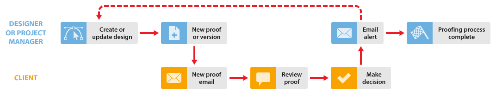

# Proceso de revisión básico en [!DNL Workfront Proof]

<!-- Audited: 5/2025 -->

>[!IMPORTANT]
>
>Este artículo hace referencia a la funcionalidad del producto independiente [!DNL Workfront Proof]. Para obtener información sobre la revisión dentro de [!DNL Adobe Workfront], vea [Revisión: índice de artículo](../../../review-and-approve-work/proofing/proofing.md).

En este ejemplo se explica el flujo de trabajo básico entre un diseñador o jefe de proyecto y uno o varios revisores, como un cliente. Puede repetir este proceso hasta que se apruebe la prueba.

* **Crear nueva prueba**: el diseñador o el administrador del proyecto crea una nueva prueba en [!DNL Workfront Proof] y la comparte con el cliente. Para obtener más información, consulte [Generar pruebas en [!DNL Workfront Proof]](../../../workfront-proof/wp-work-proofsfiles/create-proofs-and-files/generate-proofs.md).

* **Nuevo correo electrónico de revisión**: el cliente recibe un correo electrónico que contiene un vínculo a la revisión.

* **Revisar una revisión**: El cliente revisa la revisión, agrega comentarios y toma una decisión. Para obtener más información, consulte [Revisar pruebas en [!DNL Adobe Workfront]: índice de artículos](../../../review-and-approve-work/proofing/reviewing-proofs-within-workfront/review-proofs-in-wf.md) y [Tomar una decisión sobre una prueba en el visor de revisiones](../../../review-and-approve-work/proofing/reviewing-proofs-within-workfront/make-a-decision-on-a-proof/make-decisions-on-proof.md).

* **Alerta por correo electrónico**: el diseñador o el administrador del proyecto recibe un correo electrónico con un resumen de la revisión del cliente, en función de las alertas de correo electrónico que hayan establecido. Para obtener más información, consulte [Configurar las notificaciones por correo electrónico en [!DNL Workfront Proof]](../../../workfront-proof/wp-emailsntfctns/email-alerts/config-email-notification-settings-wp.md).

* **Nueva versión** (si es necesario): el diseñador o el administrador del proyecto modifica el archivo y lo sube a [!DNL Workfront Proof] como una nueva versión.

