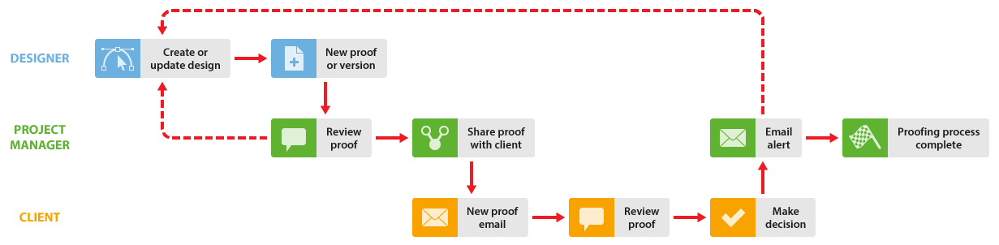
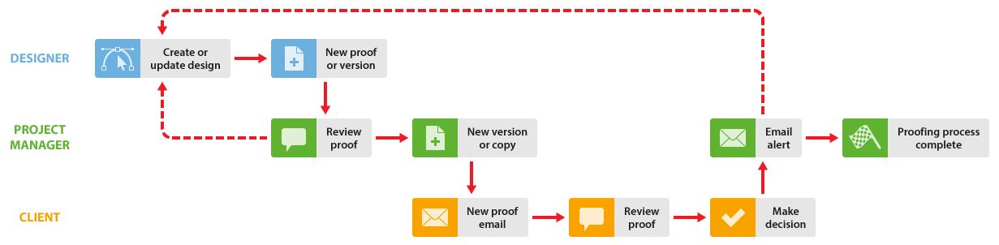

# Revisión interna y externa en [!DNL Workfront Proof]

>[!IMPORTANT]
>
>Este artículo hace referencia a la funcionalidad del producto independiente [!DNL Workfront Proof]. Para obtener información sobre la revisión dentro de [!DNL Adobe Workfront], consulte [Revisión](../../../review-and-approve-work/proofing/proofing.md).

Si su organización completa revisiones internas antes de compartir pruebas con clientes, sugerimos dos formas de utilizar [!DNL Workfront Proof] para mejorar el flujo de trabajo:

## Los clientes ven los comentarios internos

Esta opción ilustra un flujo de trabajo en el que los clientes pueden ver todos los comentarios internos.

El diseñador comparte primero la prueba con el administrador del proyecto (y con cualquier otro compañero). Los compañeros revisan la prueba y, si la aprueban, puede utilizar la función de compartir para compartir la prueba con sus clientes. Para obtener más información, consulte [Compartir una prueba en [!DNL Workfront Proof]](../../../workfront-proof/wp-work-proofsfiles/share-proofs-and-files/share-proof.md).

1. **Crear una nueva prueba**: el diseñador crea una nueva prueba en [!DNL Workfront Proof] y la comparte con los revisores internos. El diseñador convierte al administrador del proyecto en el propietario de la prueba.
1. **Revisión interna**: el administrador del proyecto y otros compañeros revisan la revisión.
1. **Compartir prueba**: el administrador del proyecto comparte la revisión con el cliente.
1. **Correo electrónico de nueva prueba**: el cliente recibe el nuevo correo electrónico de prueba con el vínculo [!UICONTROL Ir a la prueba]. Para obtener más información, consulte [Correo electrónico de nueva prueba](../../../workfront-proof/wp-emailsntfctns/proof-notifications-and-reminders/new-proof-email.md).

1. **Revisar prueba**: se revisa la prueba, añade comentarios y toma una decisión.
1. **Alerta por correo electrónico**: el administrador del proyecto recibe una alerta por correo electrónico (según su configuración en la prueba). Para obtener más información, consulte [Configuración de notificaciones por correo electrónico en Workfront Proof](../../../workfront-proof/wp-emailsntfctns/email-alerts/config-email-notification-settings-wp.md).

1. **Solicitud de cambio**: el administrador de proyectos permite que el diseñador sepa sobre las solicitudes de cambio. Esto se puede hacer con la función de impresión de comentarios. Para obtener más información, consulte [Imprimir y exportar comentarios en [!DNL Workfront Proof]](../../../workfront-proof/wp-work-proofsfiles/organize-your-work/print-and-export-comments.md).

1. **Nueva versión** (si es necesario): el diseñador modifica el archivo y lo sube a [!DNL Workfront Proof] como una nueva versión. Para obtener más información, consulte.

Puede repetir este proceso hasta que se apruebe la prueba.

## El cliente solo ve su propia versión

Esta opción ilustra un flujo de trabajo en el que el proceso de revisión lo administra el administrador del proyecto, que crea cualquier versión nueva (según sea necesario) y comparte la prueba con el cliente. No es necesario que el diseñador participe en el proceso de revisión).

1. **Crear una nueva prueba**: el diseñador crea una nueva prueba en [!DNL Workfront Proof] y la comparte con revisores internos. El diseñador convierte al administrador del proyecto en el propietario de la prueba o, alternativamente, le asigna la función de [!UICONTROL Autor] en la prueba (consulte [Administrar funciones de prueba en [!DNL Workfront Proof]](../../../workfront-proof/wp-work-proofsfiles/share-proofs-and-files/manage-proof-roles.md)).

1. **Revisión interna**: el administrador del proyecto y otros compañeros revisan la revisión. Para obtener más información, consulte [Revisión de pruebas en el Visor de revisión web](https://support.workfront.com/hc/en-us/sections/115000275214-Reviewing-Proofs-in-the-Web-Proofing-Viewer) y [Revisión de pruebas en el Visor de corrección de escritorio](https://support.workfront.com/hc/en-us/sections/360000686434-Reviewing-Proofs-in-the-Desktop-Proofing-Viewer)

1. **Nueva versión**: el administrador del proyecto crea una nueva versión (o una copia) de la revisión y la comparte con el cliente. Ver [Copia de pruebas en [!DNL Workfront Proof]](../../../workfront-proof/wp-work-proofsfiles/create-proofs-and-files/copy-proofs.md) y [Compartir una prueba en [!DNL Workfront Proof]](../../../workfront-proof/wp-work-proofsfiles/share-proofs-and-files/share-proof.md).

1. **Correo electrónico de nueva prueba**: el cliente recibe el nuevo correo electrónico de prueba con un vínculo [!UICONTROL Ir a la prueba]. Para obtener más información, consulte [Correo electrónico de nueva prueba](../../../workfront-proof/wp-emailsntfctns/proof-notifications-and-reminders/new-proof-email.md).

1. **[!UICONTROL Revisar prueba]**: el cliente revisa la revisión, añade comentarios y toma una decisión.
1. El cliente solo puede ver la versión de la prueba que se ha compartido explícitamente con él; no podrá ver la versión interna.
1. **[!UICONTROL Alerta por correo electrónico]**: el administrador del proyecto recibe un correo electrónico con un resumen de la revisión del cliente (según su configuración en la prueba).
1. **Solicitud de cambio**: el administrador de proyectos permite que el diseñador sepa sobre las solicitudes de cambio. Esto se puede hacer con la función de impresión de comentarios. Para obtener más información, consulte [Imprimir y exportar comentarios en [!DNL Workfront Proof]](../../../workfront-proof/wp-work-proofsfiles/organize-your-work/print-and-export-comments.md).

1. **Nueva versión** (si es necesario): el diseñador modifica el archivo y lo sube a [!DNL Workfront Proof] como una nueva versión. Para obtener más información, consulte.

Puede repetir este proceso hasta que se apruebe la prueba.
