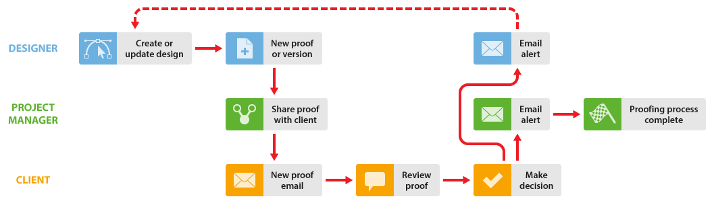
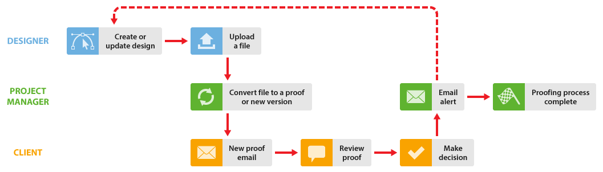

# Trabajo con diseñadores y gerentes de proyectos en [!DNL Workfront Proof]

>[!IMPORTANT]
>
>Este artículo hace referencia a la funcionalidad del producto independiente [!DNL Workfront Proof]. Para obtener información sobre la revisión dentro de [!DNL Adobe Workfront], consulte [Revisión](../../../review-and-approve-work/proofing/proofing.md).

Puede mejorar el flujo de trabajo de la corrección para el gerente del proyecto (la persona que gestiona el proceso de revisión) y el diseñador que trabajan conjuntamente en un proyecto de las dos formas que se describen a continuación.

Estos flujos de trabajo funcionan bien en cualquier situación, pero son especialmente útiles si el diseñador crea archivos que pueden ser demasiado grandes para enviarlos por correo electrónico al gerente del proyecto.

## Cuando el diseñador necesita ver los comentarios y las decisiones

Cuando el diseñador necesite ver los comentarios y las decisiones tomadas sobre una prueba, puede comenzar el proceso de revisión y recibir la prueba nuevamente cuando el proceso se haya completado. A continuación, el diseñador puede volver a iniciar el proceso.

1. El diseñador crea una nueva prueba y asigna al gerente del proyecto como propietario del proyecto (para obtener más información, consulte [Generar pruebas en  [!DNL Workfront Proof]](../../../workfront-proof/wp-work-proofsfiles/create-proofs-and-files/generate-proofs.md)). Como creador de la prueba, el diseñador puede:

   * Comentar la prueba y utilizar la pestaña [!UICONTROL Acciones] para realizar un seguimiento de los hilos de comentarios.
   * Crear una nueva versión de la prueba para el gerente del proyecto.

1. El gerente del proyecto revisa la prueba y, a continuación, la comparte con el cliente. Para obtener más información, consulte [Compartir una prueba en  [!DNL Workfront Proof]](../../../workfront-proof/wp-work-proofsfiles/share-proofs-and-files/share-proof.md).
1. El cliente recibe un correo electrónico que contiene un vínculo a la prueba. Para obtener más información, consulte [Nuevo correo electrónico de la prueba](../../../workfront-proof/wp-emailsntfctns/proof-notifications-and-reminders/new-proof-email.md).
1. El cliente revisa la prueba, añade comentarios y toma una decisión sobre ella.
1. El gerente del proyecto recibe un mensaje de correo electrónico que resume la revisión del cliente y el diseñador recibe un mensaje por correo electrónico sobre los cambios necesarios. Para obtener más información, consulte [Configurar notificaciones por correo electrónico en  [!DNL Workfront Proof]](../../../workfront-proof/wp-emailsntfctns/email-alerts/config-email-notification-settings-wp.md).
1. El diseñador o el gerente del proyecto modifica el archivo; si el diseñador lo carga como una nueva versión, [!DNL Workfront Proof] reasigna la propiedad de la prueba al gerente del proyecto.

## Cuando el diseñador no necesita ver los comentarios y las decisiones de la revisión

Cuando no sea necesario que el diseñador participe en el proceso de revisión de [!DNL Workfront Proof], el gerente del proyecto puede crear la prueba y añadir los revisores.

1. El diseñador carga el archivo y lo comparte con el gerente del proyecto. Para obtener más información, consulte [Cargar archivos y contenido web en  [!DNL Workfront Proof]](../../../workfront-proof/wp-work-proofsfiles/create-proofs-and-files/upload-files-web-content.md) y [Compartir archivos en  [!DNL Workfront Proof]](../../../workfront-proof/wp-work-proofsfiles/share-proofs-and-files/share-files.md).

1. El gerente del proyecto recibe el archivo y puede crear una prueba a partir del archivo con un solo clic. Para obtener más información, consulte [Generar pruebas en  [!DNL Workfront Proof]](../../../workfront-proof/wp-work-proofsfiles/create-proofs-and-files/generate-proofs.md) y [Administrar archivos en  [!DNL Workfront Proof]](../../../workfront-proof/wp-work-proofsfiles/manage-your-work/manage-files.md) para obtener información sobre cómo convertir archivos en pruebas.

1. El cliente recibe un correo electrónico que contiene un vínculo a la prueba. Para obtener más información, consulte [Nuevo correo electrónico de la prueba](../../../workfront-proof/wp-emailsntfctns/proof-notifications-and-reminders/new-proof-email.md).
1. El cliente revisa la prueba, añade comentarios y toma una decisión.
1. El gerente del proyecto recibe un correo electrónico con un resumen de la revisión del cliente y su decisión. Para obtener más información, consulte [Configurar notificaciones por correo electrónico en  [!DNL Workfront Proof]](../../../workfront-proof/wp-emailsntfctns/email-alerts/config-email-notification-settings-wp.md).
1. El administrador del proyecto permite que el diseñador conozca las solicitudes de cambio mediante [!UICONTROL Imprimir comentarios]. Para obtener más información, consulte [Imprimir y exportar comentarios en  [!DNL Workfront Proof]](../../../workfront-proof/wp-work-proofsfiles/organize-your-work/print-and-export-comments.md).
1. Si es necesario, el diseñador modifica el archivo y lo sube a [!DNL Workfront Proof], donde el gerente del proyecto puede crear una nueva versión para otra ronda de revisión.

