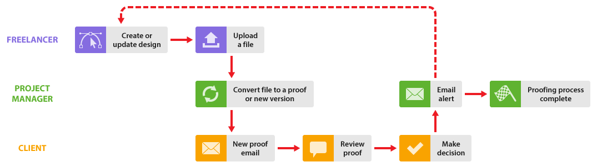
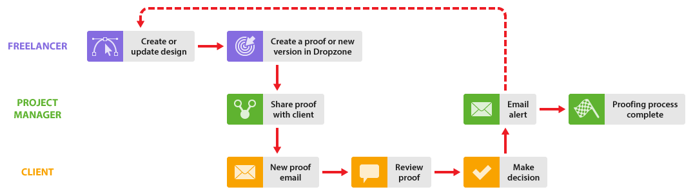

# Trabajar con autónomos en [!DNL Workfront Proof]

>[!IMPORTANT]
>
>Este artículo hace referencia a la funcionalidad del producto independiente [!DNL Workfront Proof]. Para obtener información sobre la revisión dentro de [!DNL Adobe Workfront], consulte [Revisión](../../../review-and-approve-work/proofing/proofing.md).

Si su organización trabaja con autónomos, también puede incluirlos en su proceso de [!DNL Workfront Proof].

Hay varias formas de hacerlo dependiendo de si desea que el trabajador autónomo forme parte de su organización en [!DNL Workfront Proof] o no:

## Añadir trabajadores autónomos a su cuenta de [!DNL Workfront Proof]

Puede simplemente añadir sus trabajadores autónomos como usuarios a su cuenta en [!DNL Workfront Proof], al igual que lo haría con sus compañeros, y luego podrán formar parte de todos los flujos de trabajo que se describen en esta sección.

Puede utilizar los distintos perfiles de usuario, así como la regla de privacidad de carpetas, para administrar la visibilidad y el acceso de su trabajador autónomo en su cuenta.

Consulte los artículos [Perfiles y permisos de usuario](https://support.workfront.com/hc/https://support.workfront.com/hc/es-es/articles/115004087428-User-profiles-and-permissions) y [Comprender los permisos de carpeta en  [!DNL Workfront Proof]](../../../workfront-proof/wp-work-proofsfiles/organize-your-work/folder-permissions.md) antes de añadir un trabajador autónomo como usuario a su cuenta.

Para obtener información sobre cómo añadir un trabajador autónomo a su equipo, consulte [Crear usuarios con  [!DNL Workfront Proof]](../../../workfront-proof/wp-mnguserscontacts/users/create-users.md).

>[!NOTE]
>
>Cualquier trabajador autónomo añadido a su cuenta como usuario tendrá visibilidad de su cuenta y también podrá ver los detalles del cliente (según su perfil de usuario). Puede que esto no sea lo que desea, por lo que quizás configurar una cuenta Satellite para sus trabajadores autónomos sería una opción más adecuada; consulte [Configurar una cuenta Satellite para sus trabajadores autónomos](https://support.workfront.com/knowledge/articles/115004259868/es-es?brand_id=662728&return_to=%2Fhc%2Fen-us%2Farticles%2F115004259868#Option-B---set-up-a-satellite-account-for-your-freelancers) a continuación.

## Configurar una cuenta satélite para sus trabajadores autónomos

Si no desea que los clientes y los autónomos se vean en [!DNL Workfront Proof], puede configurar cuentas satélite para los autónomos.

Esto significa que tendrán su propio panel de control para ver todos los elementos en los que están trabajando en un solo lugar. Además, podrán enviarle archivos a través de [!DNL Workfront Proof], que puede convertir en pruebas (planes [!UICONTROL Empresa] e [!UICONTROL Ilimitado] solamente). Para obtener más información, consulte [Administrar archivos en  [!DNL Workfront Proof]](../../../workfront-proof/wp-work-proofsfiles/manage-your-work/manage-files.md).

También significa que si el autónomo necesita crear nuevas versiones de la prueba durante el proceso de revisión, puede añadirlas explícitamente a la prueba como [!UICONTROL Autor], lo que les permitirá participar en el proceso de revisión y crear nuevas versiones cuando sea necesario. Para obtener más información, consulte [Administrar funciones de prueba en  [!DNL Workfront Proof]](../../../workfront-proof/wp-work-proofsfiles/share-proofs-and-files/manage-proof-roles.md).

1. El trabajador autónomo inicia sesión en su cuenta satélite.
1. El trabajador autónomo sube el archivo y lo comparte con usted. Consulte [Cargar archivos y contenido web en [!DNL Workfront Proof]](../../../workfront-proof/wp-work-proofsfiles/create-proofs-and-files/upload-files-web-content.md) y [Compartir archivos en [!DNL Workfront Proof]](../../../workfront-proof/wp-work-proofsfiles/share-proofs-and-files/share-files.md).

1. Recibirá un correo electrónico que le informa de que se ha compartido un archivo con usted.
1. Inicie sesión en su cuenta y busque el archivo que se ha compartido.
1. Utilice el botón [!UICONTROL convertir en prueba] para convertir el archivo en una prueba. Para obtener más información, consulte [Administrar archivos en [!DNL Workfront Proof]](../../../workfront-proof/wp-work-proofsfiles/manage-your-work/manage-files.md).
1. A continuación, administre el flujo de trabajo de la prueba con sus clientes de la manera normal. Si desea añadir su trabajador autónomo explícitamente a la prueba, puede hacerlo usando la función de compartir. Para obtener más información, consulte [Compartir una prueba en  [!DNL Workfront Proof]](../../../workfront-proof/wp-work-proofsfiles/share-proofs-and-files/share-proof.md).
1. Si no desea añadir su trabajador autónomo de forma explícita a la prueba, pero sí desea notificarle cuando se haya aprobado, puede notificar a su trabajador autónomo al final del proceso de la prueba compartiendo un enlace a la revisión con ellos.

   Esto significa que no forman parte del equipo de revisión y que los clientes no verán su nombre en la prueba

Para obtener información sobre cómo configurar una cuenta satélite para los trabajadores autónomos, consulte [Configurar una cuenta satélite en [!DNL Workfront Proof]](../../../workfront-proof/wp-acct-admin/satellite-accounts/configure-sat-acct-in-wp.md).

## Uso de [!UICONTROL Dropzone]

Esta opción es útil si no desea que los clientes y los autónomos se vean en [!DNL Workfront Proof]. Puede otorgar acceso a sus trabajadores autónomos a su [!UICONTROL Dropzone] (disponible solo en los planes de [!UICONTROL Empresa] e [!UICONTROL Ilimitado]). Para obtener más información, consulte [[!UICONTROL Dropzone]](../../../workfront-proof/wp-work-proofsfiles/create-proofs-and-files/dropzone.md).

1. El trabajador autónomo accede a su página pública de [!UICONTROL Dropzone].
1. Usa [!UICONTROL Dropzone] para crear una nueva prueba en su cuenta.
1. Usted recibirá un correo electrónico informándole de que hay una nueva prueba en su [!UICONTROL Dropzone].
1. Inicie sesión en su cuenta y encuentre la prueba en su [!UICONTROL Dropzone].
1. Puede desbloquear la prueba, añadir revisores, establecer la configuración de la prueba y administrar el flujo de trabajo de la prueba con sus clientes de la manera normal. Su trabajador autónomo se muestra como el Creador de la prueba y no podrá ser eliminado.

* Puede administrar el acceso de su trabajador autónomo a la prueba con su configuración de [!UICONTROL Dropzone]. Para obtener más información, consulte [Configurar Dropzone en  [!DNL Workfront Proof]](../../../workfront-proof/wp-acct-admin/account-settings/configure-dropzone-in-wp.md).
* También puede administrar la función que se les asigna en la prueba, como [!UICONTROL Solo lectura], así como comunicarse por correo electrónico con ellos en relación con la prueba. Para obtener más información, consulte [Administrar funciones de prueba en  [!DNL Workfront Proof]](../../../workfront-proof/wp-work-proofsfiles/share-proofs-and-files/manage-proof-roles.md).
* Si no quiere que el trabajador autónomo participe en el proceso de revisión, pero sí que se le notifique la decisión final, establecezca la función de prueba predeterminada dentro de su configuración de [!UICONTROL Dropzone] y una alerta por correo electrónico para todos los remitentes de [!UICONTROL Dropzone] en [Administrar funciones de prueba en  [!DNL Workfront Proof]](../../../workfront-proof/wp-work-proofsfiles/share-proofs-and-files/manage-proof-roles.md) y [Configurar las opciones de notificación por correo electrónico en  [!DNL Workfront Proof]](../../../workfront-proof/wp-emailsntfctns/email-alerts/config-email-notification-settings-wp.md), respectivamente. Para obtener más información, consulte [Alertas por correo electrónico,](https://support.workfront.com/hc/es-es/sections/115000911867-Email-alerts) [Administrar funciones de prueba en  [!DNL Workfront Proof]](../../../workfront-proof/wp-work-proofsfiles/share-proofs-and-files/manage-proof-roles.md) y [Configurar las opciones de notificación por correo electrónico en  [!DNL Workfront Proof]](../../../workfront-proof/wp-emailsntfctns/email-alerts/config-email-notification-settings-wp.md).
* Si desea que su trabajador autónomo participe activamente en el proceso de revisión, puede ajustar su función de prueba y la configuración de alertas por correo electrónico según sea necesario, edite esto en línea en la página de detalles de la prueba. Para obtener más información sobre esa página, consulte [Administrar detalles de la prueba en  [!DNL Workfront Proof]](../../../workfront-proof/wp-work-proofsfiles/manage-your-work/manage-proof-details.md)
