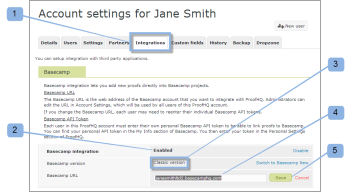
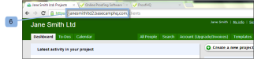
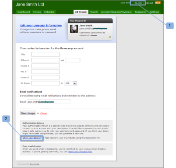
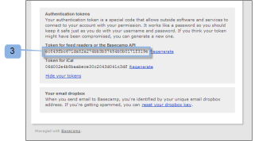
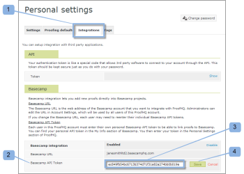

# Integrar [!DNL Workfront Proof] con [!DNL Basecamp Classic]

>[!IMPORTANT]
>
>Este artículo hace referencia a la funcionalidad del producto independiente [!DNL Workfront Proof]. Para obtener información sobre la revisión dentro de [!DNL Adobe Workfront], consulte [Revisión](../../../review-and-approve-work/proofing/proofing.md).

Si usa [!DNL Basecamp] para la administración de proyectos, puede ofrecer al equipo del proyecto herramientas de revisión y aprobación más completas mediante [!DNL Workfront Proof].

## Explicación de la integración de [!DNL Basecamp] con [!DNL Workfront]

La integración con [!DNL Basecamp] permite a los usuarios ver, revisar y aprobar pruebas en [!DNL Basecamp]. Los usuarios pueden enviar pruebas a su cuenta de [!DNL Workfront Proof] y conectarlas con el proyecto [!DNL Basecamp]. Los revisores pueden y tomar [una decisión sobre una prueba en el visor de revisión](../../../review-and-approve-work/proofing/reviewing-proofs-within-workfront/make-a-decision-on-a-proof/make-decisions-on-proof.md) a través de [!DNL Basecamp], mediante la minirprueba incrustada en el mensaje de Basecamp.

Cuando se integra con [!DNL Workfront Proof], [!DNL Basecamp] permite a los usuarios hacer lo siguiente con las pruebas:

* Los usuarios pueden revisar y aprobar las pruebas en [!DNL Basecamp Classic].
* Los usuarios tienen herramientas de revisión disponibles.
* Los equipos de revisión de proyecto reciben un mensaje en [!DNL Basecamp] con una miniprueba para su revisión y aprobación.
* Los usuarios pueden cambiar a una prueba de página completa para su revisión y aprobación.
* Los usuarios pueden añadir comentarios y marcas a las pruebas tanto de tamaño mini como completo.

  >[!NOTE]
  >
  >Una vez respondido un comentario, no se puede editar ni eliminar.

* Los revisores pueden responder a las correcciones realizadas por otros revisores.
* Se avisa a los usuarios cuando hay una nueva versión de la prueba disponible.
* Los usuarios que no sean [!DNL Workfront Proof] pueden trabajar en una prueba en [!DNL Basecamp].

La integración de [!DNL Workfront Proof] con [!DNL Basecamp] debe configurarse en dos niveles:

* Configurar [!DNL Basecamp] en [Configuración de la cuenta:](https://support.workfront.com/hc/en-us/sections/115000912147-Account-settings) esto habilita la integración de Basecamp para toda la organización.
* Para obtener más información, consulte [Habilitar la integración de  [!DNL Basecamp] con [!DNL Workfront Proof]](#enabling-the-basecamp-integration-with-workfront-proof).
* Configurar [!DNL Basecamp] en [configuración personal](https://support.workfront.com/hc/en-us/sections/115000921168-Personal-settings): Esto permite a los creadores y propietarios de pruebas conectarse a su cuenta personal de [!DNL Basecamp] y autorizar el acceso de [!DNL Workfront Proof]. Para obtener más información, consulte [Configuración personal](#configuring-personal-settings).

Puede integrar [!DNL Workfront] con [!DNL Basecamp] o [!DNL Basecamp Classic]. Cada versión de [!DNL Basecamp] usa una API diferente y, por lo tanto, requiere procedimientos de configuración diferentes.

Para obtener información sobre cómo configurar [!DNL Basecamp Classic], consulte [Habilitar la  [!DNL Basecamp] integración con [!DNL Workfront Proof]](#enabling-the-basecamp-integration-with-workfront-proof) en este artículo.

Para obtener información sobre la configuración de [!DNL Basecamp], consulte [Integrar [!DNL Workfront Proof] con [!DNL Basecamp]](../../../workfront-proof/wp-integrations/basecamp/integrate-workfront-proof-with-basecamp.md).

## Habilitar la integración de [!DNL Basecamp] con [!DNL Workfront Proof]

Como [Perfiles de permisos de revisión en [!DNL Workfront Proof]](../../../workfront-proof/wp-acct-admin/account-settings/proof-perm-profiles-in-wp.md) o [Perfiles de permisos de revisión en [!DNL Workfront Proof]](../../../workfront-proof/wp-acct-admin/account-settings/proof-perm-profiles-in-wp.md), puede configurar la integración de Basecamp para toda la cuenta en la [configuración de la cuenta](https://support.workfront.com/hc/en-us/sections/115000912147-Account-settings).

1. Ir a [Configuración de la cuenta.](https://support.workfront.com/hc/en-us/sections/115000912147-Account-settings)
1. Abra la pestaña **[!UICONTROL Integrations]** (1).
1. Para habilitar la integración de Basecamp, haga clic en **[!UICONTROL Habilitar]** (2).
1. Compruebe que [!DNL Basecamp Classic] es la versión con la que se integra (3).
1. (Condicional) Si no se muestra ninguna dirección URL de [!DNL Basecamp] (4), haga clic en **[!UICONTROL Editar]** e introduzca la dirección URL de su cuenta de [!DNL Basecamp] (sin el http://).
1. Haga clic en **[!UICONTROL Guardar]** (5).\
   

1. (Opcional) Compruebe la URL [!DNL Basecamp] en su explorador después de iniciar sesión en su cuenta de [!DNL Basecamp Classic] (6).

   

   Una vez que integre [!DNL Workfront Proof] con [!DNL Basecamp], los usuarios podrán establecer su configuración personal. Para obtener información sobre cómo establecer la configuración personal, consulte [Configuración personal](#configuring-personal-settings).

   Si no puede habilitar la integración de [!DNL Basecamp], es posible que el ID de cuenta de [!DNL Workfront Proof] no sea el mismo que el ID de la cuenta que usa en [!DNL Basecamp].

## Configuración personal

Después de configurar [Configuración de la cuenta](https://support.workfront.com/hc/en-us/sections/115000912147-Account-settings) para su organización, cada uno de los autores que cree o envíe pruebas deberá establecer su [configuración personal.](https://support.workfront.com/hc/en-us/sections/115000921168-Personal-settings)

>[!NOTE]
>
>Completar estos pasos es más fácil si tiene la sesión [!DNL Basecamp] abierta en una ventana del explorador y la sesión [!DNL Workfront Proof] abierta en otra ventana.

* [Recuperando su token de API  [!DNL Basecamp] &#x200B;](#retrieving-your-basecamp-api-token)
* [Agregando tu token de API  [!DNL Basecamp] a tu configuración personal](#adding-your-basecamp-api-token-to-your-personal-settings)

### Recuperando su token de API [!DNL Basecamp]

Para completar la integración a nivel individual en [!DNL Workfront Proof], los usuarios necesitan su token de autenticación individual para la API [!DNL Basecamp].

Para recuperar su token de API [!DNL Basecamp]:

1. Inicie sesión en su cuenta de [!DNL Basecamp].
1. Haga clic en **[!UICONTROL Mi información]** (1) en la esquina superior derecha de la pantalla.\
   Se muestra la página [!UICONTROL Mi información].\
   

1. En la sección [!UICONTROL tokens de autenticación], haga clic en **[!UICONTROL Mostrar sus tokens]** (2) para mostrar sus tokens de autenticación personales.
1. Seleccione el **[!UICONTROL token para lectores de fuentes]** o la **[!UICONTROL API de Basecamp]** (3) y copie el token en el portapapeles.

1. Pegue su token de API [!DNL Basecamp] en el [!UICONTROL token para lectores de fuentes] o en el cuadro de la API [!UICONTROL Basecamp].\
   

### Agregando su token de API [!DNL Basecamp] a su configuración personal

Para pegar el token de la API [!DNL Basecamp] en [!DNL Workfront Proof] [configuración personal](https://support.workfront.com/hc/en-us/sections/115000921168-Personal-settings):

1. Vaya a [[!UICONTROL Integraciones] - Configuración del usuario](../../../workfront-proof/wp-getstarted/personal-settings/integrations-user-setup.md) en su [configuración personal](https://support.workfront.com/hc/en-us/sections/115000921168-Personal-settings) (1).\
   Un administrador debe habilitar primero la integración de [!DNL Basecamp Classic] para que pueda habilitar su configuración personal. Para obtener información sobre cómo configurar la integración, consulte [Habilitar la  [!DNL Basecamp] integración con [!DNL Workfront Proof]](#enabling-the-basecamp-integration-with-workfront-proof) en este artículo.

1. En el cuadro Token de API [!DNL Basecamp] (2), pegue el token que acaba de copiar de su página [!DNL Basecamp] [!UICONTROL Mi información] en el campo (3).\
   Para obtener información sobre cómo copiar el token de API [!DNL Basecamp], consulte [Recuperación del token de API [!DNL Basecamp] 3&rbrace; en este artículo.](#retrieving-your-basecamp-api-token)

1. Haga clic en **[!UICONTROL Guardar]** (4).

Tu [!DNL Workfront Proof] [configuración personal](https://support.workfront.com/hc/en-us/sections/115000921168-Personal-settings) se ha integrado con tu cuenta de [!DNL Basecamp Classic].
