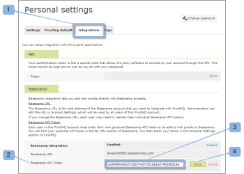

# Integrar [!DNL Workfront Proof] con [!DNL Basecamp Classic]

>[!IMPORTANT]
>
>Este artículo se refiere a la funcionalidad en el producto independiente [!DNL Workfront Proof]. Para obtener información sobre pruebas en el interior [!DNL Adobe Workfront], consulte [Prueba](../../../review-and-approve-work/proofing/proofing.md).

Si usa [!DNL Basecamp] para la administración de proyectos, puede ofrecer al equipo del proyecto herramientas de revisión y aprobación más ricas mediante [!DNL Workfront Proof].

## Información sobre [!DNL Basecamp] Integración con [!DNL Workfront]

Integración con [!DNL Basecamp] permite a los usuarios ver, revisar y aprobar pruebas en [!DNL Basecamp]. Los usuarios pueden enviar pruebas a su [!DNL Workfront Proof] y conéctelas con su [!DNL Basecamp] proyecto. Los revisores pueden y [Tome una decisión sobre una prueba en el visor de pruebas](../../../review-and-approve-work/proofing/reviewing-proofs-within-workfront/make-a-decision-on-a-proof/make-decisions-on-proof.md) via [!DNL Basecamp], utilizando la prueba mini incrustada en el mensaje de Basecamp.

Cuando se integra con [!DNL Workfront Proof], [!DNL Basecamp] permite a los usuarios hacer lo siguiente con pruebas:

* Los usuarios pueden revisar y aprobar pruebas en [!DNL Basecamp Classic].
* Los usuarios tienen herramientas de revisión disponibles.
* Los equipos de revisión de proyectos reciben un mensaje en [!DNL Basecamp] con una mini prueba para revisión y aprobación.
* Los usuarios pueden cambiar a una prueba de página completa para su revisión y aprobación.
* Los usuarios pueden agregar comentarios y marcas a pruebas de tamaño completo y mini.

   >[!NOTE]
   >
   >Una vez que se ha respondido a un comentario, no se puede editar ni eliminar.

* Los revisores pueden responder a las marcas y realizadas por otros revisores.
* Se avisa a los usuarios cuando hay una nueva versión de prueba disponible.
* Usuarios que no [!DNL Workfront Proof] los usuarios pueden trabajar con una prueba en [!DNL Basecamp].

La integración de [!DNL Workfront Proof] con [!DNL Basecamp] debe estar configurado en dos niveles:

* Configurar [!DNL Basecamp] en [Configuración de la cuenta:](https://support.workfront.com/hc/en-us/sections/115000912147-Account-settings) Esto permite la integración de Basecamp para toda la organización.
* Para obtener más información, consulte [Al habilitar la variable [!DNL Basecamp] Integración con [!DNL Workfront Proof]](#enabling-the-basecamp-integration-with-workfront-proof).
* Configurar [!DNL Basecamp] en [Ajustes personales](https://support.workfront.com/hc/en-us/sections/115000921168-Personal-settings): Esto permite a los creadores y propietarios de pruebas conectarse a su [!DNL Basecamp] y autorizar [!DNL Workfront Proof] acceso. Para obtener más información, consulte [Configuración personal](#configuring-personal-settings).

Puede integrar [!DNL Workfront] con cualquiera de las [!DNL Basecamp] o [!DNL Basecamp Classic]. Cada versión de [!DNL Basecamp] utiliza una API diferente y, por lo tanto, requiere procedimientos de configuración diferentes.

Para obtener información sobre cómo configurar [!DNL Basecamp Classic], consulte [Al habilitar la variable [!DNL Basecamp] Integración con [!DNL Workfront Proof]](#enabling-the-basecamp-integration-with-workfront-proof) en este artículo.

Para obtener información sobre cómo configurar [!DNL Basecamp], consulte [Integrar [!DNL Workfront Proof] con [!DNL Basecamp]](../../../workfront-proof/wp-integrations/basecamp/integrate-workfront-proof-with-basecamp.md).

## Al habilitar la variable [!DNL Basecamp] Integración con [!DNL Workfront Proof]

Como [Perfiles de permisos de prueba en [!DNL Workfront Proof]](../../../workfront-proof/wp-acct-admin/account-settings/proof-perm-profiles-in-wp.md) o [Perfiles de permisos de prueba en [!DNL Workfront Proof]](../../../workfront-proof/wp-acct-admin/account-settings/proof-perm-profiles-in-wp.md), puede configurar la integración de Basecamp para toda la cuenta en su [Configuración de la cuenta](https://support.workfront.com/hc/en-us/sections/115000912147-Account-settings).

1. Vaya a [Configuración de la cuenta.](https://support.workfront.com/hc/en-us/sections/115000912147-Account-settings)
1. Abra el **[!UICONTROL Integraciones]** (1).
1. Para habilitar la integración de Basecamp, haga clic en **[!UICONTROL Habilitar]** (2)
1. Compruebe que [!DNL Basecamp Classic] es la versión con la que se integra (3).
1. (Condicional) Si no [!DNL Basecamp] Se muestra la dirección URL (4), haga clic en **[!UICONTROL Editar]** e introduzca la dirección URL de su [!DNL Basecamp] cuenta (sin el http://).
1. Haga clic en **[!UICONTROL Guardar]** (5)\
   

1. (Opcional) Consulte [!DNL Basecamp] La dirección URL del explorador después de iniciar sesión en el [!DNL Basecamp Classic] cuenta (6).

   

   Una vez realizada la integración [!DNL Workfront Proof] con [!DNL Basecamp], los usuarios pueden configurar sus ajustes personales. Para obtener información sobre la configuración de ajustes personales, consulte [Configuración personal](#configuring-personal-settings).

   Si no puede habilitar [!DNL Basecamp] integración, su [!DNL Workfront Proof] es posible que el ID de cuenta no sea el mismo que el que se usa en [!DNL Basecamp].

## Configuración personal

Después de configurar [Configuración de la cuenta](https://support.workfront.com/hc/en-us/sections/115000912147-Account-settings) para su organización, cada uno de los autores que creen o envíen pruebas debe configurar su  [configuración personal.](https://support.workfront.com/hc/en-us/sections/115000921168-Personal-settings)

>[!NOTE]
>
>Completar estos pasos es más fácil si tiene su [!DNL Basecamp] abra la sesión en una ventana del explorador y [!DNL Workfront Proof] sesión abierta en otra ventana.

* [Recuperación de [!DNL Basecamp] Token de API](#retrieving-your-basecamp-api-token)
* [Adición de [!DNL Basecamp] Token de API a su configuración personal](#adding-your-basecamp-api-token-to-your-personal-settings)

### Recuperación de [!DNL Basecamp] Token de API

Para completar la integración a nivel individual en [!DNL Workfront Proof], los usuarios necesitan su token de autenticación individual para el [!DNL Basecamp] API.

Para recuperar el [!DNL Basecamp] Token de API:

1. Inicie sesión en su [!DNL Basecamp] cuenta.
1. Haga clic en **[!UICONTROL My Info]** (1) en la esquina superior derecha de la pantalla.\
   La variable [!UICONTROL My Info] se muestra.\
   

1. En el [!UICONTROL Tokens de autenticación] , haga clic en **[!UICONTROL Mostrar los tokens]** (2) para mostrar sus tokens de autenticación personales.
1. Seleccione el **[!UICONTROL Token para lectores de fuentes]** o **[!UICONTROL API de Basecamp]** (3) y, a continuación, copie el token en el portapapeles.

1. Pegue el [!DNL Basecamp] Token de API en el [!UICONTROL Token para lectores de fuentes] o [!UICONTROL API de Basecamp] en la ventana\
   

### Adición de [!DNL Basecamp] Token de API a su configuración personal

Para pegar el [!DNL Basecamp] Token de API en su [!DNL Workfront Proof] [Ajustes personales](https://support.workfront.com/hc/en-us/sections/115000921168-Personal-settings):

1. Vaya a la [[!UICONTROL Integraciones] - Configuración de usuario](../../../workfront-proof/wp-getstarted/personal-settings/integrations-user-setup.md) en su [Ajustes personales](https://support.workfront.com/hc/en-us/sections/115000921168-Personal-settings) (1)\
   Un administrador debe habilitar primero la variable [!DNL Basecamp Classic] para que pueda habilitar su configuración personal. Para obtener información sobre la configuración de la integración, consulte [Al habilitar la variable [!DNL Basecamp] Integración con [!DNL Workfront Proof]](#enabling-the-basecamp-integration-with-workfront-proof) en este artículo.

1. En el [!DNL Basecamp] Cuadro de token de API (2), pegue el token que acaba de copiar de su [!DNL Basecamp] [!UICONTROL My Info] en el campo (3).\
   Para obtener información sobre cómo copiar su [!DNL Basecamp] token de API, consulte [Recuperación de [!DNL Basecamp] Token de API](#retrieving-your-basecamp-api-token) en este artículo.

1. Haga clic en **[!UICONTROL Guardar]** (4)

Su [!DNL Workfront Proof] [Ajustes personales](https://support.workfront.com/hc/en-us/sections/115000921168-Personal-settings) ahora están integrados con su [!DNL Basecamp Classic] cuenta.
