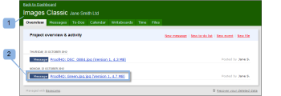

# Revisar una revisión en [!DNL Basecamp] Classic

>[!IMPORTANT]
>
>Este artículo hace referencia a la funcionalidad del producto independiente [!DNL Workfront Proof]. Para obtener información sobre la revisión dentro de [!DNL Adobe Workfront], vea [Revisión](../../../review-and-approve-work/proofing/proofing.md).

[!DNL Basecamp] es una herramienta de administración de proyectos en línea desarrollada por [!DNL 37signals]. Si usa [!DNL Basecamp] para la administración de proyectos, puede ofrecer al equipo del proyecto herramientas de revisión y aprobación más completas mediante [!DNL Workfront Proof].

## Explicación de las revisiones de revisión en [!DNL Basecamp Classic]

Cuando se integra con [!DNL Workfront Proof], [!DNL Basecamp] permite a los usuarios hacer lo siguiente con las pruebas:

* Los usuarios pueden revisar y aprobar las revisiones en [!DNL Basecamp Classic].
* Los usuarios tienen herramientas de revisión disponibles.
* Los equipos de revisión de proyecto reciben un mensaje en [!DNL Basecamp] con una mini prueba para su revisión y aprobación.
* Los usuarios pueden cambiar a una prueba de página completa para su revisión y aprobación.
* Los usuarios pueden agregar comentarios y marcas a las pruebas tanto de tamaño mini como completo.
* Una vez respondido un comentario, no se puede editar ni eliminar. Para obtener información acerca de los comentarios, vea [Comentario sobre una revisión](../../../review-and-approve-work/proofing/reviewing-proofs-within-workfront/comment-on-a-proof/comment-on-proof.md).
* Los revisores pueden responder a las marcas y realizadas por otros revisores. Para obtener información acerca de los comentarios, vea [Comentario sobre una revisión](../../../review-and-approve-work/proofing/reviewing-proofs-within-workfront/comment-on-a-proof/comment-on-proof.md).
* Se avisa a los usuarios cuando hay una nueva versión de la prueba disponible.
* Los usuarios que no sean [!DNL Workfront Proof] pueden trabajar en una revisión en [!DNL Basecamp].

## Visualización de una prueba mediante el correo electrónico de notificación

Si vincula una revisión a [!DNL Basecamp], [!DNL Workfront Proof] enviará un mensaje de correo electrónico de notificación de revisión (1) a todos los revisores, con la siguiente información:

* **Detalles de la revisión** (2): muestra información sobre la revisión. La información que se muestra depende de cómo haya configurado Basecamp el administrador de Workfront.
* **[!UICONTROL Ir a la revisión] link** (3): Abre la revisión en Workfront.
* **[!DNL Basecamp]URL** (4): Abre la revisión en Basecamp. Si se añaden revisores que no son de BaseCamp a la prueba, su notificación por correo electrónico no incluye el vínculo BaseCamp.
* **[!UICONTROL Progreso de prueba]** (5): Enumera las etapas de aprobación y muestra los indicadores de progreso de prueba.
* **[!UICONTROL Fase]** (6): enumera los revisores y su progreso individual.

Para abrir la prueba desde la notificación por correo electrónico:

1. Para abrir la revisión en [!DNL Workfront Proof], haga clic en **[!UICONTROL Ir a la revisión]**.\
   O\
   Para abrir la revisión en [!DNL Basecamp], haga clic en la dirección URL que aparece en el campo **[!UICONTROL [!DNL Basecamp]dirección URL]**.\
   Para obtener información sobre cómo revisar una revisión en [!DNL Basecamp Classic], consulte [Revisión de una revisión en [!DNL Basecamp]](#reviewing-a-proof-in-basecamp) en este artículo.

## Visualización de la revisión a través del mensaje [!DNL Basecamp Classic]

Puede acceder a una revisión desde un mensaje [!DNL Basecamp Classic].

1. En [!DNL Basecamp], vaya a la página del proyecto (1).\
   

1. Haga clic en el mensaje de la prueba que desee abrir. (2)\
   Se abre el mensaje de la prueba y se muestra una mini prueba. El nombre de la prueba se muestra en la parte superior de la ventana de mensaje (3).\
   Puede ver la revisión de miniaturas en [!DNL Basecamp Classic] o en [!DNL Workfront Proof].\
   

1. Para ver la revisión en modo de pantalla completa en [!DNL Workfront proof], haga clic en la dirección URL que aparece arriba de la revisión (4).
1. (Condicional) Si no ha iniciado sesión en su cuenta de [!DNL Workfront Proof] en una de las ventanas del explorador, inicie sesión para revisar la revisión:

   1. Haga clic en **[!UICONTROL Iniciar sesión]** (5) sobre la revisión.
   1. Escriba su dirección de correo electrónico (6).\

      Debe utilizar la misma dirección de correo electrónico que utilizó cuando se le agregó a la revisión.
   1. Haga clic en **[!UICONTROL Siguiente]**.
   1. Escriba su contraseña de [!DNL Workfront Proof] (7).\

      O\
      Si no tiene una cuenta de [!DNL Workfront Proof], escriba un nombre público para mostrar.\
      Puede seleccionar &quot;[!UICONTROL recordarme]&quot;, así que solo tendrá que introducir sus datos una vez.

1. Para revisar la revisión, continúe con [Revisión de una revisión en [!DNL Basecamp]](#reviewing-a-proof-in-basecamp).

>[!NOTE]
>
> El cuadro de comentarios que se muestra debajo de la mini prueba en la página del mensaje se aplica solo al mensaje en sí. Para enviar comentarios de revisión, debe usar el botón de icono de comentarios en la parte superior de la prueba mini o el botón [!UICONTROL Comentarios] más grande en la parte superior de la prueba de página completa. Para obtener más información, vea Revisar una [revisión de una revisión en [!DNL Basecamp]](#reviewing-a-proof-in-basecamp).

## Revisando una revisión en [!DNL Basecamp]

La revisión mínima de [!DNL Basecamp] le proporciona las herramientas que necesita para agregar y para [tomar una decisión sobre una revisión en el visor de revisión](../../../review-and-approve-work/proofing/reviewing-proofs-within-workfront/make-a-decision-on-a-proof/make-decisions-on-proof.md) de la revisión. Todos los usuarios asignados al proyecto ven sus marcas y comentarios y pueden responder con sus propios comentarios en tiempo real.

Cuando abra la prueba, esta se mostrará en la ventana [!UICONTROL revisión] (1) y el nombre de la prueba y el número de versión se mostrarán en la esquina superior izquierda (2).

Para revisar la revisión:

1. Para agregar un comentario, haga clic en [!UICONTROL Comentario] (3) en la parte superior de la prueba y escriba el comentario.\
   No es necesario enviar una respuesta al mensaje [!DNL Basecamp], ya que los comentarios y [Tome una decisión sobre una prueba en el visor de revisión](../../../review-and-approve-work/proofing/reviewing-proofs-within-workfront/make-a-decision-on-a-proof/make-decisions-on-proof.md) se guardaron en la prueba (similar a revisar una prueba en [!DNL Workfront Proof]).

1. Para añadir una decisión, haga clic en Decisión (3) en la parte superior de la prueba y seleccione la decisión de aprobación.\
   Para obtener más información sobre cómo tomar decisiones acerca de una prueba, consulte [Tomar una decisión acerca de una prueba en el visor de pruebas](../../../review-and-approve-work/proofing/reviewing-proofs-within-workfront/make-a-decision-on-a-proof/make-decisions-on-proof.md#making-a-decision-on-a-proof).

Otras funciones de la ventana de prueba incluyen:

* **[!UICONTROL Menús de acción]** (4): permite seleccionar la configuración de la revisión.
* **[!UICONTROL Botón de pantalla completa]** (5): permite alternar entre pantalla completa y prueba mínima.
* **[!UICONTROL Barra lateral]** (6): permite expandir o reducir la vista de la prueba.
* **[!UICONTROL Nombre de usuario]** (7): muestra su nombre de usuario si ha iniciado sesión en Workfront.
* **[!UICONTROL Herramientas de zoom]** (8): permite ampliar un área de la revisión.
* **[!UICONTROL Herramientas de navegación de páginas]** (9): le permite desplazarse a otras páginas dentro de la prueba.

<!--For more information on reviewing proofs, see [Legacy proofing viewer Overview](../../../workfront-proof/wp-work-proofsfiles/review-proofs-lpv/legacy-proofing-viewer.md).-->
