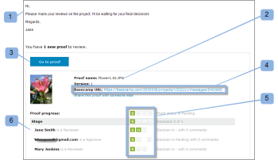
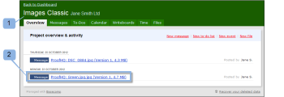
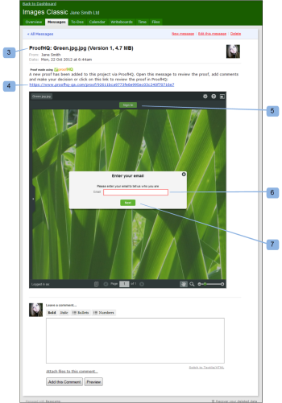
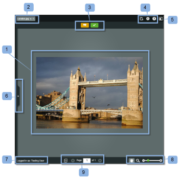

# Revisión de una prueba en [!DNL Basecamp] Classic

>[!IMPORTANT]
>
>Este artículo hace referencia a la funcionalidad del producto independiente [!DNL Workfront Proof]. Para obtener información sobre la revisión dentro de [!DNL Adobe Workfront], consulte [Revisión](../../../review-and-approve-work/proofing/proofing.md).

[!DNL Basecamp] es una herramienta de administración de proyectos en línea desarrollada por [!DNL 37signals]. Si usa [!DNL Basecamp] para la administración de proyectos, puede ofrecer al equipo del proyecto herramientas de revisión y aprobación más completas mediante [!DNL Workfront Proof].

## Explicación de las revisiones de pruebas en [!DNL Basecamp Classic]

Cuando se integra con [!DNL Workfront Proof], [!DNL Basecamp] permite a los usuarios hacer lo siguiente con las pruebas:

* Los usuarios pueden revisar y aprobar las pruebas en [!DNL Basecamp Classic].
* Los usuarios tienen herramientas de revisión disponibles.
* Los equipos de revisión de proyecto reciben un mensaje en [!DNL Basecamp] con una miniprueba para su revisión y aprobación.
* Los usuarios pueden cambiar a una prueba de página completa para su revisión y aprobación.
* Los usuarios pueden añadir comentarios y marcas a las pruebas tanto de tamaño mini como completo.
* Una vez respondido un comentario, no se puede editar ni eliminar. Para obtener información acerca de los comentarios, vea [Comentario sobre una prueba](../../../review-and-approve-work/proofing/reviewing-proofs-within-workfront/comment-on-a-proof/comment-on-proof.md).
* Los revisores pueden responder a las correcciones realizadas por otros revisores. Para obtener información acerca de los comentarios, vea [Comentario sobre una prueba](../../../review-and-approve-work/proofing/reviewing-proofs-within-workfront/comment-on-a-proof/comment-on-proof.md).
* Se avisa a los usuarios cuando hay una nueva versión de la prueba disponible.
* Los usuarios que no sean [!DNL Workfront Proof] pueden trabajar en una revisión en [!DNL Basecamp].

## Visualización de una prueba mediante el correo electrónico de notificación

Si vincula una prueba a [!DNL Basecamp], [!DNL Workfront Proof] enviará un mensaje de correo electrónico de notificación de prueba (1) a todos los revisores, con la siguiente información:

* **Detalles de la prueba** (2): muestra información sobre la prueba. La información que se muestra depende de cómo haya configurado Basecamp el administrador de Workfront.
* **[!UICONTROL Ir al vínculo de la prueba]** (3): abre la prueba en Workfront.
* URL de **[!DNL Basecamp]** (4): abre la prueba en Basecamp. Si se añaden revisores que no son de BaseCamp a la prueba, su notificación por correo electrónico no incluye el vínculo de BaseCamp.
* **[!UICONTROL Progreso de la revisión]** (5): enumera las etapas de aprobación y muestra los indicadores de progreso de la revisión.
* **[!UICONTROL Fase]** (6): enumera los revisores y su progreso individual.

Para abrir la prueba desde la notificación por correo electrónico:

1. Para abrir la revisión en [!DNL Workfront Proof], haga clic en **[!UICONTROL Ir a la prueba]**.\
   O\
   Para abrir la revisión en [!DNL Basecamp], haga clic en la dirección URL que aparece en el campo URL de **[!UICONTROL [!DNL Basecamp]]**.\
   Para obtener información sobre cómo revisar una prueba en [!DNL Basecamp Classic], consulte [Revisión de una prueba en [!DNL Basecamp]](#reviewing-a-proof-in-basecamp) en este artículo.

## Visualización de la prueba a través del mensaje de [!DNL Basecamp Classic]

Puede acceder a una prueba desde un mensaje de [!DNL Basecamp Classic].

1. En [!DNL Basecamp], vaya a la página del proyecto (1).\
   

1. Haga clic en el mensaje de la prueba que desee abrir. (2)\
   Se abre el mensaje de la prueba y se muestra una miniprueba. El nombre de la prueba se muestra en la parte superior de la ventana de mensaje (3).\
   Puede ver la prueba en miniatura en [!DNL Basecamp Classic] o en [!DNL Workfront Proof].\
   

1. Para ver la revisión en modo de pantalla completa en [!DNL Workfront proof], haga clic en la dirección URL que aparece encima de la prueba (4).
1. (Condicional) Si no ha iniciado sesión en su cuenta de [!DNL Workfront Proof] en una de las ventanas del explorador, inicie sesión para revisar la prueba:

   1. Haga clic en **[!UICONTROL Iniciar sesión]** (5) sobre la prueba.
   1. Escriba su dirección de correo electrónico (6).\

      Es necesario utilizar la misma dirección de correo electrónico que se usó cuando se le añadió a la revisión.
   1. Haga clic en **[!UICONTROL Siguiente]**.
   1. Escriba la contraseña de [!DNL Workfront Proof] (7).\

      O\
      Si no dispone de una cuenta de [!DNL Workfront Proof], escriba un nombre público para mostrar.\
      Seleccione “[!UICONTROL recordarme]” y solo tendrá que introducir sus datos una vez.

1. Para revisar la prueba, continúe con [Revisión de pruebas en [!DNL Basecamp]](#reviewing-a-proof-in-basecamp).

>[!NOTE]
>
> El cuadro de comentarios que se muestra debajo de la prueba mínima en la página del mensaje se aplica solo al mensaje en sí. Para enviar comentarios de revisión, use el botón de icono de comentarios de la parte superior de la prueba mínima o el botón [!UICONTROL Comentarios] más grande de la parte superior de la prueba de página completa. Para obtener más información, consulte [Revisión de pruebas en [!DNL Basecamp]](#reviewing-a-proof-in-basecamp).

## Revisión de pruebas en [!DNL Basecamp]

La prueba mínima de [!DNL Basecamp] proporciona las herramientas necesarias para añadir y aplicar [Tomar una decisión sobre la prueba en el visualizador de revisión](../../../review-and-approve-work/proofing/reviewing-proofs-within-workfront/make-a-decision-on-a-proof/make-decisions-on-proof.md) en la prueba. Todos los usuarios asignados al proyecto verán sus marcas y comentarios y podrán responder con sus propios comentarios en tiempo real.

Al abrir la prueba, esta se mostrará en la ventana de [!UICONTROL revisión] (1) y el nombre de la prueba y el número de versión se mostrarán en la esquina superior izquierda (2).

Para revisar la prueba:

1. Para añadir un comentario, haga clic en [!UICONTROL Comentario] (3), en la parte superior de la prueba, y escríbalo.\
   No es necesario enviar una respuesta al mensaje de [!DNL Basecamp], ya que los comentarios y [Tomar una decisión sobre la prueba en el visualizador de revisión](../../../review-and-approve-work/proofing/reviewing-proofs-within-workfront/make-a-decision-on-a-proof/make-decisions-on-proof.md) se guardaron en la prueba (de forma similar a revisar una prueba en [!DNL Workfront Proof]).

1. Para añadir una decisión, haga clic en Decisión (3), en la parte superior de la prueba, y seleccione la decisión de aprobación.\
   Para obtener más información sobre cómo tomar decisiones sobre pruebas, consulte [Tomar una decisión sobre la prueba en el visualizador de revisión](../../../review-and-approve-work/proofing/reviewing-proofs-within-workfront/make-a-decision-on-a-proof/make-decisions-on-proof.md#making-a-decision-on-a-proof).

Otras funciones de la ventana de la prueba incluyen:

* **[!UICONTROL Menús de acción]** (4): permiten seleccionar la configuración de la prueba.
* **[!UICONTROL Botón de pantalla completa]** (5): permite alternar entre pantalla completa y prueba mínima.
* **[!UICONTROL Barra lateral]** (6): permite expandir o reducir la vista de la prueba.
* **[!UICONTROL Nombre de usuario]** (7): muestra el nombre de usuario si se inició sesión en Workfront.
* **[!UICONTROL Herramientas de zoom]** (8): permiten ampliar un área de la prueba.
* **[!UICONTROL Herramientas de navegación de página]** (9): permiten el desplazamiento a otras páginas dentro de la prueba.

<!--For more information on reviewing proofs, see [Legacy proofing viewer Overview](../../../workfront-proof/wp-work-proofsfiles/review-proofs-lpv/legacy-proofing-viewer.md).-->
