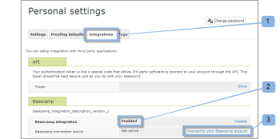

# Integrar [!DNL Workfront Proof] con [!DNL Basecamp]

>[!IMPORTANT]
>
>Este artículo se refiere a la funcionalidad en el producto independiente [!DNL Workfront Proof]. Para obtener información sobre pruebas en el interior [!DNL Adobe Workfront], consulte [Prueba](../../../review-and-approve-work/proofing/proofing.md).

Si usa [!DNL Basecamp] para la administración de proyectos, puede ofrecer al equipo del proyecto herramientas de revisión y aprobación más ricas mediante [!DNL Workfront Proof].

## Información sobre [!DNL Basecamp] Integración con [!DNL Workfront]

Integración con [!DNL Basecamp] permite a los usuarios ver, revisar y aprobar pruebas en [!DNL Basecamp]. Los usuarios pueden enviar pruebas a su [!DNL Workfront Proof] y conéctelas con su [!DNL Basecamp] proyecto. Los revisores pueden realizar comentarios y tomar decisiones a través de [!DNL Basecamp], utilizando la prueba mini incrustada en el mensaje de Basecamp.

Cuando se integra con [!DNL Workfront Proof], [!DNL Basecamp] tiene la siguiente funcionalidad de prueba:

* Los usuarios pueden revisar y aprobar pruebas en [!DNL Basecamp Classic].
* Los usuarios tienen herramientas de revisión disponibles.
* Los equipos de revisión de proyectos reciben un mensaje en [!DNL Basecamp] con una mini prueba para revisión y aprobación.
* Los usuarios pueden cambiar a una prueba de página completa para su revisión y aprobación.
* Los usuarios pueden agregar comentarios y marcas a pruebas de tamaño completo y mini.

   >[!NOTE]
   >
   >Una vez que se ha respondido a un comentario, no se puede editar ni eliminar.

* Los revisores pueden responder a las marcas y realizadas por otros revisores.
* Se avisa a los usuarios cuando hay una nueva versión de prueba disponible.
* Usuarios que no [!DNL Workfront Proof] los usuarios pueden trabajar con una prueba en [!DNL Basecamp].

La integración de [!DNL Workfront Proof] con [!DNL Basecamp] debe estar configurado en dos niveles:

* Configurar [!DNL Basecamp] en [Configuración de la cuenta:](https://support.workfront.com/hc/en-us/sections/115000912147-Account-settings) Esto permite la integración de Basecamp para toda la organización. Para obtener más información, consulte [Activación de la integración de Basecamp con [!DNL Workfront Proof]](#enabling-the-basecamp-integration-with-workfront-proof).

* Configurar [!DNL Basecamp] en [Ajustes personales](https://support.workfront.com/hc/en-us/sections/115000921168-Personal-settings): Esto permite a los creadores y propietarios de pruebas conectarse a su cuenta personal de Basecamp y autorizar [!DNL Workfront Proof] acceso. Para obtener más información, consulte [Configuración personal](#configuring-personal-settings).

Puede integrar [!DNL Workfront] con cualquiera de las [!DNL Basecamp] o [!DNL Basecamp Classic]. Cada versión de [!DNL Basecamp] utiliza una API diferente y, por lo tanto, requiere procedimientos de configuración diferentes.

Para obtener información sobre cómo configurar [!DNL Basecamp Classic], consulte [Integración [!DNL Workfront Proof] con [!DNL Basecamp Classic].](https://support.workfront.com/knowledge/articles/115004234707/en-us?brand_id=662728&amp;return_to=%2Fhc%2Fen-us%2Farticles%2F115004234707)

## Al habilitar la variable [!DNL Basecamp] Integración con [!DNL Workfront Proof]

Como [Perfiles de permisos de prueba en [!DNL Workfront Proof]](../../../workfront-proof/wp-acct-admin/account-settings/proof-perm-profiles-in-wp.md) o [Perfiles de permisos de prueba en [!DNL Workfront Proof]](../../../workfront-proof/wp-acct-admin/account-settings/proof-perm-profiles-in-wp.md), puede configurar la variable [!DNL Basecamp] integración para toda la cuenta en su [Configuración de la cuenta](https://support.workfront.com/hc/en-us/sections/115000912147-Account-settings).

1. En [!UICONTROL Basecamp], recopile la siguiente información:

   * La dirección URL de [!DNL Basecamp] account
   * La URL encontrada en el[!UICONTROL Mi información]&quot;

1. Cerrar sesión [!DNL Basecamp].
1. Haga clic en **[!UICONTROL Configuración de la cuenta]** cerca de la esquina superior derecha.
1. Haga clic en el **[!UICONTROL Integraciones]** pestaña .
1. En el **[!UICONTROL [!DNL Basecamp]]** a la derecha de **[!UICONTROL [!DNL Basecamp]integración]**, haga clic en **[!UICONTROL Habilitar]**.

1. Junto a **[!UICONTROL [!DNL Basecamp]version]**, verifique el **[!UICONTROL Versión clásica]** es la versión con la que se integra.

1. (Condicional) Si no [!DNL Basecamp] Se muestra la dirección URL, haga clic en **[!UICONTROL Editar]**, escriba la dirección URL de [!DNL Basecamp] cuenta, sin incluir &quot;http://&quot; y, a continuación, haga clic en **[!UICONTROL Guardar]**.

1. En la esquina superior derecha de la ventana, haga clic en **[!UICONTROL Configuración]** > **[!UICONTROL Ajustes personales]**.

1. Haga clic en el **[!UICONTROL Integraciones]** pestaña .
1. En **[!DNL Basecamp]**, a la derecha de **[!UICONTROL Integración con Basecamp]**, haga clic en **[!UICONTROL Habilitar]**.

1. En las opciones que aparecen, a la derecha de **[!UICONTROL [!DNL Basecamp]Token de API]**, haga clic en **[!UICONTROL Editar]**.

1. En el cuadro que aparece, escriba la dirección URL que se encuentra en la &quot;[!UICONTROL Mi información]&quot; en [!DNL Basecamp]y haga clic en **[!UICONTROL Guardar]**.\
   Una vez realizada la integración [!DNL Workfront Proof] con [!DNL Basecamp], los usuarios pueden configurar sus ajustes personales. Para obtener información sobre la configuración de ajustes personales, consulte [Configuración personal](#configuring-personal-settings)

1. Si no puede habilitar [!DNL Basecamp] integración, su [!DNL Workfront Proof] es posible que el ID de cuenta no sea el mismo que el que se usa en [!DNL Basecamp].
1. Una vez realizada la integración [!DNL Workfront Proof] con [!DNL Basecamp], los usuarios pueden configurar sus ajustes personales. Para obtener información sobre la configuración de ajustes personales, consulte [Configuración personal](#configuring-personal-settings).

## Configuración personal

Después de configurar [Configuración de la cuenta](https://support.workfront.com/hc/en-us/sections/115000912147-Account-settings) para su organización, cada uno de los autores que creen o envíen pruebas debe configurar su  [configuración personal.](https://support.workfront.com/hc/en-us/sections/115000921168-Personal-settings)

1. Vaya a **[!UICONTROL Ajustes personales** &#x200B;**]**.

1. Abra el **[!UICONTROL Integraciones]** (1).
1. Para habilitar la variable [!DNL Basecamp] integración, haga clic en **[!UICONTROL Habilitar]** (2)
1. Haga clic en **[!UICONTROL Conéctese a su [!DNL Basecamp] account]** (3)\
   

1. Inicie sesión en su [!DNL Basecamp] cuenta (1).\
   

1. Haga clic en **[!UICONTROL Sí, permitiré el acceso]** para autorizar [!DNL Workfront Proof] acceso a su cuenta (2).\
   

1. (Opcional) Cuando su integración personal esté activa (3), puede alternar fácilmente entre sus [!DNL Basecamp] cuentas.

   1. Hacer clic **[!UICONTROL Conmutador [!DNL Basecamp] account]** (4).\

      \
      La variable [!UICONTROL Cambiar cuenta de Basecamp] le lleva a la función [!UICONTROL Configuración personal] , donde puede elegir cuál de sus [!DNL Basecamp] las cuentas que desee integrar con su [!DNL Workfront Proof] cuenta.

   1. Haga clic en **[!UICONTROL Reintegrar con[!DNL Basecamp]]** (5) antes de elegir el [!DNL Basecamp] account\

      Esto actualiza el [!UICONTROL Configuración personal] y muestra la lista más actualizada de [!DNL Basecamp] cuentas.

   1. Haga clic en **[!UICONTROL Integrar con esta cuenta]** para conectarlo con [!DNL Workfront Proof].\

      \
      Ahora puede agregar pruebas a [!DNL Basecamp] proyectos.
