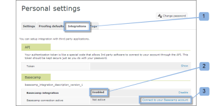
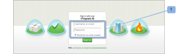
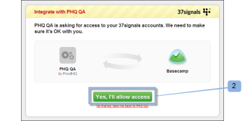
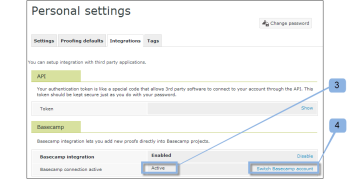
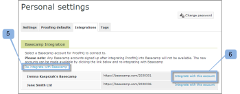

# Integrar [!DNL Workfront Proof] con [!DNL Basecamp]

>[!IMPORTANT]
>
>Este artículo hace referencia a la funcionalidad del producto independiente [!DNL Workfront Proof]. Para obtener información sobre la revisión dentro de [!DNL Adobe Workfront], consulte [Revisión](../../../review-and-approve-work/proofing/proofing.md).

Si usa [!DNL Basecamp] para la administración de proyectos, puede ofrecer al equipo del proyecto herramientas de revisión y aprobación más completas mediante [!DNL Workfront Proof].

## Explicación de la integración de [!DNL Basecamp] con [!DNL Workfront]

La integración con [!DNL Basecamp] permite a los usuarios ver, revisar y aprobar pruebas en [!DNL Basecamp]. Los usuarios pueden enviar pruebas a su cuenta de [!DNL Workfront Proof] y conectarlas con el proyecto [!DNL Basecamp]. Los revisores pueden realizar comentarios y tomar decisiones a través de [!DNL Basecamp] mediante la miniprueba incrustada en el mensaje de Basecamp.

Cuando se integra con [!DNL Workfront Proof], [!DNL Basecamp] tiene la siguiente funcionalidad de revisión:

* Los usuarios pueden revisar y aprobar las pruebas en [!DNL Basecamp Classic].
* Los usuarios tienen herramientas de revisión disponibles.
* Los equipos de revisión de proyecto reciben un mensaje en [!DNL Basecamp] con una miniprueba para su revisión y aprobación.
* Los usuarios pueden cambiar a una prueba de página completa para su revisión y aprobación.
* Los usuarios pueden añadir comentarios y marcas a las pruebas tanto de tamaño mini como completo.

  >[!NOTE]
  >
  >Una vez respondido un comentario, no se puede editar ni eliminar.

* Los revisores pueden responder a las correcciones realizadas por otros revisores.
* Se avisa a los usuarios cuando hay una nueva versión de la prueba disponible.
* Los usuarios que no sean [!DNL Workfront Proof] pueden trabajar en una prueba en [!DNL Basecamp].

La integración de [!DNL Workfront Proof] con [!DNL Basecamp] debe configurarse en dos niveles:

* Configurar [!DNL Basecamp] en [Configuración de la cuenta:](https://support.workfront.com/hc/en-us/sections/115000912147-Account-settings) esto habilita la integración de Basecamp para toda la organización. Para obtener más información, consulte [Habilitar la integración de BaseCamp con [!DNL Workfront Proof]](#enabling-the-basecamp-integration-with-workfront-proof).

* Configurar [!DNL Basecamp] en [Configuración personal](https://support.workfront.com/hc/en-us/sections/115000921168-Personal-settings): esto permite a los creadores y propietarios de pruebas conectarse a su cuenta personal de Basecamp y autorizar el acceso de [!DNL Workfront Proof]. Para obtener más información, consulte [Configuración personal](#configuring-personal-settings).

Puede integrar [!DNL Workfront] con [!DNL Basecamp] o [!DNL Basecamp Classic]. Cada versión de [!DNL Basecamp] usa una API diferente y, por lo tanto, requiere procedimientos de configuración diferentes.

Para obtener información sobre la configuración de [!DNL Basecamp Classic], consulte [Integración [!DNL Workfront Proof] con [!DNL Basecamp Classic].](https://support.workfront.com/knowledge/articles/115004234707/en-us?brand_id=662728&return_to=%2Fhc%2Fen-us%2Farticles%2F115004234707)

## Habilitar la integración de [!DNL Basecamp] con [!DNL Workfront Proof]

Como [Perfiles de permisos de prueba en [!DNL Workfront Proof]](../../../workfront-proof/wp-acct-admin/account-settings/proof-perm-profiles-in-wp.md) o [Perfiles de permisos de prueba en [!DNL Workfront Proof]](../../../workfront-proof/wp-acct-admin/account-settings/proof-perm-profiles-in-wp.md), puede configurar la integración de [!DNL Basecamp] para toda la cuenta en [Configuración de la cuenta](https://support.workfront.com/hc/en-us/sections/115000912147-Account-settings).

1. En [!UICONTROL Basecamp], recopile la siguiente información:

   * La URL de su cuenta de [!DNL Basecamp]
   * La URL encontrada en la sección “[!UICONTROL Mi información]”

1. Cerrar sesión de [!DNL Basecamp].
1. Haga clic en **[!UICONTROL Configuración de la cuenta]** cerca de la esquina superior derecha.
1. Haga clic en la pestaña **[!UICONTROL Integraciones]**.
1. En la sección **[!UICONTROL [!DNL Basecamp]]**, a la derecha de la integración de **[!UICONTROL [!DNL Basecamp]]**, haga clic en **[!UICONTROL Habilitar]**.

1. Junto a **[!UICONTROL [!DNL Basecamp]versión]**, verifique que **[!UICONTROL Versión clásica]** sea la versión con la que está realizando la integración.

1. (Condicional) Si no se muestra ninguna URL de [!DNL Basecamp], haga clic en **[!UICONTROL Editar]**, escriba la URL de su cuenta de [!DNL Basecamp], sin incluir “http://”, y luego haga clic en **[!UICONTROL Guardar]**.

1. En la esquina superior derecha de la ventana, haga clic en **[!UICONTROL Configuración]** > **[!UICONTROL Configuración personal]**.

1. Haga clic en la pestaña **[!UICONTROL Integraciones]**.
1. En **[!DNL Basecamp]**, a la derecha de **[!UICONTROL Integración de Basecamp]**, haga clic en **[!UICONTROL Habilitar]**.

1. En las opciones que aparecen, a la derecha de **[!UICONTROL [!DNL Basecamp]Token de API]**, haga clic en **[!UICONTROL Editar]**.

1. En el cuadro que aparece, escriba la URL que se encuentra en la sección “[!UICONTROL Mi información]” de [!DNL Basecamp] y, a continuación, haga clic en **[!UICONTROL Guardar]**.\
   Una vez que integre [!DNL Workfront Proof] con [!DNL Basecamp], los usuarios podrán establecer su configuración personal. Para obtener información sobre cómo establecer la configuración personal, consulte [Configuración personal](#configuring-personal-settings)

1. Si no puede habilitar la integración de [!DNL Basecamp], es posible que el ID de cuenta de [!DNL Workfront Proof] no sea el mismo que el ID de la cuenta que usa en [!DNL Basecamp].
1. Una vez que integre [!DNL Workfront Proof] con [!DNL Basecamp], los usuarios podrán establecer su configuración personal. Para obtener información sobre cómo establecer la configuración personal, consulte [Configuración personal](#configuring-personal-settings).

## Configuración personal

Después de establecer la [Configuración de la cuenta](https://support.workfront.com/hc/en-us/sections/115000912147-Account-settings) para su organización, cada uno de los autores que cree o envíe pruebas debería establecer su propia [configuración personal.](https://support.workfront.com/hc/en-us/sections/115000921168-Personal-settings)

1. Vaya a **[!UICONTROL Personal**&#x200B;**settings]**.

1. Abra la pestaña **[!UICONTROL Integrations]** (1).
1. Para habilitar la integración de [!DNL Basecamp], haga clic en **[!UICONTROL Enable]** (2).
1. Haga clic en **[!UICONTROL Connect to your [!DNL Basecamp] account]** (3).\
   

1. Inicie sesión en su cuenta de [!DNL Basecamp] (1).\
   

1. Haga clic en **[!UICONTROL Yes, I&#39;ll allow access]** para autorizar el acceso de [!DNL Workfront Proof] a su cuenta (2).\
   

1. (Opcional) Cuando su integración personal esté activa (3), puede cambiar fácilmente entre sus cuentas de [!DNL Basecamp].

   1. Haga clic en **[!UICONTROL Switch [!DNL Basecamp] account]** (4).\

      \
      La [!UICONTROL Switch Basecamp Account] le lleva a la página [!UICONTROL Configuración personal], donde puede elegir cuál de sus cuentas de [!DNL Basecamp] desea integrar con su cuenta de [!DNL Workfront Proof].

   1. Haga clic en **[!UICONTROL Re-Integrate with[!DNL Basecamp]]** (5) antes de elegir la cuenta de [!DNL Basecamp]\

      Esto actualiza la página [!UICONTROL Configuración personal ] y muestra la lista más actualizada de cuentas de [!DNL Basecamp].

   1. Haga clic en **[!UICONTROL Integrar con esta cuenta]** para conectarla con [!DNL Workfront Proof].\

      \
      Ahora puede añadir pruebas a proyectos de [!DNL Basecamp].
