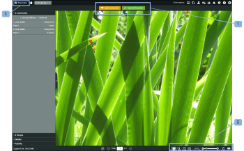

# Revisar una prueba en [!DNL Basecamp]

>[!IMPORTANT]
>
>Este artículo se refiere a la funcionalidad en el producto independiente [!DNL Workfront Proof]. Para obtener información sobre pruebas en el interior [!DNL Adobe Workfront], consulte [Prueba](../../../review-and-approve-work/proofing/proofing.md).

La variable [!DNL Basecamp] integración con [!DNL Workfront Proof] facilita la revisión y aprobación de pruebas sin salir [!DNL Basecamp].

Ni siquiera necesitas un [!DNL Workfront Proof] inicie sesión para utilizar todas las herramientas de revisión para realizar comentarios y decisiones sobre pruebas:

* En [!DNL Basecamp] , recibirá un mensaje que incluye la prueba que debe revisar (a través de la miniprueba)
* Puede agregar comentarios, marcas y tomar decisiones sobre la prueba miniprueba o cambiar a la prueba de página completa para su revisión si lo prefiere
* Puede ver y responder a los comentarios y las marcas del resto de revisores

Para obtener información sobre las decisiones, consulte [Tome una decisión sobre una prueba en el visor de pruebas](../../../review-and-approve-work/proofing/reviewing-proofs-within-workfront/make-a-decision-on-a-proof/make-decisions-on-proof.md).

>[!NOTE]
>
> Si no es usuario de [!DNL Workfront Proof], aún puede trabajar en la prueba en [!DNL Basecamp]. Todo lo que debe hacer es introducir su dirección de correo electrónico y su nombre de pantalla. También puede elegir &quot;[!UICONTROL recordarme]&quot; por lo que sólo debe introducir estos detalles una vez.

## Visualización de la prueba mediante el correo electrónico de notificación

Si vincula una prueba nueva o existente a [!DNL Basecamp], [!DNL Workfront Proof] enviará un correo electrónico de notificación de prueba a todos los revisores que contengan:

* El mensaje de prueba (personalizado o estándar) (1)
* Detalles de la prueba (2)
* URL personal (vaya al vínculo de prueba) (3)
* Vínculo a [!DNL Basecamp] mensaje del proyecto para llevarle directamente a la prueba en [!DNL Basecamp] (4)\
   Si no[!DNL Basecamp] los revisores se han agregado a la prueba, su notificación por correo electrónico no incluirá la variable [!DNL Basecamp] vínculo.
* Progreso de la prueba (5)
* Los revisores y sus progresos individuales (6)

>[!NOTE]
>
> Si no tiene un [!DNL Basecamp] abrir sesión en otra ventana del explorador, debe iniciar sesión en [!DNL Basecamp] antes de ver el mensaje en [!DNL Basecamp].

## Visualización de la prueba a través del [!DNL Basecamp] Mensaje

Cuando reciba una notificación por correo electrónico sobre una nueva prueba agregada a su [!DNL Basecamp] proyecto:

1. Vaya a la página del proyecto (1).
1. Busque el mensaje para la prueba (2).\
   La página del mensaje contiene el nombre de la prueba (en el asunto) (3) y un vínculo al visor de pruebas en pantalla completa (4).
1. 

1. Si ha iniciado sesión en su [!DNL Workfront Proof] en una de las ventanas de los navegadores, puede empezar a revisarla de inmediato. Si no puede ver su nombre en la esquina inferior izquierda de miniproof:
1. Haga clic en **[!UICONTROL Iniciar sesión]** (5)
1. Escriba su dirección de correo electrónico (que se utilizó para agregarle a la prueba) (6).
1. Haga clic en **[!UICONTROL Siguiente]** y en un segundo cuadro que aparece, escriba su [!DNL Workfront Proof] contraseña (7).\
   Si no tiene un [!DNL Workfront Proof] cuenta, escriba un nombre público para mostrar.

1. Haga clic en **[!UICONTROL Recordarme]** por lo tanto, solo tiene que introducir los detalles una vez.\
   Ahora está listo para continuar con la revisión de la prueba en [!DNL Basecamp].

## Revisión de una prueba en [!DNL Basecamp]

Revisión de una prueba en [!DNL Basecamp] es tan fácil como hacerlo en [!DNL Workfront Proof]. La miniprueba en [!DNL Basecamp] le proporciona todas las herramientas necesarias para añadir comentarios, marcas y tomar decisiones sobre la prueba.

* Su [!DNL Basecamp] nombre del proyecto (1)
* La variable [!DNL Workfront Proof] asunto de la notificación por correo electrónico (2)
* Vínculo directo al visor de pruebas completo (abre una vista de ventana completa) (3)
* Nombre y versión de la prueba (4)
* Menús de acción (5)
* Botón Pantalla completa (6)
* Barra lateral (7)
* Nombre de usuario (8)
* [!UICONTROL Comentario] y [!UICONTROL Decisión] botones (9)
* Herramientas de zoom (10)
* Herramientas de navegación de la página (11)

No es necesario enviar una respuesta a la variable [!DNL Basecamp] , ya que los comentarios y las decisiones se guardarán en la prueba (tal y como se guardan al revisar una prueba dentro de [!DNL Workfront Proof]).

## Revisión de la prueba de página completa

Puede mostrar la prueba de página completa con todas las [!DNL Workfront Proof] funcionalidad normal haciendo clic en el vínculo del mensaje justo encima de la miniprueba o en el icono de pantalla completa en la esquina superior derecha de la miniprueba.

La imagen de prueba sigue siendo del tamaño original, pero la página en sí es más ancha que la página a prueba de miniaturas.

La prueba de página completa muestra:

* La variable [!UICONTROL Añadir comentarios] y [!UICONTROL Enviar decisión] (en lugar de los comentarios y los iconos de decisión que se muestran en la miniprueba) (1).
* Más herramientas de zoom y navegación que la miniprueba (2).
* La variable [!UICONTROL Vaya a [!DNL Basecamp]] en la esquina superior izquierda de la prueba. Si hace clic en esto, volverá a entrar en su [!DNL Basecamp] cuenta (3).

