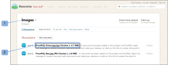
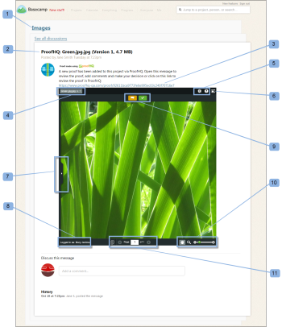
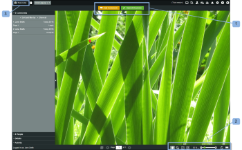

# Revisión de una prueba en [!DNL Basecamp]

>[!IMPORTANT]
>
>Este artículo hace referencia a la funcionalidad del producto independiente [!DNL Workfront Proof]. Para obtener información sobre la revisión dentro de [!DNL Adobe Workfront], consulte [Revisión](../../../review-and-approve-work/proofing/proofing.md).

La integración de [!DNL Basecamp] con [!DNL Workfront Proof] facilita la revisión y aprobación de pruebas sin salir de [!DNL Basecamp].

Ni siquiera necesita un inicio de sesión de [!DNL Workfront Proof] para usar todas las herramientas de revisión con el fin de hacer comentarios y tomar decisiones sobre las pruebas:

* En su cuenta de [!DNL Basecamp], recibirá un mensaje que incluye la prueba para que la revise (a través de la prueba mínima)
* Puede añadir comentarios, marcas y tomar decisiones en la prueba mínima o cambiar a la prueba de página completa para su revisión, si lo prefiere
* Puede ver y responder a los comentarios y marcas de los demás revisores

Para obtener información acerca de las decisiones, consulte [Tomar una decisión sobre una revisión en el visualizador de revisiones](../../../review-and-approve-work/proofing/reviewing-proofs-within-workfront/make-a-decision-on-a-proof/make-decisions-on-proof.md).

>[!NOTE]
>
> Si no es usuario de [!DNL Workfront Proof], todavía puede trabajar en la prueba en [!DNL Basecamp]. Todo lo que tiene que hacer es introducir su dirección de correo electrónico y nombre de pantalla. También puede elegir &quot;[!UICONTROL remember me]&quot; para tener que introducir estos datos una sola vez.

## Visualización de la prueba mediante el correo electrónico de notificación

Si vincula una prueba nueva o existente a [!DNL Basecamp], [!DNL Workfront Proof] enviará un mensaje de correo electrónico de notificación de prueba a todos los revisores que contenga:

* El mensaje de prueba (personalizado o estándar) (1)
* Detalles de la prueba (2)
* Dirección URL personal (vínculo Ir a la prueba) (3)
* Vínculo al mensaje del proyecto [!DNL Basecamp] para llevarlo directamente a la prueba en [!DNL Basecamp] (4)\
   Si se han añadido revisores que no son [!DNL Basecamp] a la prueba, su notificación por correo electrónico no incluirá el vínculo [!DNL Basecamp].
* Progreso de la revisión (5)
* Revisores y su progreso individual (6)

>[!NOTE]
>
> Si no tiene una sesión de [!DNL Basecamp] abierta en otra ventana del explorador, debe iniciar sesión en su cuenta de [!DNL Basecamp] para poder ver el mensaje en [!DNL Basecamp].

## Visualización de la prueba a través del mensaje de [!DNL Basecamp]

Cuando reciba una notificación por correo electrónico sobre una nueva prueba añadida a su proyecto de [!DNL Basecamp]:

1. Vaya a la página del proyecto (1).
1. Busque el mensaje de la prueba (2).\
   La página del mensaje contiene el nombre de la prueba (en el asunto) (3) y un vínculo al Visualizador de pruebas a pantalla completa (4).
1. 

1. Si ha iniciado sesión en su cuenta de [!DNL Workfront Proof] en una de las ventanas de su explorador, puede empezar a revisar de inmediato. Si no puede ver su nombre en la esquina inferior izquierda de la prueba mínima:
1. Haga clic en **[!UICONTROL Sign in]** (5).
1. Escriba su dirección de correo electrónico (que se utilizó para añadirle a la prueba) (6).
1. Haga clic en **[!UICONTROL Next]** y, en el segundo cuadro que aparece, escriba la contraseña de [!DNL Workfront Proof] (7).\
   Si no tiene una cuenta de [!DNL Workfront Proof], escriba un nombre público para mostrar.

1. Haz clic en **[!UICONTROL Remember me]** para que solo tenga que introducir estos datos una sola vez.\
   Ahora está listo para continuar revisando la prueba en [!DNL Basecamp].

## Revisión de una prueba en [!DNL Basecamp]

Revisar una prueba en [!DNL Basecamp] es tan fácil como hacerlo en [!DNL Workfront Proof]. La prueba mínima de [!DNL Basecamp] le proporciona todas las herramientas necesarias para añadir comentarios, marcas y tomar decisiones sobre la prueba.

* Nombre del proyecto de [!DNL Basecamp] (1)
* Asunto de la notificación por correo electrónico de [!DNL Workfront Proof] (2)
* Vínculo directo al Visualizador de pruebas completo (abre una vista de ventana completa) (3)
* Nombre y versión de la prueba (4)
* Menús de acción (5)
* Botón de pantalla completa (6)
* Barra lateral (7)
* Nombre de usuario (8)
* Botones [!UICONTROL Comment] y [!UICONTROL Decision] (9)
* Herramientas de zoom (10)
* Herramientas de navegación de página (11)

No es necesario enviar una respuesta al mensaje [!DNL Basecamp], ya que los comentarios y las decisiones se guardarán en la prueba (como ocurre al revisar una prueba en [!DNL Workfront Proof]).

## Revisión de la prueba de página completa

Puede mostrar la prueba de página completa con toda la funcionalidad normal de [!DNL Workfront Proof] haciendo clic en el enlace en el mensaje que se encuentra justo encima de la prueba mínima o en el icono de pantalla completa en la esquina superior derecha de la prueba mínima.

La imagen de prueba sigue teniendo el tamaño original, pero la página en sí es más ancha que la página de prueba mínima.

La prueba de página completa muestra lo siguiente:

* Los botones [!UICONTROL Añadir comentarios] y [!UICONTROL Enviar decisión] (en lugar de los iconos de comentarios y decisión que se muestran en la prueba mínima) (1).
* Más herramientas de zoom y navegación que la prueba mínima (2).
* El botón [!UICONTROL Ir a [!DNL Basecamp]] se encuentra en la esquina superior izquierda de la prueba. Si hace clic en esta opción, volverá a su cuenta de [!DNL Basecamp] (3).

