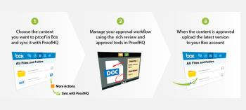

# Introducción a la integración de [!DNL Workfront Proof] y [!DNL Box]

>[!IMPORTANT]
>
>Este artículo hace referencia a la funcionalidad del producto independiente [!DNL Workfront Proof]. Para obtener información sobre la revisión dentro de [!DNL Adobe Workfront], consulte [Revisión](../../../review-and-approve-work/proofing/proofing.md).

Nuestra integración con el sistema de uso compartido de archivos en línea y gestión de contenidos de [!DNL Box] le permite crear nuevas pruebas y nuevas versiones de prueba directamente a partir de los archivos de su cuenta de [!DNL Box]. Para obtener información sobre [!DNL Box], consulte www.box.com.

Nuestra funcionalidad de sincronización de carpetas le permite sincronizar una carpeta [!DNL Box] con una carpeta en [!DNL Workfront Proof]. Cuando agrega un archivo o una nueva versión de un archivo a la carpeta sincronizada en [!DNL Box], el archivo también se agrega a la carpeta asociada en Workfront Proof. Para obtener más información, consulte [Sincronizar [!DNL Box] carpetas con [!DNL Workfront Proof]](../../../workfront-proof/wp-integrations/box/sycn-box-folder.md).

## Ventajas principales

* **Mejore la revisión y aprobación colaborativas:** proporcione a su equipo herramientas enriquecidas de marcado, comentarios y discusión para mejorar la colaboración en recursos creativos.
* **Acelere la entrega de proyectos:** acelere la entrega de sus proyectos de diseño en un 56% al acortar el ciclo de revisión y reducir el número de revisiones. Un consenso y unas decisiones más rápidas resultan en una entrega de proyectos más rápida y en una mayor rapidez para el mercado. Las revisiones de diseño se reducen en un 29%.
* **Ahorre tiempo de administración:** cuando su equipo emplea menos tiempo en imprimir copias manualmente, enviar comentarios por correo electrónico y enrutar revisiones, su esfuerzo por administrar pruebas se puede reducir en un promedio del 59%.
* **Reducir costes:** el tiempo es dinero. Un flujo de trabajo estandarizado permite optimizar los procesos de aprobación. Dado que la eficiencia, la precisión y la rapidez se mejoran, también ahorra dinero.
* **Obtenga mayor visibilidad y responsabilidad:** puede registrar versiones de archivo, comentarios y decisiones de archivos con marcas de tiempo en un seguimiento de auditoría rastreable. Esto le proporciona una responsabilidad total en cada fase del proceso de revisión y le ayuda a cumplir los requisitos de cumplimiento.\
   

## Características principales

* Envíe sus archivos creativos a [!DNL Workfront Proof] directamente desde su cuenta de [!DNL Box].
* Notifique al equipo de revisión acerca de una nueva prueba por correo electrónico que contenga un vínculo al archivo en [!UICONTROL Box].
* Proporcione a los usuarios las herramientas de marcado, comentarios y discusión enriquecidos de [!DNL Workfront Proof].
* Permita que el equipo del proyecto colabore y tome decisiones en tiempo real en diferentes formatos multimedia, incluidos contenido impreso, digital, web, vídeo e interactivo.
* Use [!DNL Workfront Proof] para cumplir con los requisitos regulatorios e identificar las mejoras del proceso.

## Agregar la aplicación de sincronización [!DNL Workfront Proof] a su cuenta de [!DNL Box]

Siga los sencillos pasos a continuación para agregar nuestra aplicación a su cuenta de Box:

1. En su cuenta de [!DNL Box], vaya a la sección **[!UICONTROL Aplicaciones]**.
1. En la barra de búsqueda, escriba **[!DNL Workfront Proof]Sincronizar**.
1. Haga clic en **[!UICONTROL [!DNL Workfront Proof]Sincronizar]** en los resultados de búsqueda.
1. Haga clic en **[!UICONTROL Añadir]** para agregar la aplicación de sincronización de [!DNL Workfront Proof] a su cuenta de Box.
1. En el cuadro de confirmación que aparece, haga clic en **[!UICONTROL Aceptar]**.

