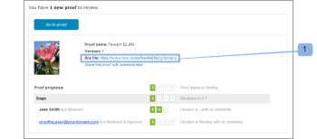
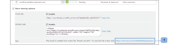

# Ver el archivo original de una prueba en Box

>[!IMPORTANT]
>
>Este artículo hace referencia a la funcionalidad del producto independiente [!DNL Workfront Proof]. Para obtener información sobre la revisión dentro de [!DNL Adobe Workfront], consulte [Revisión](../../../review-and-approve-work/proofing/proofing.md).

Si está utilizando la integración de [!DNL Workfront Proof] - [!DNL Box], en Box, puede ver el archivo original utilizado para crear una prueba. Puede hacerlo de dos maneras:

## Visualización del archivo en [!DNL Box] mediante notificación de correo electrónico de prueba

Cuando se crea una nueva prueba o versión a partir de un archivo de [!DNL Box], el creador y los revisores reciben una notificación por correo electrónico que contiene un vínculo al archivo en su cuenta de [!DNL Box] (1).\

## Visualización del archivo en [!DNL Box] a través de la página [!UICONTROL Proof Details]

La sección [!UICONTROL More sharing options] de la página [!UICONTROL Proof details] de la prueba que creó a partir de un archivo de [!DNL Box] incluye un vínculo al archivo en su cuenta de [!DNL Box] (1).

