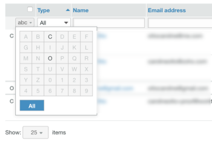

# Administrar contactos en [!DNL Workfront Proof]

>[!IMPORTANT]
>
>Este artículo hace referencia a la funcionalidad del producto independiente [!DNL Workfront Proof]. Para obtener información sobre la revisión dentro de [!DNL Adobe Workfront], vea [Revisión](../../../review-and-approve-work/proofing/proofing.md).

Puede administrar sus compañeros, miembros e invitados en la página Contactos.

## Abrir la página Contactos

1. Haga clic en **[!UICONTROL Contactos]** en la barra lateral de navegación izquierda.
1. (Opcional) Haga clic en **[!UICONTROL Cambiar vista]** y, a continuación, seleccione una opción para especificar si desea ver por contacto o por compañía.

## Ordenar contactos

1. Haga clic en **[!UICONTROL Contactos]** en la barra lateral de navegación izquierda.
1. Haga clic en el encabezado de columna por el que desee ordenar.
O
Seleccione una opción en el menú **[!UICONTROL Ordenar]** de la esquina superior derecha de la página Contactos.

1. 

1. El triángulo de un encabezado de columna indica el orden de clasificación. Apuntando hacia arriba, indica el orden ascendente; apuntando hacia abajo indica el orden descendente.

## Filtrado de contactos

1. Haga clic en **[!UICONTROL Contactos]** en la barra lateral de navegación izquierda.
1. Haga clic en el icono **[!UICONTROL Filter]** situado a la derecha de los encabezados de columna para mostrar las opciones de filtrado debajo de los encabezados de columna.
1. Seleccione [!UICONTROL opciones de filtrado] en los menús desplegables, escriba los cuadros de filtrado que aparecen debajo del encabezado de cada columna y, a continuación, haga clic de nuevo en el icono **[!UICONTROL Filtro]** para aplicar las opciones.
1. 

1. O
1. Seleccione la primera letra del nombre del contacto que desee.
1. 

## Administrar uno o varios contactos

1. Haga clic en **[!UICONTROL Contactos]** en la barra lateral de navegación izquierda.
1. Seleccione la casilla de verificación de uno o varios contactos.
1. Realice una de las siguientes acciones:

   * Haga clic en **[!UICONTROL Agregar al grupo]** para agregar los contactos seleccionados a un grupo.

     

   * Haga clic en **[!UICONTROL Quitar]** y, a continuación, haga clic en una opción del menú desplegable para quitar el contacto de las pruebas o grupos.
   * Haga clic en **[!UICONTROL Más]** > **[!UICONTROL Enviar recordatorio sobre pruebas tardías]** para enviar un correo electrónico recordatorio a los contactos seleccionados sobre cualquier prueba tardía.

   * Haga clic en **[!UICONTROL Más]** > **[!UICONTROL Exportar contactos a CSV]** para exportar los contactos seleccionados a un archivo CSV.

   * Haz clic en **[!UICONTROL Eliminar contactos]** para eliminar los contactos seleccionados de tu lista.

     
Eliminar un contacto no significa que se elimine un usuario de su cuenta; sin embargo, si un administrador o administrador de facturación elimina a alguien de la lista de contactos, esa persona se eliminará por completo de la cuenta de su organización.

   * Haz clic en el icono **[!UICONTROL Más]** al final de la fila de un contacto y usa cualquiera de las opciones del menú desplegable que aparece.

     Estas opciones son diferentes para diferentes tipos de contactos. Ver [Explicación de usuarios, miembros e invitados en [!DNL Workfront Proof]](../../../workfront-proof/wp-mnguserscontacts/contacts/use-members-guests.md) para obtener más información.

## Importando contactos

Puede importar contactos desde un archivo CSV.

1. Haga clic en **[!UICONTROL Contactos]** en la barra lateral de navegación izquierda.
1. En la página Contactos, haga clic en **[!UICONTROL Más]** > **[!UICONTROL Importar contactos]** para agregar contactos a su lista.

1. En la página Importar personas que aparece, haga clic en **[!UICONTROL Elegir archivo]**.
1. Seleccione el método de separación de campos en el archivo.
1. Haga clic en **[!UICONTROL Guardar]**.

   * El archivo CSV debe tener al menos una columna llamada &quot;Correo electrónico&quot; (que contenga las direcciones de correo electrónico).
   * También puede incluir columnas adicionales para &quot;Nombre&quot;, &quot;Empresa&quot;, &quot;Teléfono&quot; y &quot;Móvil&quot;.
   * En lugar de &quot;Nombre&quot;, puede utilizar dos columnas para &quot;Nombre&quot; y &quot;Apellidos&quot;. Si se utilizan columnas de nombre y apellido independientes, debe asegurarse de no incluir también una columna &quot;Nombre&quot;.
