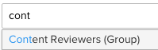

# Agregar grupos a una prueba

>[!IMPORTANT]
>
>Este artículo se refiere a la funcionalidad en el producto independiente [!DNL Workfront Proof]. Para obtener información sobre pruebas en el interior [!DNL Adobe Workfront], consulte [Prueba](../../../review-and-approve-work/proofing/proofing.md).

Agregue un grupo a una prueba para enviar automáticamente el contenido a todos los miembros del grupo.

Para obtener información sobre cómo crear un grupo, consulte [Crear grupos de prueba usando [!DNL Workfront Proof]](../../../workfront-proof/wp-mnguserscontacts/groups/create-proofing-groups.md).

1. Comience a crear una prueba utilizando uno de los métodos siguientes:

   * Cree una prueba estándar.

      Para obtener más información, consulte [Generar pruebas en [!DNL Workfront Proof]](../../../workfront-proof/wp-work-proofsfiles/create-proofs-and-files/generate-proofs.md).

   * Cree una nueva versión de prueba.

      Para obtener más información, consulte .
   * Haga una copia de una prueba. Para obtener más información, consulte <a href="../../../workfront-proof/wp-work-proofsfiles/create-proofs-and-files/copy-proofs.md" class="MCXref xref">Copia de pruebas en [!DNL Workfront Proof]</a>.

1. En el **[!UICONTROL Flujo de trabajo]** , empiece a escribir el nombre del grupo en la sección **[!UICONTROL Escriba el nombre de contacto o la dirección de correo electrónico para agregar un destinatario]** campo . 
1. Seleccione el nombre del grupo.
Ahora se muestran los miembros del grupo. 
1. (Opcional) Cambiar el nombre de un miembro individual **Función de prueba** o **Alertas de correo electrónico** con los menús desplegables.
Para obtener más información, consulte <a href="../../../workfront-proof/wp-work-proofsfiles/share-proofs-and-files/manage-proof-roles.md" class="MCXref xref">Administrar funciones de prueba en [!DNL Workfront Proof]</a> y <a href="../../../workfront-proof/wp-emailsntfctns/email-alerts/config-email-notification-settings-wp.md" class="MCXref xref">Configure las opciones de notificación por correo electrónico en [!DNL Workfront Proof]</a>.
1. (Opcional) Elimine un miembro del grupo de la prueba pasando el cursor sobre la información del usuario y haciendo clic en el botón **[!UICONTROL X]**.
O Elimine todos los miembros de la prueba haciendo clic en **[!UICONTROL Eliminar todo]**.
1. Continúe creando la prueba como se describe en <a href="../../../workfront-proof/wp-work-proofsfiles/create-proofs-and-files/generate-proofs.md" class="MCXref xref">Generar pruebas en [!DNL Workfront Proof]</a>  o <a href="../../../workfront-proof/wp-work-proofsfiles/create-proofs-and-files/copy-proofs.md" class="MCXref xref">Copia de pruebas en [!DNL Workfront Proof]</a>. 
