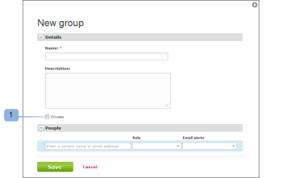
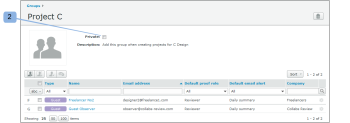

# Convertir los grupos en privados mediante [!DNL Workfront Proof]

>[!IMPORTANT]
>
>Este artículo hace referencia a la funcionalidad del producto independiente [!DNL Workfront Proof]. Para obtener información sobre la revisión dentro de [!DNL Adobe Workfront], consulte [Revisión](../../../review-and-approve-work/proofing/proofing.md).

Convertir su grupo en privado significa que solo usted podrá ver, usar, editar o eliminar el grupo. Si el grupo no es privado, todos los usuarios de la cuenta podrán verlo y utilizarlo.

## Configurar un nuevo grupo como privado

Para convertir un nuevo grupo en privado:

1. Vaya a **[!UICONTROL Grupos]** en el lado izquierdo de la pantalla.
1. Seleccione la opción **[!UICONTROL Privado]** en la página [!UICONTROL Nuevo grupo] al configurar el grupo. (1)

## Configurar un grupo existente como privado

Para convertir un grupo existente en privado:

1. Vaya a **[!UICONTROL Grupos]** en el lado izquierdo de la pantalla.
1. Habilite la opción **[!UICONTROL Privado]** en la página de detalles del grupo. (2)

